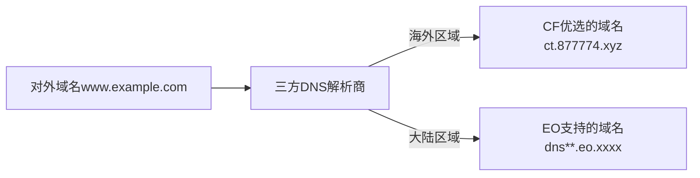

# Cloudflare + EdgeOne CDN 线路自动选择

众所周知，CloudFlare国外速度快，EdgeOne国内速度快，那有没有办法自动分线路解析呢

有的，兄弟，有的，利用DNS分线路解析，可以很轻松实现这一点

## 实现原理

大致思路就是，找个支持区分国内和海外不同线路解析的DNS解析商：
- 海外区域：CNAME指向CF优选的域名ct.877774.xyz
(如果Pages：CNAME指向CF优选的域名xxx.pages.dev)
- 大陆区域：CNAME指向EO加速的域名dns**.eo.xxxx

这样EO/CF检测你域名CNAME的时候就会正常通过，而不会报错。

这样要求被优选的域名是不能接入Cloudflare的！但是如果需要接入，怎么办？

可以利用Cloudflare的NS记录功能，把子域名DNS接入三方DNS解析商实现优选。

原理如下，假设是要优选www.cdn.example.com：

只能解析三级域名吗？当然不是，比如你想解析www.example.com

可以绑定www.example.com的NS到三方DNS解析商，直接解析@记录。

### 优选教程
1. 找一个支持区分国内和海外不同线路解析的DNS解析商，例如DNSPod、华为云DNS等，
这里以DNS POD为例，添加域名，例如cdn.example.com，也可以直接添加example.com

2. 查看NS记录，如果你添加的是根域名，直接去注册商那里修改为DNS POD的NS记录

3. 如果是母域名托管Cloudflare需要优选子域名的，添加子域名到Cloudflare
 - 记录类型为NS，记录值为ns1.xxxxx.xxx（DNS POD的NS记录）

4. 打开DNSPod解析设置页面，添加CNAME记录：
 - 默认线路：默认填CF优选域名ct.877774.xyz（可以替换你自己的）
 - 电信/联通/移动：填EO给你的记录dns**.eo.xxxx（替换你自己的）

此时就OK了！注意：如果你之前开启了代理，那么解析记录可能要一两个小时才会生效。
