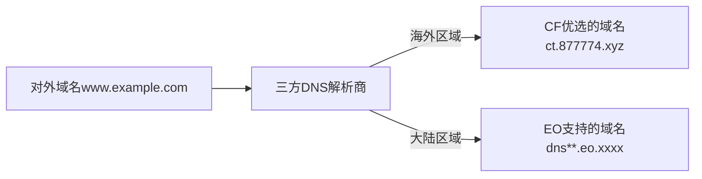
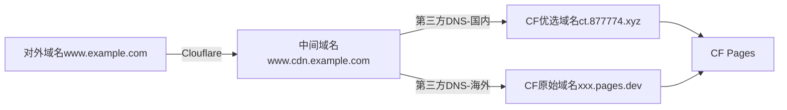
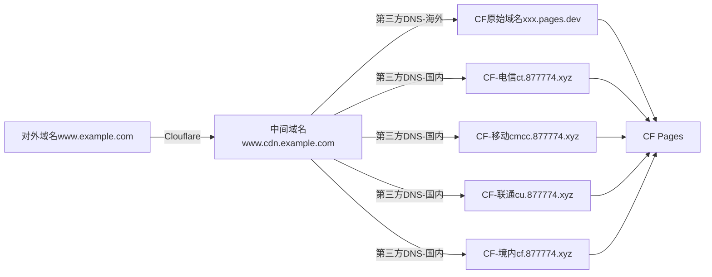
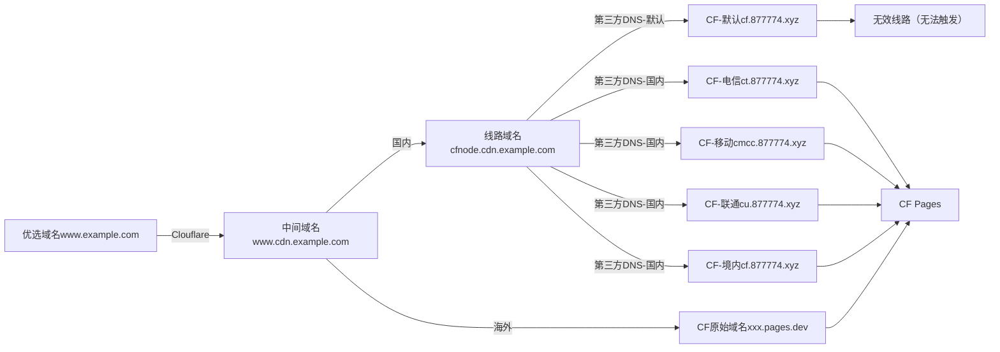

# Cloudflare+EdgeOne线路自动选择

众所周知，CloudFlare国外速度快，EdgeOne国内速度快，那有没有办法自动分线路解析呢

有的，兄弟，有的，利用DNS分线路解析，可以很轻松实现这一点

## 分线路实现原理

大致思路就是，找个支持区分国内和海外不同线路解析的DNS解析商：

- 海外区域：CNAME指向CF优选的域名ct.877774.xyz

- 大陆区域：CNAME指向EO加速的域名dns**.eo.xxxx

这样EO/CF检测你域名CNAME的时候就会正常通过，而不会报错。

```mermaid
graph LR
A[对外域名www.example.com]
    A --> B[三方DNS解析商]
    B -->|海外区域| C[CF优选的域名ct.877774.xyz]
    B -->|大陆区域| D[EO支持的域名dns**.eo.xxxx]
```

这样要求被优选的域名是不能接入Cloudflare的！但是如果需要接入，怎么办？

可以利用Cloudflare的NS记录功能，把子域名DNS接入三方DNS解析商实现优选。

原理如下，假设是要优选www.cdn.example.com：

```mermaid
graph LR
A[对外域名www.cdn.example.com] -->|NS解析cdn.example.com| B[Cloudflare DNS记录 ns1.xxxxx.xxx]
B -->|DNS解析| C[三方DNS解析商ns1.xxxxx.xxx]
```

只能解析三级域名吗？当然不是，比如你想解析www.example.com

可以绑定www.example.com的NS到三方DNS解析商，直接解析@记录。

### 分线路教程
1. 找一个支持区分国内和海外不同线路解析的DNS解析商，例如DNSPod、华为云DNS等，
这里以DNS POD为例，添加域名，例如cdn.example.com，也可以直接添加example.com

2. 查看NS记录，如果你添加的是根域名，直接去注册商那里修改为DNS POD的NS记录

3. 如果是母域名托管Cloudflare需要优选子域名的，添加子域名到Cloudflare
 - 记录类型为NS，记录值为ns1.xxxxx.xxx（DNS POD的NS记录）

4. 打开DNSPod解析设置页面，添加CNAME记录：
 - 默认线路：默认填CF优选域名ct.877774.xyz（可以替换你自己的）
 - 电信/联通/移动：填EO给你的记录dns**.eo.xxxx（替换你自己的）

此时就OK了！注意：如果你之前开启了代理，那么解析记录可能要一两个小时才会生效。

## 搭配CF Pages优选IP

比如你有个CF Pages站点www.cdn.example.com，因为优选了CF IP，但是多了一层cdn

这样虽然实现了优选IP，但是感觉不优雅，怎么办？当然可以再套一层CNAME，指向cdn

### 实现原理

```mermaid
graph LR
A[对外域名www.example.com]
    A -->|Clouflare| B[中间域名www.cdn.example.com]
    B -->|第三方DNS-国内| C[CF优选域名ct.877774.xyz]
    B -->|第三方DNS-海外| D[CF原始域名xxx.pages.dev]
    C --> E[CF Pages]
    D --> E[CF Pages]
```

### 实现方法

在上一步的基础上，添加CNAME记录：
 - 记录值：www.cdn.example.com（指向中间域名）

## 按不同运营商优选

那么，如果我想按运营商优选，可以选择不同的节点IP吗？

当然可以！只需要在上一步的基础上改一下就行

### 实现原理

```mermaid
graph LR
A[对外域名www.example.com]
    A -->|Clouflare| B[中间域名www.cdn.example.com]
    B -->|第三方DNS-海外| C[CF原始域名xxx.pages.dev]
    B -->|第三方DNS-国内| D[CF-电信ct.877774.xyz]
    B -->|第三方DNS-国内| E[CF-移动cmcc.877774.xyz]
    B -->|第三方DNS-国内| F[CF-联通cu.877774.xyz]
    B -->|第三方DNS-国内| G[CF-境内cf.877774.xyz]
    
    C --> Z[CF Pages]
    D --> Z[CF Pages]
    E --> Z[CF Pages]
    F --> Z[CF Pages]
    G --> Z[CF Pages]
```

### 实现方法

在上一步的基础上，修改CNAME记录：
- 类型：CNAME记录
- 名称：www.cdn.example.com
- 记录：ct.877774.xyz/cu.877774.xyz/cmcc.877774.xyz/cf.877774.xyz
- 线路：电信/联通/移动/境内

注意：这个**境内**是必须的，否则会有教育网或者铁通等会走非优选节点
生效顺序：电信/联通/移动>境内/境外>默认

## 记录太多怎么办？

上一步的【按不同运营商优选】，每一个域名都会产生5条线路记录

太多了，有办法可以减少记录数量吗？当然有！只需要设置一下即可

### 实现原理

```mermaid
graph LR
O[线路域名cfnode.cdn.example.com]
    O -->|第三方DNS-默认| P[CF-默认cf.877774.xyz]
    O -->|第三方DNS-国内| Q[CF-电信ct.877774.xyz]
    O -->|第三方DNS-国内| R[CF-移动cmcc.877774.xyz]
    O -->|第三方DNS-国内| S[CF-联通cu.877774.xyz]
    O -->|第三方DNS-国内| T[CF-境内cf.877774.xyz]
    Q --> Z[CF Pages]
    R --> Z[CF Pages]
    S --> Z[CF Pages]
    T --> Z[CF Pages]
    P --> Y[无效线路（无法触发）]
   
A[优选域名www.example.com]
    A -->|Clouflare| B[中间域名www.cdn.example.com]
    B -->|国内| O
    B -->|海外| E[CF原始域名xxx.pages.dev]
    E --> Z[CF Pages]
    
```
### 实现方法

1. 在上一步的基础上，分别添加CNAME记录：
- 类型：CNAME记录
- 名称：cfnode.cdn.example.com
- 记录：ct.877774.xyz/cu.877774.xyz/cmcc.877774.xyz/cf.877774.xyz/cf.877774.xyz
- 线路：电信/联通/移动/境内/默认

2. 把之前设置的分线路CNAME记录修改一下：

   a.修改原有的分线路记录，只保留一个
   - 类型：CNAME记录
   - 名称：www.cdn.example.com
   - 记录：cfnode.cdn.example.com
   - 线路：境内

   b.默认这个线路还是需要保留
   - 类型：CNAME记录
   - 名称：www.cdn.example.com
   - 记录：xxxxx.pages.dev
   - 线路：默认

注意：cfnode.cdn.example.com域名必须保留境内和默认：
 - 保留境内的原因是可能有教育网或铁通等会走非优选节点
 - 保留默认的原因是因为分线路解析必须要保留默认线路