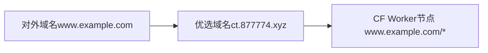
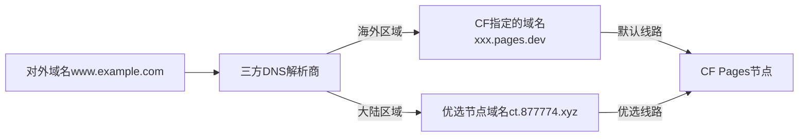
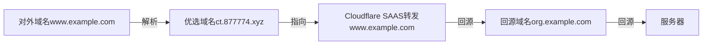

# Cloudflare 不同类型优选节点IP教程

CloudFlare优选IP通过在全国部署节点测试CloudFlare的公布的IP地址

从而优选国内访问质量较好的IP地址，提升访问速度和国内使用体验

优选之前：平均>250~300ms，地图基本上是黄的

优选之后：平均<200ms，地图基本上是绿的

教程示例域名：

- 对外域名： www.example.com （替换为你自己的域名）

- 优选域名： ct.877774.xyz （你可以找别的优选域名）

## Worker 优选

Cloudflare Worker优选特别简单：

- 只需要自定义路由，让worker接受所有请求。
- 让请求都指向优选的Worker节点，即可实现优选。

### 优选原理

### 优选教程

1. 打开Worker设置页面——删除原有的『自定义域』，例如www.example.com

2. 添加域和路由，选择『路由』，输入www.example.com/*
   

3. 在DNS这里设置优选域名的A记录指向优选域名的IP地址，记住不要打开小黄云『代理』
   

优选就完成了！注意：如果你之前开启了代理，那么解析记录可能要一两个小时才会生效。

## Pages 优选

CF Pages优选复杂一点，因为Pages要求你必须CNAME指向Cloudflare指定的域名。

而不是直接指向你优选节点的域名，如果没有指向CF提供的域名，则会100X报错。

### 优选原理

大致思路就是，找个支持区分国内和海外不同线路解析的DNS解析商：

- 海外区域：CNAME指向CF指定的域名xxx.pages.dev
- 大陆区域：CNAME指向优选节点域名ct.877774.xyz

这样CF检测你域名CNAME的时候就会正常通过，而不会报错。

这样要求被优选的域名是不能接入Cloudflare的！但是如果需要接入，怎么办？

可以利用Cloudflare的NS记录功能，把子域名DNS接入三方DNS解析商实现优选。

原理如下，假设是要优选www.cdn.example.com：

只能解析三级域名吗？当然不是，比如你想解析www.example.com

可以绑定www.example.com的NS到三方DNS解析商，直接解析@记录。

### 优选教程
1、找一个支持区分国内和海外不同线路解析的DNS解析商，例如DNSPod、华为云DNS等，
这里以DNS POD为例，添加域名，例如cdn.example.com，也可以直接添加example.com

2、查看NS记录，如果你添加的是根域名，直接去注册商那里修改为DNS POD的NS记录

3、如果是母域名托管Cloudflare需要优选子域名的，添加子域名到Cloudflare
 - 记录类型为NS，记录值为ns1.xxxxx.xxx（DNS POD的NS记录）

4. 打开DNSPod解析设置页面，添加CNAME记录：
 - 默认线路：默认填CF Pages的记录xxxx.pages.dev
 - 优选线路：填优选节点域名ct.877774.xyz（替换你自己的）

此时优选就完成了！注意：如果你之前开启了代理，那么解析记录可能要一两个小时才会生效。

## CDN / Tunnel 优选

你需要准备一个外币信用卡或者Paypal用于开通免费的Saas服务

- 用于优选的域名： www.example.com （替换为你自己的域名）
- 用于回源的域名： org.example.com （替换为你自己的域名）
- CF优选节点域名： ct.877774.xyz （你可以找别的优选域名）

### 优选原理

### 优选教程
1. 打开Cloudflare解析设置页面，添加『回源域名』CNAME记录，**需要**打开小黄云『代理』

案例里应该设置org.example.com解析到你的回源服务器，或者设置为Tunnel绑定IP的隧道连接

2. 添加『优选域名』CNAME记录，**不能**打开小黄云『代理』，记录的值为『优选节点域名』

案例里应该设置www.example.com解析到ct.877774.xyz（可以替换为你自己的优选节点的域名）

3. 打开SSL设置页面-自定义主机名，在回退源这里设置任意一个回源域名为回退源的回源域名

添加的回退源主机名应该是回源域名的org.example.com，而不是优选域名的www.example.com

5. 添加『优选域名』到『自定义主机名』中，建议设置HTTP验证SSL证书，其他选项保持默认

自定义源需要填写『回源域名』org.example.com，如果只要一个优选可以选『默认源服务器』

此时优选就完成了！注意：如果你之前开启了代理，那么解析记录可能要一两个小时才会生效。