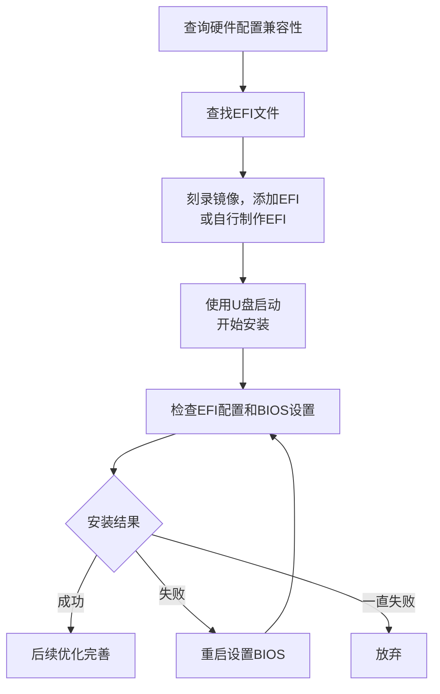

# 黑果教程和资源下载和常见问题(FAQ)

> 《黑果资源下载地址和常见问题(FAQ)》，作者：[皮卡丘](https://github.com/PIKACHUIM)、鹰击长空，引用源：[黑果屋](https://imacos.top/)、[黑果星球](https://heipg.cn/)、[果里果气黑果](https://www.zhihu.com/people/forjar)、[国光的黑果教程](https://apple.sqlsec.com/)、[OpenCore Install Guide](https://dortania.github.io/OpenCore-Install-Guide/)等
>
> 本文章遵循[**CC BY-NC-SA 4.0**](https://creativecommons.org/licenses/by-nc-sa/4.0/deed.zh-hans)许可协议，您不得将本文用于商业行为，并且在共享、演绎、转载本文时需保留此部分及链接https://coding.pika.net.cn/index.php/archives/531/

## 0x0 前言—为什么要装黑果

自从苹果采用Intel的处理器，苹果操作系统(macOS)被黑客破解后可以安装在Intel CPU与部分AMD CPU的机器上，因此出现了一大批*
*非苹果设备而使用苹果操作系统**的机器，由于安装原版Mac系统的设备被称为白苹果(Macintosh)，因此这样的系统被称为**黑果(
Hackintosh)**。

黑果有着**性价比高**，**扩展性强**，**可玩性高**的优点，安装黑果主要是为了以更低成本体验 macOS
操作系统，实现高性价比的硬件定制化升级，同时享受苹果生态和专业软件，尤其适合预算有限或追求高性能、可玩性强的专业用户和DIY爱好者。

### 0.0 新手小白黑果安装流程

## 📚 章节导航

本教程内容较多，已按章节拆分为独立文章，点击下方链接跳转阅读：

| 章节 | 标题 | 说明 |
|------|------|------|
| 0x1 | [硬件兼容与版本选择](/blog/hackintosh-tutorial1) | CPU/GPU/网卡/硬盘兼容性详细说明 |
| 0x2 | [黑果镜像下载地址](/blog/hackintosh-tutorial2) | 镜像、工具、补丁下载地址汇总 |
| 0x3 | [黑果安装准备工作](/blog/hackintosh-tutorial3) | BIOS设置、镜像写入、EFI生成 |
| 0x4 | [黑果安装详细教程](/blog/hackintosh-tutorial4) | 完整的安装步骤图文教程 |
| 0x5 | [黑果OCLP-MOD补丁教程](/blog/hackintosh-tutorial5) | 旧硬件驱动补丁安装教程 |
| 0x6 | [驱动显卡教程](/blog/hackintosh-tutorial6) | Intel/AMD/Nvidia显卡驱动方法 |
| 0x7 | [驱动网卡蓝牙](/blog/hackintosh-tutorial7) | 博通/Intel网卡蓝牙驱动方法 |
| 0x8 | [驱动声卡教程](/blog/hackintosh-tutorial8) | AppleALC/VoodooHDA声卡驱动 |
| 0x9 | [定制SSDT教程](/blog/hackintosh-tutorial9) | ACPI/SSDT定制完整教程 |
| 0xA | [定制USB教程](/blog/hackintosh-tutorial10) | USBToolBox USB端口定制 |
| 0xB | [虚拟机黑果](/blog/hackintosh-tutorialb) | VMware/PVE/ESXi虚拟机安装（[VMware](/blog/hackintosh-tutorialb1) / [PVE](/blog/hackintosh-tutorialb2) / [ESXi](/blog/hackintosh-tutorialb3)） |
| 0xC | [实用优化教程](/blog/hackintosh-tutorial12) | 性能监控、HiDPI等优化技巧 |
| 0xD | [主题与启动项](/blog/hackintosh-tutorial13) | OpenCanopy主题、启动项管理 |
| 0xE | [OC配置详情单](/blog/hackintosh-tutorial14) | OpenCore配置详细说明 |
| 0xF | [安装常见问题](/blog/hackintosh-tutorial15) | 150+个常见问题解答 |

## 教程引用参考链接

> - [1]《黑果系列1 - 为什么需要黑果》，作者：陈鹏，链接：https://zhuanlan.zhihu.com/p/180946454
> - [2]《如何上手黑果》，作者：黑果星球，链接：https://heipg.cn/tutorial/how-to-hackintosh.html
> - [3]《2025年黑果硬件配置推荐表》，作者：黑果星球，链接：https://heipg.cn/tutorial/diy-hackintosh-2020.html
> - [7]《国光的黑果安装教程：手把手教你配置 OpenCore》，作者：国光，链接：https://apple.sqlsec.com/
> - [OpenCore Install Guide](https://dortania.github.io/OpenCore-Install-Guide/)
