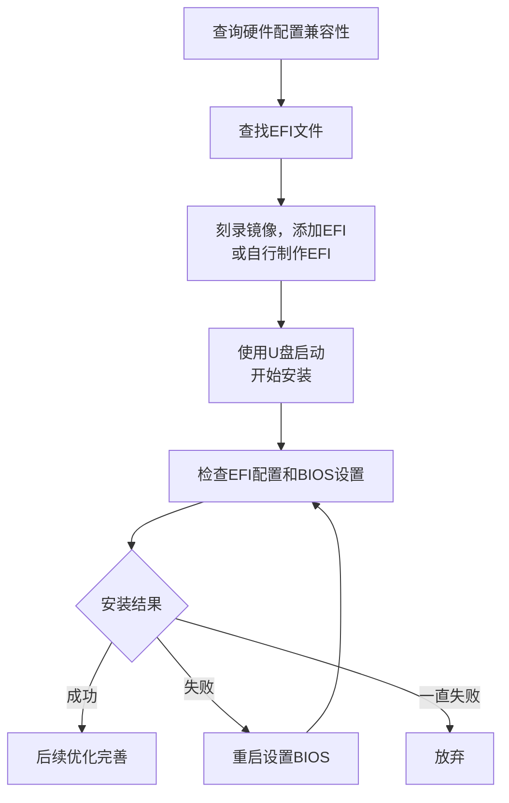

# 黑苹果教程和资源下载地址和常见问题(FAQ)

> 《黑苹果资源下载地址和常见问题(FAQ)》，作者：[皮卡丘](https://github.com/PIKACHUIM)、鹰击长空，引用源：[黑苹果屋](https://imacos.top/)、[黑苹果星球](https://heipg.cn/)、[果里果气黑苹果](https://www.zhihu.com/people/forjar)、[国光的黑苹果教程](https://apple.sqlsec.com/)、[OpenCore Install Guide](https://dortania.github.io/OpenCore-Install-Guide/)等
>
> 本文章遵循[**CC BY-NC-SA 4.0**](https://creativecommons.org/licenses/by-nc-sa/4.0/deed.zh-hans)许可协议，您不得将本文用于商业行为，并且在共享、演绎、转载本文时需保留此部分及链接https://coding.pika.net.cn/index.php/archives/531/

## 0x0 前言—为什么要装黑果

自从苹果采用Intel的处理器，苹果操作系统(macOS)被黑客破解后可以安装在Intel CPU与部分AMD CPU的机器上，因此出现了一大批*
*非苹果设备而使用苹果操作系统**的机器，由于安装原版Mac系统的设备被称为白苹果(Macintosh)，因此这样的系统被称为**黑苹果(
Hackintosh)**。

黑苹果有着**性价比高**，**扩展性强**，**可玩性高**的优点，安装黑苹果主要是为了以更低成本体验 macOS
操作系统，实现高性价比的硬件定制化升级，同时享受苹果生态和专业软件，尤其适合预算有限或追求高性能、可玩性强的专业用户和DIY爱好者。

### 0.0 新手小白黑苹果安装流程



## 0x1 硬件兼容与版本选择

### 1.0 整体兼容性

由于苹果官方只为自家硬件兼容了macOS，因此黑苹果的硬件兼容性不如Windows，大致原则：

- ① Intel & AMD CPU (需AVX2指令集)  ② Intel 2~10代核显/AMD免驱/开普勒-帕斯卡N卡

- ③ Intel Core/Xeon X79~X299/AMD Ryzen之后主板 ④ 不存在部分三星/海力士固态硬盘

### 1.1 主板兼容性

黑苹果可考虑微星、技嘉、华硕、华擎，其它方面主要就是避免选择 BIOS 太烂的品牌，且 BIOS 设置里拥有 CFG Lock 选项的最佳；
> 为什么要求有 CFG Lock 选项？
>
> 因为此项关联主板 MSR 0xE2 寄存器是否可读写（也就是 NVRAM 读写支持）。
> 对于逐渐成为主流的新一代引导工具 OpenCore 来说，BIOS中没有该选项会导致额外的折腾流程；

#### 1.1.1「特别注意」

以下型号主板没有或不支持NVRAM读写，属于知名的macOS安装“老大难”平台：

- X79、X99 、X299、C422、C612、C621

绝大部分上述型号即使用工具解锁 CFG-Lock 后，也大概率会卡在CFG这里

### 1.2 CPU 兼容性

#### 1.2.1 CPU兼容性原则

参考：https://imacos.top/2023/05/12/intel-amd/

##### 1.2.1.1 架构支持：

- 32 位架构的 CPU 只支持 macOS 10.4.1 到 macOS 10.6.8
- 64 位架构的 CPU 支持 macOS 10.4.1 至 macOS 26

##### 1.2.1.2 指令支持：

- macOS 10.11 和更老版本需要 需要 SSE3
- macOS 10.12 和更新版本需要 SSE4
- macOS 10.14 和更新版本需要 SSE4.2
- macOS 12 和更新版本需要 AVX2（可以通过补丁绕过）

##### 1.2.1.3 品牌支持：

- 支持AMD（需补丁）和Intel（酷睿11代起需要仿冒10代）

##### 1.2.1.4 线程支持：

- macOS10.10及更早版本最多支持 24 个线程，包括双 CPU。
- macOS10.11及更新版本最多支持 64 个线程，包括双 CPU。

#### 1.2.2 CPU兼容性表

| 架构/代号                                    | 品牌    | 典型型号/系列                                 | 10.12-10.14 | 10.15-13+ | 兼容性备注                      |
  |:-----------------------------------------|:------|:----------------------------------------|:-----------:|:---------:|:---------------------------|
| **Presler/Cedar Mill/Conroe/Kentsfield** | Intel | Pentium D, Core 2 Duo/Quad              |      ❌      |     ❌     | 太旧，无SSE4.2指令集              |
| **Haswell→Comet Lake**                   | Intel | 4代-10代 Core i3/i5/i7/i9                 |      ✅      |     ✅     | 消费级主力，全功能支持                |
| **Clarkdale/Arrandale**                  | Intel | 1代Core i3/i5/i7                         |      ✅      |     ✅     | **需CPU仿冒**+核显补丁            |
| **Sandy/Ivy Bridge**                     | Intel | 2-3代 Core i3/i5/i7                      |      ✅      |     ✅     | **需核显补丁**(Mojave/Monterey) |
| **Sandy-E → Cascade Lake**               | Intel | HEDT/服务器 E3/E5/E7/Xeon W                |      ✅      |     ✅     | 无核显，服务器端稳定                 |
| **Nehalem/Westmere**                     | Intel | 1代Core i7/Xeon                          |      ✅      |     ✅     | **需CPU仿冒**，无核显             |
| **Rocket Lake(11代)**                     | Intel | Core i5/i7/i9-11xxx                     |      ✅      |     ✅     | **需仿冒**，无核显驱动              |
| **Alder Lake(12代)**                      | Intel | Core i3/i5/i7/i9-12xxx                  |      ✅      |     ✅     | **需仿冒**，无核显驱动              |
| **Raptor Lake(13/14代)**                  | Intel | Core i5/i7/i9-13xxx/14xxx               |      ✅      |     ✅     | **需仿冒**，无核显驱动              |
| **Meteor Lake(Core Ultra 1代)**           | Intel | Ultra 5/7/100H系列                        |      ✅      |     ✅     | **需仿冒**，无核显驱动              |
| **Arrow Lake(Core Ultra 2代)**            | Intel | Ultra 200S系列                            |      ✅      |     ✅     | **需仿冒**，无核显驱动              |
| **Bristol Ridge**                        | AMD   | A6/A8/A10/A12-9000系列                    |      ✅      |     ✅     | 无核显驱动，需独显                  |
| **Zen/Zen+/Zen2/Zen3**                   | AMD   | Ryzen 1000-6000, Threadripper 1000-3000 |      ✅      |     ✅     | 原生支持，完美兼容                  |
| **Raphael(Zen4桌面)**                      | AMD   | Ryzen 7000系列                            |      ✅      |     ✅     | **需CPUID仿冒**，无核显           |
| **Dragon Range(Zen4移动)**                 | AMD   | Ryzen 7000HX系列                          |      ✅      |     ✅     | **需CPUID仿冒**，无核显           |
| **Phoenix/Hawk Point(Zen4 APU)**         | AMD   | Ryzen 7000/8000G系列                      |      ✅      |     ✅     | **需仿冒**，核显不可用              |
| **Strix Point/Granite Ridge(Zen5)**      | AMD   | Ryzen 9000系列                            |      ✅      |     ✅     | **需仿冒**，无核显支持              |

### 1.3 GPU 兼容性

#### 1.3.1 什么是免驱卡

macOS 的显卡驱动是系统内置的，这些驱动支持部分 AMD/NVIDIA/Intel 推出的显卡型号，型号符合的显卡在安装完 macOS
就可以自己驱动起来正常工作，即“免驱卡”；

##### 1.3.1.1 完全免驱显卡

- AMD 免驱显卡: RX4x0、RX5x0、RX Vega、RX5x00XT、RX6x00XT、RX6x50XT、MI25/50/镭7、WXx100系列，但是RX6700/6X50不能原生支持，需要仿冒或者使用NootRX
- NVIDIA免驱显卡: 只有两代 Kepler，对应 GTX6x0 和 GTX7x0 系列，但不包括 745、750 和 750Ti，并且最多只支持到 macOS 12.0 beta
  6，更高版本需要打第三方补丁；
- Intel 免驱显卡: 仅支持Intel核显，最新只到 UHD630（8-10 代酷睿）以及 Iris Plus Graphics（10 代移动端酷睿）及以前的型号，新型号Xe系列/Arc
  独显的暂不支持；

##### 1.3.1.2 可打驱动显卡

- NVIDIA可打驱动: Maxwell 和 Pascal 两个系列的显卡。需要额外安装 Webdriver 驱动并且默认只能支持 10.13.6，通过 OpenCore
  Legacy Patcher 则可以支持最新版本
- AMD 可打驱动: AMD核心显卡仅 Vega 架构这一代，这包括了 Ryzen 1xxx (Athlon Silver/Gold) 到 5xxx，还有 7x30
  系列，独显则支持RX6900~6600范围内的所有显卡

> 「注意」
> 1. 苹果于 2022 年 6 月公布了 Metal 3 支持的硬件，从 RX Vega 起步，不再支持 RX4x0 和 Rx5x0，不过不支持 Metal 3
     也仍然可以正常使用目前的 Metal 2；

#### 1.3.2 显卡兼容性表

##### 1.3.2.1 NVIDIA 显卡兼容性明细表

| **型号系列**                         | **核心架构**                         | **原生支持最高版本**            | **OCLP支持最高版本** | **备注**                       |
|:---------------------------------|:---------------------------------|:------------------------|:---------------|:-----------------------------|
| **GTX 670/680/760/770/780**      | Kepler (GK104/110)               | 12.x Monterey           | 15.x Sequoia   | 含Ti/690/TITAN Z，无HEVC硬解      |
| **GTX 660/650/640/740**          | Kepler (GK106/107)               | 12.x Monterey           | 15.x Sequoia   | 含Ti/Boost/OEM，部分花屏           |
| **GTX 750/950/960**              | Maxwell (GM107/206)              | **10.13.6 High Sierra** | 15.x Sequoia   | **原生需WebDriver，OCLP下无Metal** |
| **GTX 970/980/980Ti**            | Maxwell (GM204/200)              | **10.13.6 High Sierra** | 15.x Sequoia   | **原生需WebDriver，OCLP下无Metal** |
| **GTX 1050/1060/1070/1080**      | Pascal (GP107/106/104)           | **10.13.6 High Sierra** | 15.x Sequoia   | **原生需WebDriver，OCLP下无Metal** |
| **GT 1010/1030**                 | Pascal (GP108)                   | **10.13.6 High Sierra** | 15.x Sequoia   | GK107版属Kepler，需甄别核心          |
| **Quadro K系列**                   | Kepler (GK104/106/107)           | 12.x Monterey           | 15.x Sequoia   | K2000-K6000，部分无确切资料          |
| **Quadro M/P系列**                 | Maxwell/Pascal                   | **10.13.6 High Sierra** | 15.x Sequoia   | **原生需WebDriver，OCLP下无Metal** |
| **RTX 2060/2070/2080全系列**        | Turing (TU106/104/102)           | ❌ **无法驱动**              | ❌ **无法驱动**     | **苹果永久终止合作**                 |
| **GTX 1650/1660全系列**             | Turing (TU117/116)               | ❌ **无法驱动**              | ❌ **无法驱动**     | **架构被系统级屏蔽**                 |
| **RTX 3050/3060/3070/3080/3090** | Ampere (GA106/104/102)           | ❌ **无法驱动**              | ❌ **无法驱动**     | **无任何社区解决方案**                |
| **RTX 4060/4070/4080/4090**      | Ada Lovelace (AD106/104/103/102) | ❌ **无法驱动**              | ❌ **无法驱动**     | **完全不支持**                    |

##### 1.3.2.2 AMD 显卡兼容性明细表

| **架构代际**                     | **型号系列**                         | **原生支持最高版本** | **OCLP支持最高版本** | **备注**                |
|:-----------------------------|:---------------------------------|:-------------|:---------------|:----------------------|
| **GCN 4.0 (Polaris)**        | RX 460/470/480/570/580/590       | 26.x Tahoe   | 26.x Tahoe     | 含XT/D/2048SP/580G，最稳定 |
| **GCN 5.0/5.1 (Vega)**       | Vega 56/64/FE/Radeon VII         | 26.x Tahoe   | 26.x Tahoe     | 含Liquid/Pro版本，Mac专属   |
| **RDNA 1.0 (Navi 10)**       | RX 5300/5500/5600/5700系列         | 26.x Tahoe   | 26.x Tahoe     | 含50周年纪念版，完美免驱         |
| **RDNA 2.0 (Navi 23)**       | RX 6600/6600XT                   | 26.x Tahoe   | 26.x Tahoe     | **需macOS 12.1 Beta+** |
| **RDNA 2.0 (Navi 21)**       | RX 6800/6900全系列                  | 26.x Tahoe   | 26.x Tahoe     | 含XT/XTX/6950XT，完美免驱   |
| **RDNA 2.0 Mac专属**           | Pro W6800/W6900X/Vega II         | 26.x Tahoe   | 26.x Tahoe     | Mac Pro/iMac Pro独占    |
| **GCN 1.0-3.0**              | HD 7000/R9 200系列                 | 11.x Big Sur | 15.x Sequoia   | 需刷BIOS或仿冒ID，双芯卡单核     |
| **RDNA 2.0 (Navi 22)**       | RX 6700/6750XT/6650XT            | 15.x Sequoia | 15.x Sequoia   | **需第三方补丁或仿冒ID**       |
| **RDNA 2.0 (Navi 24)**       | **RX 6400/6500XT**               | ❌ **无法驱动**   | ❌ **无法驱动**     | **系统级核心屏蔽**           |
| **RDNA 3.0 (Navi 31/32/33)** | **RX 7600/7700XT/7800XT/7900系列** | ❌ **无法驱动**   | ❌ **无法驱动**     | **苹果未开发RDNA3驱动**      |
| **GCN 1.0双芯卡**               | HD7990/R9 295X2等                 | 11.x Big Sur | 11.x Big Sur   | **第二核心永久失效**          |

##### 1.3.2.3 Intel显卡兼容性列表

| 世代                 | 架构     | 型号系列                              | 最高支持 macOS | 原生支持起始版本 | 关键备注                       |
|:-------------------|:-------|:----------------------------------|:-----------|:---------|:---------------------------|
| Westmere (1代)      | 一代酷睿   | HD Graphics 1000                  | 10.13.6    | -        | 10.14+ 需修改，无 Metal，胶水封装    |
| Sandy Bridge (2代)  | 二代酷睿   | HD Graphics 2000/3000             | 10.13.6    | 10.7     | 10.14+ 需修改，无 Metal         |
| Ivy Bridge (3代)    | 三代酷睿   | HD Graphics 2500/4000             | 10.15.7    | 10.8     | 10.16+ 需第三方补丁              |
| Haswell (4代)       | 四代酷睿   | HD/Iris/Iris Pro Graphics         | 11.7.x     | 10.9     | HD4400 需仿冒 HD4600          |
| Broadwell (5代)     | 五代酷睿   | Iris Pro Graphics 6200 等          | 12.0       | 10.10.2  | 性能接近 GT740                 |
| Skylake (6代)       | 六代酷睿   | HD 510/520/530/540/550/580        | 12.0       | 10.11.4  | 型号改为3位数                    |
| Kabylake (7代)      | 七代酷睿   | HD 615/620/630/640/650, Iris Plus | 13.0       | 10.12.6  | **HD610 不支持**              |
| Coffeelake (8/9代)  | 八/九代酷睿 | UHD Graphics 630                  | 13.0       | 10.13.6  | F 后缀无核显，部分 i3 需仿冒          |
| Comet Lake (10代桌面) | 十代酷睿   | UHD Graphics 630                  | 最新版        | -        | 需 Lilu 1.4.5+ / WEG 1.4.0+ |
| Ice Lake (10代移动)   | 十代酷睿   | Iris Plus Graphics                | 最新版        | 10.15.4  | 移动端最强，需特殊启动参数              |

##### 1.3.2.4 AMD核显兼容性列表

| **架构代号**         | **APU 系列**                                   | **原生支持最高版本**  | **OCLP 支持最高版本** | **驱动状态**           | **特殊要求与备注**                            |
|:-----------------|:---------------------------------------------|:--------------|:----------------|:-------------------|:---------------------------------------|
| **Raven Ridge**  | Ryzen 3/5/7 2xxxG<br>Athlon Silver/Gold 2xxx | 12.x Monterey | 15.x Sequoia    | ⚠️ **需 NootedRed** | 需屏蔽独显，移除 WhateverGreen，分配 1GB+ VRAM    |
| **Picasso**      | Ryzen 3/5/7 3xxxG<br>Athlon Silver/Gold 3xxx | 12.x Monterey | 15.x Sequoia    | ⚠️ **需 NootedRed** | 使用 iMac20,1 SMBIOS，笔记本需 SSDT-PNLF 背光补丁 |
| **Renoir**       | Ryzen 4xxxG/5xxxG (U/HS/H)                   | 13.x Ventura  | 15.x Sequoia    | ⚠️ **需 NootedRed** |                                        |
| **Barcelo-R**    | Ryzen 7330U/7530U/7730U                      | 15.x Sequoia  | 15.x Sequoia    | ⚠️ **需 NootedRed** | **唯一支持核显的 Ryzen 7000 系**               |
| **Dali**         | Athlon Gold 3150U/3150C                      | 12.x Monterey | 15.x Sequoia    | ⚠️ **需 NootedRed** | 低功耗版本，性能受限                             |
| **Pollock**      | Athlon Silver 3050GE/3150GE                  | 12.x Monterey | 15.x Sequoia    | ⚠️ **需 NootedRed** | 嵌入式版本，兼容性一般                            |
| **Rembrandt**    | Ryzen 5/7/9 6xxxH/HS/HX                      | ❌ **无法驱动**    | ❌ **无法驱动**      | ❌ **完全不支持**        | RDNA 2 核显架构，系统级屏蔽                      |
| **Phoenix**      | Ryzen 5/7/9 7xxxHS/7940HS等                   | ❌ **无法驱动**    | ❌ **无法驱动**      | ❌ **完全不支持**        | RDNA 3 核显架构，无驱动支持                      |
| **Raphael**      | Ryzen 7000 系列 (Radeon 700M)                  | ❌ **无法驱动**    | ❌ **无法驱动**      | ❌ **完全不支持**        | 桌面版 RDNA 2 核显，苹果未跟进                    |
| **Dragon Range** | Ryzen 9 7945HX等                              | ❌ **无法驱动**    | ❌ **无法驱动**      | ❌ **完全不支持**        | 无核显驱动支持                                |
| **Van Gogh**     | Steam Deck APU                               | ❌ **无法驱动**    | ❌ **无法驱动**      | ❌ **完全不支持**        | 定制架构，无对应驱动                             |
| **Mendocino**    | Ryzen 7020 系列                                | ❌ **无法驱动**    | ❌ **无法驱动**      | ❌ **完全不支持**        | RDNA 2 低端，系统黑名单                        |
| **GCN 3.0**      | Radeon R7/R9 移动版                             | ❌ **无法驱动**    | ❌ **无法驱动**      | ❌ **完全不支持**        | 核显部分无驱动支持                              |

### 1.4 网卡兼容性

#### 1.4.1 网卡选购建议

| 使用场景               | 推荐方案              | 理由              |
|--------------------|-------------------|-----------------|
| **白苹果原装**          | BCM94360CS/CS2/CD | 苹果专用，免驱完美兼容     |
| **黑苹果装机**          | BCM94360NG/Z3/Z4  | 免驱，即插即用         |
| **Windows最新**      | BE200/AX411       | WiFi 7/6E，速率最高  |
| **黑苹果+Windows双系统** | BCM94360NG        | 兼顾Mac免驱和Win兼容性  |
| **预算有限**           | AC9260/9560       | Intel最强AC，性价比最高 |
| **PCIe网卡**         | DW1560/DW1830     | 博通方案，黑苹果友好      |

#### 1.4.2 网卡兼容性表

##### 1.4.1.1 Intel 网卡完整兼容性表

| 系列           | 芯片型号               | 接口类型          | Wi-Fi标准  | 蓝牙版本 | 支持macOS版本 | 所需驱动               | 备注                  |
|--------------|--------------------|---------------|----------|------|-----------|--------------------|---------------------|
| **Wi-Fi 7**  | Intel BE200        | M.2 A/E Key   | Wi-Fi 7  | 5.3  | 10.15+    | Airportitlwm/itlwm | 最新型号                |
| **Wi-Fi 6E** | Intel AX210        | M.2 A/E Key   | Wi-Fi 6E | 5.2  | 10.15+    | Airportitlwm/itlwm | 支持6GHz              |
|              | Intel AX211        | M.2 A/E Key   | Wi-Fi 6E | 5.2  | 10.15+    | Airportitlwm/itlwm | CNVio2接口            |
|              | Intel AX411        | M.2 A/E Key   | Wi-Fi 6E | 5.2  | 10.15+    | Airportitlwm/itlwm | 高端型号                |
| **Wi-Fi 6**  | Intel AX200        | M.2 A/E Key   | Wi-Fi 6  | 5.0  | 10.15+    | Airportitlwm/itlwm | 硬件ID: 0x2723        |
|              | Intel AX201        | M.2 A/E Key   | Wi-Fi 6  | 5.0  | 10.15+    | Airportitlwm/itlwm | CNVio2接口            |
|              | Intel AX101        | M.2 A/E Key   | Wi-Fi 6  | 5.2  | 10.15+    | Airportitlwm/itlwm | 入门级                 |
| **Wi-Fi 5**  | Intel AC 9560      | M.2 A/E Key   | 802.11ac | 5.0  | 10.15+    | Airportitlwm/itlwm | 1.73Gbps            |
|              | Intel AC 9461/9462 | M.2 A/E Key   | 802.11ac | 5.0  | 10.15+    | Airportitlwm/itlwm | 集成MAC               |
|              | Intel AC 9260      | M.2 A/E Key   | 802.11ac | 5.0  | 10.15+    | Airportitlwm/itlwm | 1.73Gbps            |
|              | Intel AC 8265      | M.2 A/E Key   | 802.11ac | 4.2  | 10.15+    | Airportitlwm/itlwm | 硬件ID: 0x24f3/0x24f4 |
|              | Intel AC 8260      | M.2 A/E Key   | 802.11ac | 4.2  | 10.15+    | Airportitlwm/itlwm | 企业级                 |
|              | Intel AC 7265      | M.2 A/E Key   | 802.11ac | 4.0  | 10.15+    | Airportitlwm/itlwm | 硬件ID: 0x095a/0x095b |
|              | Intel AC 7260      | Mini PCIe/M.2 | 802.11ac | 4.0  | 10.15+    | Airportitlwm/itlwm | 硬件ID: 0x08b1/0x08b2 |
|              | Intel AC 4165      | M.2 A/E Key   | 802.11ac | 4.2  | 10.15+    | Airportitlwm/itlwm | 硬件ID: 0x24f5/0x24f6 |
|              | Intel AC 3168      | M.2 A/E Key   | 802.11ac | 4.2  | 10.15+    | Airportitlwm/itlwm | 硬件ID: 0x24fb        |
|              | Intel AC 3165      | M.2 A/E Key   | 802.11ac | 4.2  | 10.15+    | Airportitlwm/itlwm | 硬件ID: 0x3166        |
|              | Intel AC 3160      | Mini PCIe/M.2 | 802.11ac | 4.0  | 10.15+    | Airportitlwm/itlwm | 硬件ID: 0x08b4        |

##### 1.4.1.2 博通网卡完整兼容性表

| 子类别           | 芯片型号         | 接口类型             | Wi-Fi标准  | 蓝牙版本 | 天线数 | 支持macOS版本   | 驱动/状态                           | 备注                                      |
|---------------|--------------|------------------|----------|------|-----|-------------|---------------------------------|-----------------------------------------|
| **原生免驱**      | BCM943602CDP | PCIe (转接)        | 802.11ac | 4.1  | 3+1 | 10.11-10.14 | 免驱                              | iMac 2015拆机卡, 性能最强                      |
| **原生免驱**      | BCM943602CD  | PCIe (转接)        | 802.11ac | 4.0  | 3+1 | 10.11-10.14 | 免驱                              | iMac 2014拆机卡                            |
| **原生免驱**      | BCM94360CD   | PCIe (转接)        | 802.11ac | 4.0  | 3+1 | 10.11-10.14 | 免驱                              | iMac 2013-14拆机卡, 性价比高                   |
| **原生免驱**      | BCM943602CS  | M.2 A/E Key (转接) | 802.11ac | 4.1  | 3   | 10.11-10.14 | 免驱                              | MacBook Pro 2015                        |
| **原生免驱**      | BCM94360CS2  | M.2 A/E Key (转接) | 802.11ac | 4.0  | 2   | 10.11-10.14 | 免驱                              | MacBook Air 2013-17, 笔记本首选              |
| **原生免驱**      | BCM94360CSAX | M.2 A/E Key (转接) | 802.11ac | 4.0  | 3   | 10.11-10.14 | 免驱                              | MacBook Pro 2012-13                     |
| **原生免驱**      | BCM94360CS   | M.2 A/E Key (转接) | 802.11ac | 4.0  | 3   | 10.11-10.14 | 免驱                              | Mac mini 2014                           |
| **原生免驱**      | BCM94331CD   | PCIe (转接)        | 802.11n  | 4.0  | 2   | 10.11-10.13 | 需强制加载IO80211Family              | iMac 2012-13, 老系统适用                     |
| **需驱动**       | BCM94352Z    | M.2 A/E Key      | 802.11ac | 4.0  | 2   | 10.11-10.14 | AirportBrcmFixup + BrcmPatchRAM | DW1560/DW1830, 基本完美                     |
| **需驱动**       | BCM94350ZAE  | M.2 A/E Key      | 802.11ac | 4.0  | 2   | 10.11-10.14 | AirportBrcmFixup + BrcmPatchRAM | DW1820A, 需注入pci-aspm-default参数          |
| **需驱动**       | BCM943224    | Mini PCIe        | 802.11n  | 4.0  | 2   | 10.11-10.14 | AirportBrcmFixup + BrcmPatchRAM | 古董级, 性能低                                |
| **需驱动**       | BCM94352HMB  | Mini PCIe        | 802.11ac | 4.0  | 2   | 10.11-10.14 | AirportBrcmFixup + BrcmPatchRAM | 半高卡, 老笔记本适用                             |
| **博通古董**      | BCM94322     | Mini PCIe        | 802.11n  | -    | 2   | 10.11-10.13 | 需驱动, 稳定性差                       | 极老型号, 不建议使用                             |
| **博通古董**      | BCM943225    | Mini PCIe        | 802.11n  | -    | 2   | 10.11-10.13 | 需驱动                             | 古董型号                                    |
| **博通古董**      | BCM94321mc   | Mini PCIe        | 802.11n  | -    | 2   | 10.11-10.13 | 需驱动                             | 性能低下                                    |
| **Atheros古董** | AR9380       | PCIe             | 802.11n  | -    | 3   | 10.11-10.13 | 免驱/AirPortAtheros40             | 3×3 MIMO, 450Mbps, 需苹果原装卡               |
| **Atheros古董** | AR9280       | Mini PCIe        | 802.11n  | -    | 2   | 10.11-10.13 | 免驱                              | 2×2 MIMO, 300Mbps, 硬件ID: 168c:2a        |
| **Atheros古董** | AR9287       | Mini PCIe        | 802.11n  | -    | 2   | 10.11-10.13 | 需修改驱动                           | 2×2 MIMO, 300Mbps, 仅2.4G, 硬件ID: 168c:2e |
| **Atheros古董** | AR9285       | Mini PCIe        | 802.11n  | -    | 1   | 10.11-10.13 | 需修改驱动                           | 1×1 MIMO, 150Mbps, 硬件ID: 168c:2b        |
| **Atheros古董** | AR9283       | Mini PCIe        | 802.11n  | -    | 2   | 10.11-10.13 | 需修改驱动                           | 2×2 MIMO, 300Mbps, 仅2.4G                |
| **Atheros古董** | AR9462       | Mini PCIe        | 802.11n  | 4.0  | 2   | 10.11-10.13 | AirPortAtheros40                | 蓝牙4.0二合一, 硬件ID: 168c:0034               |
| **Atheros古董** | AR9485       | Mini PCIe        | 802.11n  | -    | 1   | 10.11-10.13 | AirPortAtheros40                | 单频, 仅2.4G, 硬件ID: 168c:0032              |
| **Atheros古董** | AR9565       | Mini PCIe        | 802.11n  | 4.00 | 1   | 10.11-10.13 | AirPortAtheros40                | 集成蓝牙, 仅2.4G                             |

### 1.5 硬盘兼容性

#### 1.5.1 硬盘选购建议

| 使用场景      | 推荐品牌/系列                    | 不推荐品牌/系列                   |
|-----------|----------------------------|----------------------------|
| **黑苹果装机** | 西数SN系列、三星SATA系列、海盗船MP系列    | 三星PM系列、海力士、镁光、Intel傲腾      |
| **追求稳定**  | 西数SN550/570/850、金典/浦科特SATA | 所有标注⚠️和❌的型号                |
| **性价比**   | 西数SN550、海盗船MP400           | 致钛、京造（性能陷阱）                |
| **笔记本原装** | 确认非海力士/镁光OEM型号             | 联想/戴尔部分OEM盘（PC601/611/711） |

#### 1.5.2 硬盘兼容性表

| 品牌        | 型号/系列                           | 兼容性状态                | 备注与解决方案                          |
|-----------|---------------------------------|----------------------|----------------------------------|
| **三星**    | PM981/PM981A/PM991/PM9A1/983ZET | ❌ **不可安装**           | MZVLQ/MZVLB前缀全系列，进系统慢、不稳定        |
|           | 970 EVO Plus（2019年5月前出厂）        | ⚠️ **需固件升级**         | 类似PM9x1问题，需在Windows升级官方固件        |
|           | 970 EVO/Pro/Plus（升级固件后）         | ✅ **可安装**            | 存在TRIM支持问题，需SetApfsTrimTimeout=0 |
|           | 980/980 Pro                     | ✅ **可安装**            | 同上，TRIM支持不佳                      |
|           | 950/960/970 Evo/Pro             | ⚠️ **不完全支持TRIM**     | 可安装运行，但TRIM执行慢，建议关闭              |
|           | 850/870 EVO（SATA）               | ✅ **支持TRIM**         | SATA接口相对稳定                       |
| **海力士**   | BC711/PC711/PC601/P31           | ❌ **多数不可安装**         | HFS/HFM前缀多数翻车，P31可装但易出问题         |
|           | SK Hynix HFS001TD9TNG-L5B0B     | ❌ **兼容性不佳**          | 可能无故卡住或运行不正常                     |
| **镁光**    | 2200/S2200/2200S/2200V          | ❌ **不可安装**           | MTFDHBA前缀全部翻车，需代码屏蔽              |
| **Intel** | 傲腾Optane Memory                 | ❌ **不支持**            | 必须物理拆除，否则无法安装                    |
| **金士顿**   | A2000（S5Z42105控制器）              | ⚠️ **需NVMeFix.kext** | 必须搭配NVMeFix 1.0.8+，也可能完全无法安装     |
| **技嘉**    | GIGABYTE M.2 PCIe SSD           | ⚠️ **可能有问题**         | 型号如GP-GSM2NE8512GNTD，可装但运行异常     |
| **威刚**    | Swordfish 2TB                   | ⚠️ **可能有问题**         | 兼容性问题，运行不稳定                      |
|           | S7 2TB                          | ❌ **不可安装**           | 无法通过正常安装流程                       |
| **雷克沙**   | NM620                           | ❌ **完全不能用**          | 需SSDT屏蔽否则卡代码无法进系统                |
| **阿斯加特**  | AN3+/AN2                        | ⚠️ **性能问题**          | 可安装但运行慢或卡顿                       |
| **朗科**    | NVME SSD 480                    | ❌ **不可安装**           | 有反应但无法正常安装                       |
| **致钛**    | 英韧科技主控系列                        | ⚠️ **严重性能问题**        | 能装但写入速度<200MB/s，完全不可用            |
| **京造**    | J.ZAO 5 SERIES                  | ⚠️ **致命缺陷**          | 能装但写入数据即死机，无法使用                  |
| **金泰克**   | TIGO SSD 512GB NVME             | ❌ **不可安装**           | 恢复版、安装版均失败                       |
| **大华**    | C900 PLUS 1TB                   | ⚠️ **严重性能问题**        | 英韧IG5216主控速度仅20MB/s，需确认主控        |
| **Intel** | 600P/660P/760P系列                | ⚠️ **兼容性不佳**         | 可能无故卡住或运行不正常                     |
| **西数**    | SN550/570/730/750/850           | ✅ **完美兼容**           | 可正常安装运行，TRIM支持良好                 |
| **海盗船**   | MP400/MP600系列                   | ✅ **可安装**            | 可正常安装运行                          |
| **金典**    | KingDian S280（SATA）             | ✅ **支持TRIM**         | SATA接口兼容性好                       |
| **浦科特**   | M5Pro（SATA）                     | ✅ **支持TRIM**         | SATA接口相对安全                       |
|           | M9P Plus等NVMe系列                 | ❌ **不建议**            | 多数型号存在问题                         |
| **英睿达**   | Crucial P1 1TB                  | ✅ **支持TRIM**         | SM2263EN主控，未完全测试                 |
| **爱国者**   | P2000 256GB                     | ❌ **不可安装**           | 无法通过10.15/11.x/12.x正常流程（个例除外）    |

## 0x2 黑苹果镜像下载地址
### 2.0 黑苹果教程&引导下载

- [Dortania - OpenCore黑苹果安装教程](https://dortania.github.io/OpenCore-Install-Guide/prerequisites.html)
- [国光的黑苹果安装教程：手把手教你配置 OpenCore](https://apple.sqlsec.com/)
- [Daliansky - 黑苹果长期维护机型 EFI 及安装教程整理](https://github.com/daliansky/Hackintosh)
- [皮卡的资源站 - 黑苹果EFI引导文件搜集](https://shared.pika.net.cn/Sources/OSImages/MacOS/EFIData)


### 2.1 镜像下载

| 版本类型    | 说明                            | 下载地址                                                      |
|---------|-------------------------------|-----------------------------------------------------------|
| 离线安装版   | DMG无需网络                       | https://shared.pika.net.cn/Sources/OSImages/MacOS/Hackins |
| 在线安装版   | 需要联网安装                        | https://shared.pika.net.cn/Sources/OSImages/MacOS/Onlines |
| ISO离线版  | 主要给虚拟机安装                      | https://shared.pika.net.cn/Sources/OSImages/MacOS/ISOFile |
| VM懒人包   | 安装好的VM虚拟机镜像                   | https://shared.pika.net.cn/Sources/OSImages/MacOS/Vmwares |
| PVE懒人包  | 一键启动PVE的macOS模板               | https://shared.pika.net.cn/Sources/OSImages/MacOS/Proxmox |
| RDR恢复版本 | R-Drive Image恢复版本             | https://shared.pika.net.cn/Sources/OSImages/MacOS/Rec-rdr |
| PHD恢复版本 | Paragon Hard Disk Manager 恢复版 | https://shared.pika.net.cn/Sources/OSImages/MacOS/Rec-phd |

### 2.2 工具下载

| 工具名称                   | 介绍 | 下载地址 |
|------------------------|----|------|
| OCLP-Mod               |  持在支持和不支持的Mac上运行和解锁macOS功能  |  https://github.com/laobamac/OCLP-Mod/releases/tag/3.1.4    |
| OCAuxiliaryTools(OCAT) |  一款基于图形界面的配置器，用于编辑OpenCore  |    https://github.com/ic005k/OCAuxiliaryTools/releases/tag/20250001  |
| Hackintool                       |  原版Hackintoshing的瑞士军刀  |   https://github.com/benbaker76/Hackintool/releases/tag/4.1.5   |

### 2.3 补丁下载

| 工具名称              | 介绍           | 下载地址                                                                                                                             |
|-------------------|--------------|----------------------------------------------------------------------------------------------------------------------------------|
| Intel Wireless    | Intel 无线网卡补丁 | https://github.com/OpenIntelWireless/itlwm/releases <br/> https://shared.pika.net.cn/Sources/OSImages/MacOS/MacKext/AirportItlwm |
| Intel Bluetooth   | Intel 蓝牙补丁   | https://shared.pika.net.cn/Sources/OSImages/MacOS/MacKext/IntelBluetooth                                                         |
| Broadcom Wireless | 博通蓝牙&无线网卡补丁  | https://shared.pika.net.cn/Sources/OSImages/MacOS/MacKext/BrcmPatchRAM                                                           |
| Nvidia Web Driver | 英伟达显卡补丁      | https://shared.pika.net.cn/Sources/OSImages/MacOS/MacKext/WebDriver-NVidia <br/>注意：只能用于10.13.6及以下MacOS，且只支持N卡GT(X)7XX~10XX显卡     |
| NootRX NootedRed  | AMD独显和核显驱动   | https://shared.pika.net.cn/Sources/OSImages/MacOS/MacKext/NootRX-NootedRed                                                       |
| VoodooHDA-Sounds  | 万能声卡驱动       | https://shared.pika.net.cn/Sources/OSImages/MacOS/MacKext/VoodooHDA-Sounds                                                       |

## 0x3 黑苹果安装准备工作
### 3.0 BIOS设置

在安装黑苹果之前，正确设置BIOS是至关重要的一步。BIOS配置不当可能导致系统无法启动、性能异常或功能缺失。以下是根据主板类型分类的详细BIOS设置表格。

#### 3.0.1 通用BIOS设置（所有主板）

| 设置项 | 推荐值 | 说明 | 备注 |
|--------|--------|------|------|
| **Secure Boot** | Disabled（禁用） | 安全启动会阻止非苹果签名的引导程序加载 | 必须禁用，否则无法启动OpenCore |
| **OS Type / Boot Mode** | UEFI only | 使用UEFI引导模式，不支持Legacy | 现代黑苹果必需 |
| **CSM (Compatibility Support Module)** | Disabled | 禁用传统BIOS兼容模式 | 部分老旧主板需开启，但建议禁用 |
| **SATA Mode** | AHCI | SATA控制器工作模式 | AHCI是macOS必需的，IDE模式无法识别硬盘 |
| **Above 4G Decoding** | Enabled | 启用4GB以上内存地址解码 | 大内存或多显卡系统必须开启 |
| **VT-d (Intel VT-d / AMD IOMMU)** | Disabled | 禁用输入输出内存管理单元 | 或在config.plist中开启DisableIoMapper |
| **VT-x / SVM (AMD)** | Disabled/Enabled | 虚拟化技术 | 新手建议禁用，安装后可启用 |
| **Fast Boot** | Disabled | 禁用快速启动 | 避免启动时跳过设备检测 |
| **Boot Logo Display** | Disabled/Enabled | 启动徽标显示 | 不影响功能，可选 |
| **CFG Lock / MSR 0xE2** | Disabled | 关闭CPU寄存器写保护 | **关键**：如BIOS无此选项，需在config.plist中启用AppleCpuPmCfgLock和AppleXcpmCfgLock |

#### 3.0.2 Intel平台专用设置

| 设置项 | 推荐值 | 说明 | 备注 |
|--------|--------|------|------|
| **Intel Platform Trust Technology (PTT)** | Disabled | 英特尔平台信任技术 | 可选禁用，不影响安装 |
| **SGX (Software Guard Extensions)** | Disabled | 软件保护扩展 | 禁用可提高兼容性 |
| **Power Technology** | Custom | 电源管理策略 | 可设置为Custom以获得更多控制选项 |
| **Intel Speed Shift** | Disabled | 英特尔速度变频技术 | 某些情况下需禁用以避免卡顿 |
| **Hyper-Threading** | Enabled | 超线程技术 | 可选启用，不影响安装 |
| **Execute Disable Bit** | Enabled | 执行位保护 | 建议启用 |
| **Intel Virtualization Technology** | Disabled | 虚拟化技术 | 与VT-x相同，建议禁用 |

#### 3.0.3 AMD平台专用设置

| 设置项 | 推荐值 | 说明 | 备注 |
|--------|--------|------|------|
| **AMD IOMMU** | Disabled | AMD输入输出内存管理单元 | 与Intel的VT-d相同 |
| **SVM Mode** | Disabled | 安全虚拟机模式 | 与Intel的VT-x相同 |
| **CPPC** | Disabled | 协作处理器性能控制 | 某些情况下需禁用 |
| **Global C-State Control** | Auto/Enabled | 全局C状态控制 | 默认设置即可 |
| **Package C-State** | Auto/Enabled | 封装C状态 | 默认设置即可 |
| **C6 State** | Enabled | C6深度休眠状态 | 可选启用以省电 |

#### 3.0.4 不同品牌主板差异说明

##### 华硕（ASUS）主板

| 设置项 | 位置 | 推荐值 |
|--------|------|--------|
| Secure Boot | Boot → Secure Boot → OS Type | Other OS |
| CSM | Boot → CSM (Compatibility Support Module) | Disabled |
| SATA Mode | Advanced → SATA Configuration → SATA Mode Selection | AHCI |
| Above 4G Decoding | Advanced → System Agent Configuration | Enabled |
| VT-d | Advanced → System Agent Configuration → VT-d | Disabled |
| CFG Lock | AI Tweaker → Internal CPU Power Management | Disabled |

##### 微星（MSI）主板

| 设置项 | 位置 | 推荐值 |
|--------|------|--------|
| Secure Boot | Settings → Windows OS Configuration → Secure Boot | Disabled |
| Boot Mode Select | Boot → Boot Mode Select | UEFI |
| SATA Mode | Settings → Integrated Peripherals → SATA Mode | AHCI |
| Above 4G Decoding | Settings → Integrated Peripherals → Above 4G Decoding | Enabled |
| VT-d | OC → CPU Features → Intel Virtualization Tech | Disabled |
| CFG Lock | OC → CPU Features → CFG Lock | Disabled |

##### 技嘉（GIGABYTE）主板

| 设置项 | 位置 | 推荐值 |
|--------|------|--------|
| Secure Boot | BIOS Features → Secure Boot | Disabled |
| CSM Support | BIOS Features → CSM Support | Disabled |
| SATA Mode | Peripherals → SATA Mode Selection | AHCI |
| Above 4G Decoding | Peripherals → Above 4G Decoding | Enabled |
| VT-d | M.I.T → Advanced Frequency Settings → Advanced CPU Settings → Intel Virtualization Tech | Disabled |
| CFG Lock | M.I.T → Advanced Frequency Settings → Advanced CPU Settings → CFG Lock | Disabled |

##### 华擎（ASRock）主板

| 设置项 | 位置 | 推荐值 |
|--------|------|--------|
| Secure Boot | Boot → Secure Boot | Disabled |
| UEFI Boot | Boot → UEFI Boot | Enabled |
| SATA Mode | Advanced → Storage Configuration → SATA Mode | AHCI |
| Above 4G Decoding | Advanced → Chipset Configuration → Above 4G Decoding | Enabled |
| VT-d | Advanced → CPU Configuration → Intel Virtualization Technology | Disabled |
| CFG Lock | Advanced → CPU Configuration → CFG Lock | Disabled |

##### 联想（Lenovo）笔记本

| 设置项 | 位置 | 推荐值 |
|--------|------|--------|
| Secure Boot | Security → Secure Boot → Secure Boot | Disabled |
| Boot Mode | Startup → Boot Mode | UEFI |
| SATA Mode | Config → SATA | AHCI |
| VT-d | Config → CPU → Intel Virtualization Technology (VT-d) | Disabled |
| CFG Lock | Config → CPU → Config TDP Mode | Disabled（如可用） |

##### 戴尔（Dell）笔记本

| 设置项 | 位置 | 推荐值 |
|--------|------|--------|
| Secure Boot | Boot → Secure Boot | Disabled |
| Boot List Option | Boot → Boot List Option | UEFI |
| SATA Operation | System Configuration → SATA Operation | AHCI |
| VT-d | Processor Settings → Virtualization Technology | Disabled |

#### 3.0.5 特殊情况处理

##### 情况1：BIOS中找不到CFG Lock选项

如果BIOS中没有CFG Lock选项（常见于X79、X99、X299等老平台），需要在OpenCore的config.plist中进行设置：

```
Kernel → Quirks：
  ├── AppleCpuPmCfgLock: Yes
  └── AppleXcpmCfgLock: Yes
```

##### 情况2：无法关闭VT-d

如果BIOS强制启用VT-d且无法关闭，需要在config.plist中启用补丁：

```
Kernel → Quirks：
  └── DisableIoMapper: Yes
```

##### 情况3：必须启用CSM

某些老旧主板必须启用CSM才能启动，此时建议：

1. 设置 **OS Type** 为 "Other OS" 或 "Windows UEFI Mode"
2. 尝试在UEFI驱动中添加 **OpenCanopy.efi**
3. 如果遇到显示问题，启用 **ProvideConsoleGop**

##### 情况4：睡眠唤醒问题

如果在睡眠后无法唤醒或唤醒黑屏，检查以下BIOS设置：

- **S3 Sleep State**：确保选择S3而非S1或Modern Standby
- **Wake on LAN**：可尝试禁用
- **Wake on USB**：通常需要启用

#### 3.0.6 BIOS设置检查清单

完成BIOS设置后，请按以下清单逐项确认：

- [ ] Secure Boot已禁用
- [ ] 启动模式为UEFI
- [ ] SATA模式为AHCI
- [ ] Above 4G Decoding已启用
- [ ] VT-d/IOMMU已禁用（或config.plist中开启DisableIoMapper）
- [ ] CFG Lock已禁用（或config.plist中开启AppleCpuPmCfgLock和AppleXcpmCfgLock）
- [ ] 快速启动已禁用
- [ ] 保存BIOS设置并重启

#### 3.0.7 常见问题

**Q1: 设置后无法启动，一直黑屏？**

A: 检查以下几点：
1. 确认启用了Above 4G Decoding
2. 尝试禁用CSM（或启用，具体看主板）
3. 检查CFG Lock设置是否正确
4. 确认SATA模式为AHCI

**Q2: 启动时提示"This version of Mac OS X is not supported on this platform!"**

A: 这通常是因为：
1. CFG Lock未正确关闭或未设置补丁
2. 机型ID与系统版本不兼容
3. BIOS中安全启动未完全禁用

**Q3: 进入系统后检测不到硬盘？**

A: 检查：
1. BIOS中SATA模式是否为AHCI
2. 硬盘是否被设置为RAID模式
3. 使用HFSPlus.efi驱动而非VBoxHfs.efi

**Q4: 安装完成后睡眠唤醒黑屏？**

A: BIOS检查：
1. 确认睡眠模式为S3
2. 尝试禁用Wake on LAN
3. 检查电源管理相关设置

### 3.1 写入镜像
1. 下载软件：[BalenaEtcher.exe](https://shared.pika.net.cn/Sources/OSImages/MacOS/MacTool/Mac-OS-Install-Tools/U%E7%9B%98%E5%B7%A5%E5%85%B7balenaEtchers.exe)
 - 如果后缀是.rar，则需要先解压，只能烧录DMF/ISO/CDR/IMG
 - 如果名称有part*，比如.part1.rar，则需要下载所有的part

2. 打开软件：选择——从**文件烧录**——选择DMG/ISO/CDR/IMG


3. 选择模板：**选择你的USB设备**——**现在烧录**————**自动校验————完成烧录**


> 如提示校验失败，大概率是因为无法自动拔插读取，是正常情况，其实已经成功了

### 3.2 生成EFI
1. 加QQ群：773762093，下载RapidEFI-v4.0.0-Windows.zip，解压打开
2. 根据你的实际情况，选择平台和设备，生成EFI

3. 把EFI文件夹覆盖粘贴到U盘ESP分区

## 0x4 黑苹果安装详细教程
开机！选择U盘中的OpenCore启动


等了一会儿，进度条结束之后，就开始安装向导了。首先是语言，我这里选择“简体中文”，你可以根据自己的实际情况选择，选好后点击右下角的箭头按钮


因为我们的磁盘还没有格式化，所以现在点击“磁盘工具”，再点击“继续”按钮因为我们的磁盘还没有格式化，所以我们需要先处理一下，那现在点击“磁盘工具”，再点击“继续”按钮


左边可能会列出多个挂载磁盘，一般最上面的那个写着“VMware Virtual”字样的就是虚拟机分配的磁盘了，你也可以根据它显示的磁盘大小进行判断。选中虚拟机的磁盘之后，直接点击“抹除”按钮


它会让你输入一个磁盘名称，随便输入一个英文名就行，格式和方案不要修改，直接点击“抹掉”按钮


几秒之后它就操作成功了，先点击“完成”按钮


再点击左上角的红色按钮把这个界面关闭掉


现在可以选择“安装macOS Sequoia”选项，再点击“继续”按钮


再次点击“继续”按钮


这里只能同意许可协议


这里要先选中中间的那个磁盘，才能点击“继续”按钮


到了这个界面就有得等了，虽然它显示需要二十多分钟，但我感觉好像不止，反正等了很久。因为这个过程会很消耗内存，所以建议整个过程不要动电脑，避免安装失败或者直接卡死


等它进度条结束之后会让你选择国家或地区，我这里选择“中国大陆”，再点击“继续”按钮


语言和输入法这里不用动，直接点击“继续”按钮


辅助功能可以先不开启（开启就更卡了），直接点击“以后”按钮


数据与隐私这里，直接点击“继续”按钮


迁移助理，点击左下角的“以后”按钮


账户登录，直接点击左下角的“稍后设置”按钮，再点击“跳过”按钮


条款与条件，只能同意啦


因为我们前面没有登录Apple账户，所以这里需要创建一个本地账户，建议用户名使用纯英文字符


服务定位，建议先不开启，避免占用资源，所以点击“继续”和“不使用”按钮


选择时区，你可以用鼠标点击那个地图，比如我这里点击了上海，时区会影响时间的显示，所以得选对了（当然后面我也会讲如何修改时区）


分析功能，建议取消勾选“与Apple共享Mac分析”选项，然后点击“继续”按钮


屏幕使用时间，为了节省性能资源，建议先不要开启，直接点击“稍后设置”按钮


外观，看你心情随便选择一个吧


现在终于进入到macOS 15的桌面了，但是你需要等一下，因为现在可能有点卡


等了一段时间之后，你可以试着动动鼠标，发现已经可以正常使用了，但是壁纸一直加载不出来，你也不用继续等了，因为显存过小，所以它默认的动态壁纸是永远也加载不出来的。为了不至于显示这么丑的白屏，我们可以打开设置选项，找一张图片壁纸给它换上


## 0x5 黑苹果OCLP补丁教程

### 安装 KDK

### 关闭 SIP

1.
```
csr-active-config：FF0F000
```

2. 进入opencore页面按空格选择“reset nvram”项
3. 重启电脑，就关闭成功了

参考
```text
0xFF030000 - 禁用 macOS High Sierra (0x3ff) 中的所有标志。
0xFF070000 - 禁用 macOS Mojave 和 macOS Catalina (0x7ff) 中的所有标志
0xFF0F0000 - 禁用 macOS Big Sur (0xfff) 中的所有标志
0x00000000 - 完全启用SIP
0x30000000 - 部分禁用SIP，允许未签名的 Kext 加载并允许写入受保护的文件系统路径
0x03080000 - 部分禁用SIP，
0xE7030000 - 彻底禁用SIP，不再推荐使用
0x67000000 - 彻底禁用SIP，不再推荐使用
0x7f0a0000 - 彻底禁用SIP
```

### 如何撤销OCLP

## 0x6 驱动显卡教程


### 6.1 Intel1-10代核显

#### 6.1.1 抄作业的办法（寻找现成 EFI）

"抄作业"（使用别人已经配置好的 EFI）是新手入门最快的方式，但**绝对不能直接拿来就用**，必须经过确认和修改。

##### 1. 如何寻找合适的 EFI

*   **GitHub 搜索技巧**：
    *   **精确型号**：直接搜索 `笔记本型号 + Hackintosh` 或 `主板型号 + Hackintosh`。例如：`ThinkPad T480 Hackintosh`、`Asus Z390-A OpenCore`。
    *   **关注 Topics**：点击 GitHub 上的 `hackintosh` 或 `hackintosh-efi` 标签，浏览热门仓库。
    *   **查看 Update**：优先选择最近更新（Last updated within 6 months）的仓库，太旧的 EFI 可能无法引导新版 macOS。
*   **专业论坛**：
    *   **国内**：黑果小兵、远景论坛（pcbeta）。
    *   **国外**：InsanelyMac、tonymacx86（注意 Tonymac 的工具通常闭源，建议仅参考其 EFI 结构）。

##### 2. 抄作业前的 "三对"（核对硬件）

在下载别人的 EFI 之前，必须仔细核对以下硬件信息。如果不一致，**不能直接通刷**。

*   **CPU 架构与代数**：必须完全一致。例如 i5-8250U (Kaby Lake R) 不能使用 i7-10510U (Comet Lake) 的 EFI。
*   **独立显卡**：如果是笔记本，确认对方是否屏蔽了独显（通常需要屏蔽）。如果是台式机，确认对方用的显卡是否和你一样（A 卡免驱 vs N 卡 WebDriver）。
*   **网卡与音频**：
    *   **无线网卡**：这是最容易不同的地方。如果对方是博通卡而你是 Intel 卡，你需要删除对方的博通驱动（AirportBrcmFixup 等），加上 `itlwm.kext` 或 `AirportItlwm.kext`。
    *   **声卡**：确认声卡芯片型号（如 ALC298）。如果型号不同，需要在 config.plist 中修改 `alcid`（layout-id）。

##### 3. 抄完作业必须做的修改（去重与清洗）

下载下来的 EFI **必须**进行以下修改才能使用，否则可能导致 Apple ID 被封锁或系统不稳定。

*   **生成新的序列号（三码/五码）**：
    *   **工具**：使用 [GenSMBIOS](https://github.com/corpnewt/GenSMBIOS) 或 OCAT (OCAuxiliaryTools) 的 Generate 功能。
    *   **修改项**：`PlatformInfo -> Generic` 下的 `SystemSerialNumber` (序列号), `SystemUUID` (通用唯一识别码), `MLB` (主板序列号)。
    *   **原因**：公开的 EFI 里的序列号可能已经被几千人使用，登录 iCloud 极易被封号。
*   **精简 Kexts**：
    *   删除你不用的驱动。例如对方有 `USBInjectAll.kext` 但你已经定制了 USB，或者对方有 `BrcmPatchRAM` 但你是 Intel 网卡。
*   **检查 BootArgs**：
    *   检查启动参数（`nvram -> 7C436110-AB2A-4BBB-A880-FE41995C9F82 -> boot-args`）。移除其中的 `-v` (跑码模式) 可以在稳定后加快开机，但初次安装建议保留。移除特定于对方显示器的参数（如某些分辨率修正）。
*   **USB 定制**：
    *   别人的 USBMap.kext 几乎肯定不适用于你的具体插拔情况（即使主板一样，机箱前面板接线也可能不同）。建议先禁用对方的 USB 定制驱动，使用 `USBInjectAll.kext` + `XhciPortLimit` (旧版) 或直接在 Windows 下用 USBToolBox 定制好再进 macOS。

##### 4. 推荐工具

*   **OCAuxiliaryTools (OCAT)**：全平台强大的 OpenCore 配置工具，支持自动升级 OC 版本和 Kexts。
*   **Hackintool**：万能工具箱，用于查看硬件 ID（PCIe 路径）、显卡显存大小、USB 定制等。
*   **ProperTree**：轻量级 plist 编辑器，官方推荐，即使 OCAT 无法打开的文件它也能救急。 

#### 6.1.2 手动注入核显

手动注入核显是黑苹果安装中的重要环节，通过在OpenCore的`config.plist`中配置`DeviceProperties`来驱动Intel核显。以下是详细的配置步骤：

##### 1. 准备工作

**1.1 确认核显型号**

首先需要确认你的CPU核显型号，可以通过以下方式：
- 查看CPU型号（如i5-8400对应UHD 630）
- 使用Windows下的GPU-Z工具查看
- 参考Intel官网的CPU规格说明

**1.2 获取设备路径**

核显的PCI设备路径通常为`PciRoot(0x0)/Pci(0x2,0x0)`，可以通过以下工具获取：
- 使用`gfxutil`工具：在终端运行`./gfxutil -f IGPU`
- 使用Hackintool工具查看


**1.3 准备必要的Kext驱动**

确保已添加以下驱动到`EFI/OC/Kexts`目录：
- `Lilu.kext`（必须，且必须排在第一位）
- `WhateverGreen.kext`（核显驱动核心）

##### 2. 配置ig-platform-id

`ig-platform-id`是核显驱动的核心参数，不同代际的CPU需要使用不同的ID。

**2.1 常用ig-platform-id速查表**

| CPU代际 | 核显型号 | 台式机ID | 笔记本ID | 说明 |
|:-------|:--------|:---------|:---------|:-----|
| Haswell(4代) | HD 4600 | 0x0D220003 | 0x0A260006 | 需仿冒 |
| Broadwell(5代) | HD 5500/6000 | 0x16220007 | 0x16260006 | - |
| Skylake(6代) | HD 530 | 0x19120000 | 0x19160000 | - |
| Kaby Lake(7代) | HD 630 | 0x59120000 | 0x591B0000 | - |
| Coffee Lake(8/9代) | UHD 630 | 0x3E9B0007 | 0x3E9B0000 | 推荐 |
| Comet Lake(10代) | UHD 630 | 0x9BC80003 | 0x9BC50003 | 需WEG 1.4.0+ |
| Ice Lake(10代) | Iris Plus | - | 0x8A520000 | 仅移动端 |

**2.2 ID格式转换**

`ig-platform-id`需要以十六进制倒序格式填写：
- 原始ID：`0x3E9B0007`
- 转换步骤：去掉`0x`前缀 → `3E9B0007` → 两两倒序 → `0700 9B3E`
- 最终填写：`0700 9B3E`（在Hackintool中）或`DATA`类型的`BwCbPg==`（Base64编码）


##### 3. 在config.plist中配置

**3.1 打开配置文件**

使用ProperTree、OCAT或其他plist编辑器打开`config.plist`文件。

**3.2 添加DeviceProperties**

导航到`DeviceProperties` → `Add` → `PciRoot(0x0)/Pci(0x2,0x0)`，添加以下属性：

**基础配置（必需）：**

```xml
<key>PciRoot(0x0)/Pci(0x2,0x0)</key>
<dict>
    <!-- 平台ID（以UHD630为例） -->
    <key>AAPL,ig-platform-id</key>
    <data>BwCbPg==</data>
    
    <!-- 设备ID（可选，某些型号需要） -->
    <key>device-id</key>
    <data>mz4AAA==</data>
</dict>
```

**进阶配置（解决显存/接口问题）：**

```xml
<!-- 显存分配（2048MB） -->
<key>framebuffer-unifiedmem</key>
<data>AAAAgA==</data>

<!-- 偷取显存（48MB） -->
<key>framebuffer-stolenmem</key>
<data>AAAwAQ==</data>

<!-- 帧缓冲显存（9MB） -->
<key>framebuffer-fbmem</key>
<data>AACQAA==</data>

<!-- 启用framebuffer补丁 -->
<key>framebuffer-patch-enable</key>
<data>AQAAAA==</data>
```


##### 4. 接口配置（多屏输出）

如果需要配置HDMI、DP等视频输出接口，需要添加接口补丁：

**4.1 启用接口**

```xml
<!-- 启用接口1（HDMI） -->
<key>framebuffer-con1-enable</key>
<data>AQAAAA==</data>

<!-- 接口1类型（HDMI） -->
<key>framebuffer-con1-type</key>
<data>AAgAAA==</data>

<!-- 接口1总线ID -->
<key>framebuffer-con1-busid</key>
<data>BAAAAA==</data>

<!-- 接口1管道 -->
<key>framebuffer-con1-pipe</key>
<data>EgAAAA==</data>

<!-- 接口1索引 -->
<key>framebuffer-con1-index</key>
<data>AQAAAA==</data>
```

**4.2 接口类型对照表**

| 接口类型 | 十六进制值 | Base64编码 |
|:--------|:----------|:----------|
| DP | 00040000 | BAAAAA== |
| HDMI | 00080000 | AAgAAA== |
| DVI | 00020000 | AgAAAA== |
| VGA | 00000002 | AgAAAA== |


##### 5. 使用Hackintool自动生成

对于新手，推荐使用Hackintool工具自动生成核显补丁：

**5.1 操作步骤**

1. 下载并打开Hackintool
2. 切换到"Patch"（补丁）标签页
3. 在"Intel Generation"中选择你的CPU代际
4. 选择合适的`ig-platform-id`
5. 配置接口（如果需要）
6. 点击"Generate Patch"生成补丁
7. 将生成的内容复制到`config.plist`的`DeviceProperties`中


##### 6. BIOS设置

**6.1 必需设置**

- **启用核显**：`Internal Graphics` 或 `iGPU` → `Enabled`
- **DVMT Pre-Allocated**：设置为`64MB`或更高（推荐128MB）
- **DVMT Total Gfx Mem**：设置为`MAX`或`256MB`以上

**6.2 可选设置**

- **Primary Display**：如果有独显，设置为`iGPU`（仅核显）或`Auto`（双显卡）
- **iGPU Multi-Monitor**：如果需要核显+独显同时输出，设置为`Enabled`


##### 7. 验证与调试

**7.1 检查驱动状态**

进入macOS后，通过以下方式验证核显是否正常驱动：

1. **关于本机**：点击左上角苹果图标 → 关于本机 → 显示器
   - 正常：显示正确的核显型号和显存（如1536MB）
   - 异常：显示7MB显存或无法识别

2. **Hackintool**：打开Hackintool → System标签页
   - 查看Graphics部分是否显示核显信息
   - 检查VRAM是否正常

3. **VideoProc**：测试硬件加速是否启用
   - 下载VideoProc并运行
   - 查看是否支持H.264/HEVC硬件编解码


**7.2 常见问题排查**

| 问题现象 | 可能原因 | 解决方法 |
|:--------|:--------|:--------|
| 显存只有7MB | ig-platform-id错误 | 更换正确的ID |
| 黑屏无输出 | 接口配置错误 | 检查framebuffer-conX配置 |
| 花屏闪烁 | 显存分配不足 | 增加framebuffer-unifiedmem |
| 无法唤醒 | 电源管理问题 | 添加启动参数igfxonln=1 |
| HDMI无声音 | 音频设备未启用 | 添加hda-gfx=onboard-1 |

##### 8. 进阶优化

**8.1 添加启动参数**


在`config.plist` → `NVRAM` → `Add` → `7C436110-AB2A-4BBB-A880-FE41995C9F82` → `boot-args`中添加：

- `igfxonln=1`：强制所有显示器在线（解决唤醒黑屏）
- `-igfxvesa`：禁用核显驱动（调试用）
- `-igfxnohdmi`：禁用HDMI音频
- `igfxfw=2`：强制加载Apple GuC固件

**8.2 修复特定问题**

```xml
<!-- 修复HDMI 2.0支持 -->
<key>enable-hdmi20</key>
<data>AQAAAA==</data>

<!-- 修复数字音频 -->
<key>hda-gfx</key>
<string>onboard-1</string>

<!-- 禁用eGPU（屏蔽独显） -->
<key>disable-external-gpu</key>
<data>AQAAAA==</data>
```

##### 9. 注意事项

1. **数据格式**：在plist中，所有核显参数必须使用`DATA`类型，不能使用`String`
2. **顺序要求**：`Lilu.kext`必须在所有其他kext之前加载
3. **版本兼容**：不同macOS版本可能需要不同的`ig-platform-id`
4. **备份配置**：修改前务必备份原始`config.plist`
5. **逐步调试**：先配置基础参数，确认能进系统后再添加进阶配置

##### 6.1.2.a. 参考资源

- [WhateverGreen官方文档](https://github.com/acidanthera/WhateverGreen)
- [Intel核显ID速查表](https://github.com/acidanthera/WhateverGreen/blob/master/Manual/FAQ.IntelHD.en.md)
- [Hackintool工具下载](https://github.com/headkaze/Hackintool)
- [国光的黑苹果教程](https://apple.sqlsec.com/)

通过以上步骤，你应该能够成功驱动Intel核显。如果遇到问题，建议先检查BIOS设置，然后逐步排查`ig-platform-id`和framebuffer配置。

### AMD 核显 & 独显

#### AMD 核显 (APU)
得益于 **NootedRed** 驱动，现在绝大多数 AMD APU 核显都可以驱动了。
- **支持范围**: Ryzen 1xxx (Athlon Silver/Gold) 到 5xxx 系列，以及 Ryzen 7x30 系列的 Vega 核显。
- **驱动方式**: 使用 `NootedRed.kext` 替代 `WhateverGreen.kext`。
- **注意事项**: 
  - 必须移除 `WhateverGreen.kext`，两者冲突。
  - 需要在 BIOS 中将显存 (VRAM) 设置为 512MB 以上，推荐 1GB+。
  - 不支持同时使用 AMD 独显（需屏蔽独显）。
  - 支持 macOS 10.15 (Catalina) 到最新版本。

#### AMD 独显
AMD 显卡在黑苹果中兼容性最好。对于原生不支持的型号，现在也有了解决方案。

1. **原生支持 / WhateverGreen (推荐)**
   适用于大多数免驱卡，使用官方 `WhateverGreen.kext`。
   - **Polaris (北极星)**: RX 460/470/480/560/570/580/590
   - **Vega (织女星)**: RX Vega 56/64, Radeon VII
   - **Navi 10 (RDNA)**: RX 5500/5600/5700 XT (需 `agdpmod=pikera`)
   - **Navi 21/23 (RDNA2)**: RX 6600/6800/6900 XT (macOS 11.4+, 需 `agdpmod=pikera`)

2. **NootRX 驱动支持**
   适用于 Apple 原生不支持的 RDNA2 架构显卡，使用 `NootRX.kext`。
   - **支持型号**: 
     - **Navi 22**: RX 6700 / 6700 XT / 6750 XT (macOS 12+)
     - **Navi 24**: RX 6400 / 6500 XT (macOS 12+)
   - **注意事项**:
     - 必须移除 `WhateverGreen.kext`，两者冲突。
     - 这是一个非官方驱动，可能存在小 bug（如 DRM 问题），但在这些卡上是唯一解。

**总结**: 
- 如果你的卡是 RX 580/5700XT/6600XT/6800XT 等原生卡，请继续使用 **WhateverGreen**。
- 如果你是 RX 6700XT / 6500XT 等“黑苹果绝缘卡”，请使用 **NootRX**。
- 如果你是 AMD APU 核显用户，请使用 **NootedRed**。

### Nvidia 驱动独显

macOS 对 NVIDIA 的支持在 Mojave (10.14) 之后大幅缩减。

- **Kepler (开普勒)**: GT 710/730/740, GTX 650/660/760/770/780 (原生支持至 Big Sur，Monterey 后需 OCLP 补丁)
- **Maxwell/Pascal/Turing/Ampere**: GTX 9xx/10xx/16xx/20xx/30xx/40xx 无法在 Mojave (10.14) 及之后版本驱动。仅能在 High Sierra (10.13.6) 使用 Web Driver 驱动。


## 0x7 驱动网卡蓝牙

### 7.1 博通网卡驱动

博通 (Broadcom) 网卡曾经是黑苹果的首选，因为许多型号（如 BCM94360, BCM943602, Fenvi T919 等）在 macOS 中是免驱的，支持原生的 AirDrop、Handoff 和随航功能。

#### 7.1.1 macOS Ventura (13.x) 及以下
- **免驱卡**: 插上即可使用，无需额外驱动。
- **非免驱卡**: 需要使用 `AirportBrcmFixup.kext` 和 `BrcmPatchRAM` 系列驱动。

#### 7.1.2 macOS Sonoma (14.x) 及 Sequoia (15.x)
从 macOS Sonoma 开始，Apple 彻底移除了对旧版博通网卡驱动的支持（`IO80211FamilyLegacy` 被移除）。要在新系统中使用博通网卡，需要通过 **OpenCore Legacy Patcher (OCLP)** 进行破解。

**风险提示**: 此方法需要大幅降低系统安全性（禁用 SIP、AMFI、SecureBoot），请谨慎操作。

**操作步骤**:
1.  **准备 Kexts**:
    下载并添加到 `EFI/OC/Kexts` (注意加载顺序)：
    -   `IOSkywalkFamily.kext`
    -   `IO80211FamilyLegacy.kext`
    -   `AirPortBrcmNIC.kext` (位于 IO80211FamilyLegacy 内部插件中)
    -   `AMFIPass.kext` (用于解决 AMFI 问题，替代 `amfi=0x80` 参数)

2.  **配置 Kernel -> Block (屏蔽系统驱动)**:
    -   Identifier: `com.apple.iokit.IOSkywalkFamily`
    -   Comment: `Allow IOSkywalk Downgrade`
    -   MinKernel: `23.0.0`
    -   Strategy: `Exclude`
    -   Enabled: `True`

3.  **配置 NVRAM (启动参数 & SIP)**:
    -   **SIP**: `csr-active-config` 设置为 `03080000` (禁用 SIP)。
    -   **boot-args**: 添加 `ipc_control_port_options=0` (解决 Electron 应用崩溃)。如果不用 AMFIPass，需添加 `amfi=0x80`。

4.  **配置 Misc -> Security**:
    -   `SecureBootModel`: 设置为 `Disabled`。

5.  **应用补丁**:
    -   重启进入 macOS。
    -   下载并运行 [OpenCore Legacy Patcher (OCLP)](https://github.com/dortania/OpenCore-Legacy-Patcher/releases)。
    -   点击 "Post-Install Root Patch"。
    -   点击 "Start Root Patching"。
    -   完成后重启。

### 7.2 Intel 网卡驱动

得益于 [OpenIntelWireless](https://github.com/OpenIntelWireless) 项目，Intel 网卡现在也有了很好的支持。

#### 7.2.1 Wi-Fi 驱动
有两种驱动方式，**二选一**：

1.  **AirportItlwm.kext (推荐)**:
    -   **特点**: 模拟原生 AirPort 卡，支持系统原生 Wi-Fi 菜单，支持定位服务，部分支持 Handoff/Universal Clipboard。
    -   **注意**: 必须下载对应 macOS 版本的 kext（如 Sonoma 版、Ventura 版）。
    -   **限制**: 不支持 AirDrop。

2.  **itlwm.kext + HeliPort**:
    -   **特点**: 模拟以太网卡，不依赖系统 Wi-Fi 栈，兼容性更好。
    -   **使用**: 需要安装 [HeliPort](https://github.com/OpenIntelWireless/HeliPort) 客户端来连接 Wi-Fi。
    -   **适用**: 如果 `AirportItlwm` 无法工作或导致系统不稳定，请使用此方案。

#### 7.2.2 蓝牙驱动
需要配合以下 Kexts 使用：
1.  **IntelBluetoothFirmware.kext**: 上传固件，必须。
2.  **IntelBTPatcher.kext**: 修复蓝牙 bug (macOS 12+ 需要)。
3.  **BlueToolFixup.kext**: 修复蓝牙栈 (macOS 12+ 需要，来自 [BrcmPatchRAM](https://github.com/acidanthera/BrcmPatchRAM) 包)。

**加载顺序**: `IntelBluetoothFirmware` -> `IntelBTPatcher` -> `BlueToolFixup`。

## 0x8 驱动声卡教程

### 8.1 AppleALC 声卡驱动 (推荐)

[AppleALC](https://github.com/acidanthera/AppleALC) 是目前最完美的黑苹果声卡驱动方案，它是开源的内核扩展，支持修补原生 AppleHDA，实现原生音频支持。

#### 8.1.1 准备工作
1.  确保 EFI 中已加载 `Lilu.kext`。
2.  下载最新版 `AppleALC.kext` 并放入 `EFI/OC/Kexts`。

#### 8.1.2 确定声卡型号与 layout-id
1.  **查看型号**: 使用 AIDA64 (Windows) 或 Hackintool 查看声卡型号（如 Realtek ALC892, ALC1220 等）。
2.  **查询 ID**: 访问 [AppleALC 支持列表](https://github.com/acidanthera/AppleALC/wiki/Supported-codecs)，找到你的声卡型号，记录支持的 `layout-id` (如 1, 2, 3, 5, 7 等)。

#### 8.1.3 配置 config.plist
在 `NVRAM` -> `Add` -> `7C436110-AB2A-4BBB-A880-FE41995C9F82` -> `boot-args` 中添加启动参数：
```text
alcid=1
```
其中 `1` 是你查询到的 layout-id。如果声音不正常（无声、爆音、接口不对），尝试更换其他 ID（如 `alcid=2`, `alcid=3`...）并重启，直到找到完美的 ID。

**进阶**: 也可以在 `DeviceProperties` 中注入 `layout-id` 属性（需转换为 16 进制），效果与 `boot-args` 相同。

#### 8.1.4 常见问题
- **HPET 问题**: 如果尝试了所有 ID 都不行，可能是 IRQ 冲突。需要加载 `SSDT-HPET` 补丁（使用 SSDTTime 生成）。
- **重置**: 每次修改 ID 后建议重置 NVRAM。

### 8.2 VoodooHDA 万能声卡 (备选)

如果 AppleALC 实在无法驱动你的声卡（太老或太冷门），可以使用 VoodooHDA。

- **原理**: 类似于 Linux 的 ALSA 驱动移植，完全替代 AppleHDA。
- **缺点**: 音质通常不如 AppleALC，可能底噪较大，需要禁用系统原生 AppleHDA。
- **安装**:
  1.  下载 `VoodooHDA.kext`。
  2.  放入 `EFI/OC/Kexts` 并加载。
  3.  **重要**: VoodooHDA 通常自带 `AppleHDADisabler` 功能，如果没有，需要手动屏蔽原生 `AppleHDA.kext`。
  4.  安装 `VoodooHDA.prefPane` 到系统偏好设置中调节音量和增益。

## 0x9 定制SSDT教程

### 9.0 ACPI与SSDT基础概念

#### 9.0.1 什么是ACPI

**ACPI**（Advanced Configuration and Power Interface，高级配置与电源接口）是操作系统与硬件通信的核心规范，由Intel、微软和东芝共同提出。它定义了操作系统如何发现和配置硬件、管理电源状态以及控制设备。

ACPI的主要功能包括：
- **系统电源管理**：控制计算机的全局状态（G-state）和睡眠状态（S-state）
- **设备电源管理**：定义设备的电源状态（D-state）
- **处理器电源管理**：在CPU空闲时通过ACPI进入不同的电源状态（C-state）
- **配置与即插即用**：通过层级结构组织设备信息，帮助操作系统识别设备状态

#### 9.0.2 什么是DSDT和SSDT

**DSDT**（Differentiated System Description Table，差异系统描述表）：
- 主板硬件的完整描述文件，包含所有设备信息
- 描述硬件配置（如CPU、显卡、声卡的位置和属性）
- 每个系统只有一个DSDT表

**SSDT**（Secondary System Description Table，次级系统描述表）：
- 补充DSDT的表格，用于扩展或修改特定硬件功能
- 一个系统可以有多个SSDT表
- 在黑苹果中，SSDT主要解决：
  - CPU电源管理
  - USB端口映射
  - 屏蔽独显
  - 背光控制
  - RTC/AWAC修复
  - 嵌入式控制器（EC）修复

#### 9.0.3 为什么需要定制SSDT

由于macOS只为苹果自家硬件优化，非苹果设备的ACPI表可能存在兼容性问题：
- 硬件设备无法被正确识别
- 电源管理功能异常
- USB端口工作不正常
- 睡眠唤醒出现问题

通过定制SSDT，我们可以让macOS正确识别和管理非苹果硬件，实现更好的兼容性和稳定性。

### 9.1 准备工作

#### 9.1.1 下载必备工具

| 工具名称 | 用途 | 下载地址 |
|---------|------|---------|
| **MaciASL** | 编辑和编译ACPI文件 | [GitHub](https://github.com/acidanthera/MaciASL/releases) |
| **SSDTTime** | 自动生成常用SSDT补丁 | [GitHub](https://github.com/corpnewt/SSDTTime) |
| **iasl** | ACPI编译器（命令行工具） | macOS自带或从Intel官网下载 |
| **OC-little** | SSDT补丁集合和教程 | [GitHub](https://github.com/daliansky/OC-little) |
| **ProperTree** | 编辑config.plist | [GitHub](https://github.com/corpnewt/ProperTree) |
| **Hackintool** | 综合调试工具 | [GitHub](https://github.com/benbaker76/Hackintool) |

#### 9.1.2 BIOS设置要求

在提取ACPI文件前，需要正确设置BIOS：

**必须开启的选项：**
- `XHCI Hand-off` - USB控制器交接
- `Above 4G Decoding` - 4G以上内存解码
- `AHCI Mode` - 硬盘AHCI模式
- `Internal Graphics` - 核显用户需开启

**必须关闭的选项：**
- `Secure Boot` - 安全启动
- `Fast Boot` - 快速启动
- `CSM/Legacy Boot` - 传统启动模式
- `CFG Lock` - 如果有此选项建议关闭

### 9.2 提取原始ACPI文件

提取原始ACPI文件是定制SSDT的第一步，有以下几种方法：

#### 9.2.1 方法一：使用Clover引导提取（推荐新手）

**步骤：**
1. 在Clover启动界面按 **F4** 键（部分笔记本需按 **Fn+F4**）
2. 系统会自动提取ACPI文件到：`EFI/Clover/ACPI/origin` 目录
3. 提取的文件包括：
   - `DSDT.aml` - 主系统描述表
   - `SSDT-0.aml`、`SSDT-1.aml` 等 - 次级系统描述表

**注意事项：**
- 提取前建议关闭Clover的所有 `Fix` 功能，避免注入修改后的代码
- 部分BIOS可能会生成重复的SSDT文件，需要手动筛选

#### 9.2.2 方法二：使用SSDTTime工具（Windows/macOS）

**Windows环境步骤：**
1. 安装Python 3.x并配置环境变量
2. 下载并解压SSDTTime
3. 运行 `SSDTTime.bat`
4. 选择 **P - Dump DSDT**
5. 文件会生成在 `Results` 文件夹中

**macOS环境步骤：**
1. 下载并解压SSDTTime
2. 打开终端，进入SSDTTime目录
3. 运行命令：`python SSDTTime.command`
4. 选择 **P - Dump DSDT**
5. 文件会生成在 `Results` 文件夹中

**优点：**
- 跨平台支持
- 可以直接生成常用的SSDT补丁
- 自动处理依赖关系

#### 9.2.3 方法三：Linux系统提取（最干净）

**步骤：**
1. 使用Ubuntu启动盘进入Live环境
2. 打开终端，执行以下命令：
```bash
# 创建目标目录
mkdir ~/acpi-tables

# 复制ACPI文件
sudo cp -R /sys/firmware/acpi/tables ~/acpi-tables

# 修改权限
sudo chmod -R 755 ~/acpi-tables
```
3. 将文件复制到U盘或其他存储设备
4. 文件需要添加 `.aml` 后缀（如 `DSDT` 改为 `DSDT.aml`）

**优点：**
- 提取的文件最完整、最干净
- 没有重复文件问题
- 不受引导工具影响

**推荐方案：**
- 新手：使用Clover F4提取
- 有一定基础：使用SSDTTime工具
- 追求完美：使用Linux系统提取

### 9.3 反编译ACPI文件

提取的 `.aml` 文件是二进制格式，需要反编译为 `.dsl` 文本格式才能编辑。

#### 9.3.1 使用MaciASL反编译（图形界面）

**步骤：**
1. 打开MaciASL应用
2. 点击 `File` → `Open`，选择 `.aml` 文件
3. MaciASL会自动反编译并显示代码
4. 点击 `File` → `Save As`，格式选择 `ACPI Source`，保存为 `.dsl` 文件

**注意：**
- 单独反编译可能会出现错误
- 建议使用命令行批量反编译所有文件

#### 9.3.2 使用iasl命令行反编译（推荐）

**步骤：**
1. 打开终端，进入ACPI文件所在目录
2. 执行批量反编译命令：
```bash
# 反编译所有.aml文件
iasl -da -dl *.aml

# 参数说明：
# -da: 反编译所有表
# -dl: 生成混合ASL/AML列表文件
```
3. 生成的 `.dsl` 文件即为可编辑的源代码

**优点：**
- 批量处理所有文件
- 自动解决文件间的依赖关系
- 减少反编译错误

### 9.4 使用SSDTTime自动生成补丁

SSDTTime可以自动生成常用的SSDT补丁，适合新手快速入门。

#### 9.4.1 生成常用SSDT补丁

**运行SSDTTime后的选项：**

```
1. FixHPET    - 修复HPET中断冲突
2. FakeEC     - 创建假的EC设备（台式机）
3. FakeEC Laptop - 创建假的EC设备（笔记本）
4. PLUG       - 启用CPU电源管理
5. AWAC       - 修复300系主板RTC问题
6. PMC        - 启用原生NVRAM（300系主板）
7. RTCAWAC    - RTC和AWAC二合一补丁
8. USB Reset  - 重置USB控制器
P. Dump DSDT  - 提取DSDT文件
Q. Quit       - 退出
```

**推荐生成的补丁：**

| 补丁名称 | 适用平台 | 作用 |
|---------|---------|------|
| **SSDT-PLUG** | Intel Haswell及更新 | 启用CPU原生电源管理 |
| **SSDT-EC** | 台式机 | 修复嵌入式控制器 |
| **SSDT-EC-USBX** | 笔记本 | 修复EC和USB电源 |
| **SSDT-AWAC** | 300系及更新主板 | 修复系统时钟问题 |
| **SSDT-PMC** | 300系主板 | 启用原生NVRAM |
| **SSDT-HPET** | X79/X99/笔记本 | 修复IRQ中断冲突 |

#### 9.4.2 操作步骤

1. 运行SSDTTime
2. 首先选择 **P** 提取DSDT（如果还没提取）
3. 根据需要选择对应的补丁编号
4. 工具会自动生成 `.aml` 文件到 `Results` 文件夹
5. 同时会生成对应的config.plist补丁（如果需要）

**示例：生成SSDT-PLUG**
```
选择: 4
工具会分析DSDT，找到CPU路径
自动生成: SSDT-PLUG.aml
位置: Results/SSDT-PLUG.aml
```

### 9.5 手动编辑和编译SSDT

对于特殊需求，可能需要手动编辑SSDT文件。

#### 9.5.1 使用MaciASL编辑

**步骤：**
1. 在MaciASL中打开 `.dsl` 源文件
2. 根据需要修改代码
3. 按 **F5** 或点击 **Compile** 按钮编译
4. 确保显示 **0 Errors**（Warning警告可以忽略）
5. 点击 `File` → `Save As`
6. 格式选择 **ACPI Machine Language Binary**
7. 保存为 `.aml` 文件

#### 9.5.2 常见编译错误处理

| 错误类型 | 原因 | 解决方法 |
|---------|------|---------|
| `Object does not exist` | 引用的对象不存在 | 检查设备路径是否正确 |
| `Method local variable is not initialized` | 变量未初始化 | 添加变量初始化代码 |
| `Invalid combination of Length and Index` | 数组索引错误 | 检查数组访问代码 |
| `Illegal forward reference` | 非法前向引用 | 调整代码顺序 |

**提示：**
- Warning（警告）通常可以忽略
- Error（错误）必须修复才能正常使用
- 建议参考OC-little项目中的示例代码

### 9.6 安装SSDT到OpenCore

#### 9.6.1 复制文件

将编译好的 `.aml` 文件复制到：
```
EFI/OC/ACPI/
```

**建议的文件命名规范：**
- `SSDT-PLUG.aml` - CPU电源管理
- `SSDT-EC-USBX.aml` - EC和USB修复
- `SSDT-AWAC.aml` - RTC修复
- `SSDT-PMC.aml` - NVRAM支持
- `SSDT-HPET.aml` - IRQ修复

#### 9.6.2 配置config.plist

**使用ProperTree或OCAuxiliaryTools编辑config.plist：**

1. 打开 `config.plist`
2. 找到 `ACPI` → `Add` 部分
3. 为每个SSDT文件添加条目：

```xml
<dict>
    <key>Comment</key>
    <string>CPU电源管理</string>
    <key>Enabled</key>
    <true/>
    <key>Path</key>
    <string>SSDT-PLUG.aml</string>
</dict>
```

**完整示例配置：**

| Path | Comment | Enabled |
|------|---------|---------|
| `SSDT-PLUG.aml` | CPU电源管理 | YES |
| `SSDT-EC-USBX.aml` | EC和USB修复 | YES |
| `SSDT-AWAC.aml` | RTC时钟修复 | YES |
| `SSDT-PMC.aml` | NVRAM支持 | YES |
| `SSDT-HPET.aml` | IRQ中断修复 | YES |

#### 9.6.3 加载顺序

SSDT的加载顺序很重要，建议按以下顺序排列：
1. SSDT-PLUG（CPU相关）
2. SSDT-EC/EC-USBX（EC相关）
3. SSDT-AWAC/RTC（时钟相关）
4. SSDT-PMC（NVRAM相关）
5. SSDT-HPET（中断相关）
6. 其他自定义SSDT

### 9.7 验证和测试

#### 9.7.1 检查SSDT是否加载

**方法一：使用Hackintool**
1. 打开Hackintool
2. 切换到 `System` 标签
3. 查看 `ACPI` 部分，确认SSDT已加载

**方法二：使用终端命令**
```bash
# 查看已加载的ACPI表
log show --predicate "processID == 0" --last boot | grep ACPI
```

#### 9.7.2 测试功能

**CPU电源管理测试：**
```bash
# 查看CPU变频
sudo powermetrics --samplers smc,cpu_power -i 1000 -n 1
```

**USB功能测试：**
- 测试所有USB接口是否正常工作
- 检查USB 3.0速度是否正常
- 测试USB设备热插拔

**睡眠唤醒测试：**
```bash
# 查看睡眠日志
pmset -g log | grep -e "Sleep.*due to" -e "Wake.*due to"
```

### 9.8 常见问题排查

#### 9.8.1 SSDT未生效

**可能原因：**
- config.plist中未正确添加
- 文件路径错误
- SSDT编译有错误
- 加载顺序不对

**解决方法：**
1. 检查config.plist配置
2. 确认文件在 `EFI/OC/ACPI/` 目录
3. 重新编译SSDT确保无错误
4. 调整加载顺序

#### 9.8.2 系统无法启动

**可能原因：**
- SSDT代码错误
- 设备路径不匹配
- 与其他补丁冲突

**解决方法：**
1. 进入OpenCore启动菜单
2. 按空格键显示隐藏选项
3. 选择 `Reset NVRAM`
4. 如果仍无法启动，移除最近添加的SSDT

#### 9.8.3 功能异常

**CPU变频不正常：**
- 检查SSDT-PLUG是否正确加载
- 确认CPU路径是否正确
- 查看是否需要CPUFriend配合

**USB不工作：**
- 检查SSDT-EC-USBX是否加载
- 确认USB端口映射是否正确
- 查看BIOS中USB设置

**睡眠唤醒问题：**
- 检查SSDT-GPRW/UPRW是否需要
- 查看电源管理设置
- 检查独显是否正确屏蔽

### 9.5 SSDT大全
| 序号 | SSDT 文件名 | 解释说明 |
| ----------- | -------- | -------- |
|1|[FixShutdown-USB-SSDT.aml](https://github.com/dortania/OpenCore-Post-Install/blob/master/extra-files/FixShutdown-USB-SSDT.dsl)|修复 USB 控制器，解决睡眠或者关机自动重启|
|2|[Spoof-SSDT.aml](https://github.com/dortania/OpenCore-Install-Guide/blob/master/extra-files/Spoof-SSDT.dsl)|禁用 GPU|
|3|[SSDT-ALS0.aml](https://cn.bing.com/search?q=SSDT-ALS0.aml)|添加虚拟的环境光传感器以在重启后保存之前亮度设置|
|4|[SSDT-ARTC.aml](https://cn.bing.com/search?q=SSDT-ARTC.aml)|修复在较新的硬件上找到的系统时钟。OCC 自带的|
|5|[SSDT-AWAC.aml](https://github.com/dortania/Getting-Started-With-ACPI/blob/master/extra-files/compiled/SSDT-AWAC.aml)|300 系列主板使用，|
|6|[SSDT-BAT.aml](https://cn.bing.com/search?q=SSDT-BAT.aml)|ThinkPad 等型号的电池补丁|
|7|[SSDT-BKey.aml](https://cn.bing.com/search?q=SSDT-BKey.aml)|早期的亮度调节使用|
|8|[SSDT-BRG0.aml](https://cn.bing.com/search?q=SSDT-BRG0.aml)|BIOS 没有 Serial(COM) Port 串口或者找不到禁用 Super IO 的话可能需要|
|9|[SSDT-CPUR.aml](https://github.com/dortania/Getting-Started-With-ACPI/blob/master/extra-files/compiled/SSDT-CPUR.aml)|能源管理，针对 AMD B550 和 A520 主板，X570 等较旧的主板不要使用|
|10|[SSDT-EC-DESKTOP.aml](https://github.com/dortania/Getting-Started-With-ACPI/blob/master/extra-files/compiled/SSDT-EC-DESKTOP.aml)|老的桌面平台使用，用于修复嵌入式控制器|
|11|[SSDT-EC-LAPTOP.aml](https://github.com/dortania/Getting-Started-With-ACPI/blob/master/extra-files/compiled/SSDT-EC-LAPTOP.aml)|老的笔记本平台使用，用于修复嵌入式控制器|
|12|[SSDT-EC-USBX-DESKTOP.aml](https://github.com/dortania/Getting-Started-With-ACPI/blob/master/extra-files/compiled/SSDT-EC-USBX-DESKTOP.aml)|新的桌面平台使用，用于修复嵌入式控制器|
|13|[SSDT-EC-USBX-LAPTOP.aml](https://github.com/dortania/Getting-Started-With-ACPI/blob/master/extra-files/compiled/SSDT-EC-USBX-LAPTOP.aml)|新的笔记本平台使用，用于修复嵌入式控制器|
|14|[SSDT-EHCx_OFF.aml](https://cn.bing.com/search?q=SSDT-EHCx-DISABLE.aml)|USB 兼容性表，禁用EHC1和EHC2。OCC 自带的|
|15|[SSDT-NoHybGfx.aml](https://sqlsec.lanzoub.com/iN45U04b351a)|屏蔽独显|
|16|[SSDT-GPI0.aml](https://github.com/dortania/vanilla-laptop-guide-legacy/blob/master/Misc-files/SSDT-GPIO.aml)|触控板连接修复。OCC 也自带的|
|17|[SSDT-GPRW.aml](https://github.com/dortania/OpenCore-Post-Install/blob/master/extra-files/SSDT-GPRW.aml)|修复睡眠自动唤醒补丁|
|18|[SSDT-HPET.aml](https://cn.bing.com/search?q=SSDT-HPET.aml)|主要用于 X79、X99 和笔记本电脑用户的 IRQ 补丁|
|19|[SSDT-HV-CPU.aml](https://github.com/acidanthera/MacHyperVSupport/releases)|对 macOS 的 Hyper-V 集成支持|
|20|[SSDT-HV-PLUG.aml](https://github.com/acidanthera/MacHyperVSupport/releases)|对 macOS 的 Hyper-V 集成支持|
|21|[SSDT-HV-VMBUS.aml](https://github.com/acidanthera/MacHyperVSupport/releases)|对 macOS 的 Hyper-V 集成支持|
|22|[SSDT-IMEI-S.aml](https://github.com/dortania/Getting-Started-With-ACPI/blob/master/extra-files/compiled/SSDT-IMEI-S.aml)|当 DSDT 中没有 IMEI 设备需要通过设备属性设置定义设备 ID 的时候才需要|
|23|[SSDT-IMEI.aml](https://github.com/dortania/Getting-Started-With-ACPI/blob/master/extra-files/compiled/SSDT-IMEI.aml)|当 DSDT 中没有 IMEI 设备需要通过设备属性设置定义设备 ID 的时候才需要|
|24|[SSDT-IRQ.aml](https://cn.bing.com/search?q=SSDT-IRQ.aml)|修复 IRQ 冲突|
|25|[SSDT-LANC.aml](https://github.com/dortania/OpenCore-Post-Install/blob/master/extra-files/SSDT-LANC.aml)|修复睡眠自动唤醒补丁|
|26|[SSDT-LIDpatch.aml](https://cn.bing.com/search?q=SSDT-LIDpatch.aml)|合盖睡眠|
|27|[SSDT-NDGP.aml](https://cn.bing.com/search?q=SSDT-NDGP.aml)|屏蔽独显|
|28|[SSDT-OLARILA.aml](https://cn.bing.com/search?q=SSDT-OLARILA.aml)|作用不详 来自于 Olaria.com 的特殊 SSDT|
|29|[SSDT-GPU-SPOOF.aml](https://sqlsec.lanzoub.com/iFUcV04b2yob)|AMD R9 系列仿冒使用，详细可参考 [OC 教程](https://dortania.github.io/Getting-Started-With-ACPI/Universal/spoof.html)|
|30|[SSDT-PLUG_FX.aml](https://github.com/naveenkrdy/Misc/blob/master/SSDTs/Compiled/SSDT-PLUG_FX.aml)|可能是 AMD FX 系列专用的 CPU 能源管理|
|31|[SSDT-PLUG_RYZEN.aml](https://github.com/naveenkrdy/Misc/blob/master/SSDTs/Compiled/SSDT-PLUG_RYZEN.aml)|可能是 AMD Ryzen 系列专用的 CPU 能源管理|
|32|[SSDT-PLUG-DRTNIA.aml](https://github.com/dortania/Getting-Started-With-ACPI/blob/master/extra-files/compiled/SSDT-PLUG-DRTNIA.aml)|用于 Hasewell 和更新 CPU 的能源管理|
|33|[SSDT-PMC.aml](https://github.com/dortania/OpenCore-Install-Guide/blob/master/extra-files/SSDT-PMC.aml)|300 系列主板原生的 NVRAM 补丁|
|34|[SSDT-PNLF-CFL.aml](https://github.com/dortania/Getting-Started-With-ACPI/blob/master/extra-files/compiled/SSDT-PNLF-CFL.aml)|Coffee Lake 和更新平台的笔记本背光修复补丁|
|35|[SSDT-PNLF.aml](https://github.com/dortania/Getting-Started-With-ACPI/blob/master/extra-files/compiled/SSDT-PNLF.aml)|大多数主板的背光修复补丁|
|36|[SSDT-PTSWAK.aml](https://cn.bing.com/search?q=SSDT-PTSWAK.aml)|修复关机、睡眠问题|
|37|[SSDT-RHUB.aml](https://github.com/dortania/Getting-Started-With-ACPI/blob/master/extra-files/compiled/SSDT-RHUB.aml)|修复某些 400 系列主板的问题，需要关闭 RHUB 设备并强制 macOS 手动重建端口|
|38|[SSDT-RTC0-RANGE-HEDT.aml](https://github.com/dortania/Getting-Started-With-ACPI/blob/master/extra-files/compiled/SSDT-RTC0-RANGE-HEDT.aml)|高端桌面平台专用，因为Big Sur 需要确保 RTC 设备的兼容|
|39|[SSDT-SBUS-MCHC.aml](https://github.com/acidanthera/OpenCorePkg/blob/master/Docs/AcpiSamples/Source/SSDT-SBUS-MCHC.dsl)|修复 SMBus 支持，解决 温度、风扇、电压等读数问题|
|40| [SSDT-GPU-R9-370.aml](https://sqlsec.lanzoub.com/ij85R04b2w5a) | AMD R9 370 的仿冒，实际替换成自己的实际路径使用              |
|41|[SSDT-ThinkPad_ClickPad](https://github.com/acidanthera/VoodooPS2/blob/master/Docs/ACPI/SSDT-Thinkpad_Clickpad.dsl)|ThinkPad 的 ClickPad 专用|
|42|[SSDT-UNC.aml](https://github.com/dortania/Getting-Started-With-ACPI/blob/master/extra-files/compiled/SSDT-UNC.aml)|禁用 ACPI 中未使用的设备，确保 IOPCIFamily 不会出现内核恐慌|
|43|[SSDT-UPRW.aml](https://github.com/dortania/OpenCore-Post-Install/blob/master/extra-files/SSDT-UPRW.aml)|修复睡眠自动唤醒补丁|
|44| [SSDT-USB3-1-XHC2.aml](https://sqlsec.lanzoub.com/i5bNV04b2ocj) | ASMedia ASM1142 USB 3.1 Type-A 和 Type-C 一体的 USB 专用     |
|45| [SSDT-SSCN.aml](https://sqlsec.lanzoub.com/iI61h04b2txa)     | 某些 I2C 触控板轮询失败的情况下可以考虑使用看看              |
|46|[SSDT-XHC2.aml](https://github.com/dortania/OpenCore-Post-Install/blob/master/extra-files/SSDT-XHC2.dsl)|自动注入 XHC 属性？|
|47|[SSDT-XOSI.aml](https://github.com/dortania/Getting-Started-With-ACPI/blob/master/extra-files/compiled/SSDT-XOSI.aml)|触控板连接修复，模拟 Windows 版本的 Darwin，需要配合补丁|
|48|[SSDT-RP.PXSX-disbale.aml](https://sqlsec.lanzoub.com/iTg3G04b2kdg)|屏蔽 NVME 硬盘补丁示例，记得替换自己电脑的实际硬盘路径|
|49|[SSDT-PLUG-ALT.aml](https://sqlsec.lanzoub.com/i7oos04b2m8d)|12 代 CPU 大小核调度|


## 0xA 定制USB 教程

USB 定制是黑苹果安装后必做的一步，否则可能出现睡眠秒醒、蓝牙失效、USB 设备掉线等问题。目前推荐使用 **USBToolBox** 在 Windows 下进行定制。

### 10.1 准备工作
1.  下载 [USBToolBox 工具](https://github.com/USBToolBox/tool/releases) (Windows.exe)
2.  下载 [USBToolBox.kext](https://github.com/USBToolBox/kext/releases)
3.  准备一个 USB 3.0 设备（U盘）和一个 USB 2.0 设备（鼠标或旧U盘）。

### 10.2 定制步骤 (Windows)

1.  **运行工具**：在 Windows 下运行 `Windows.exe`。
2.  **探测端口**：输入 `D` 回车，进入探测模式。
3.  **插拔设备**：
    -   将 USB 2.0 设备依次插入所有物理接口（包括 Type-C），每个接口停留 5 秒。
    -   将 USB 3.0 设备依次插入所有 USB 3.0/Type-C 接口，每个接口停留 5 秒。
    -   Type-C 接口需要正反各插一次。
4.  **导出配置**：
    -   插拔完成后，输入 `B` 返回主菜单。
    -   输入 `S` 查看已识别的端口。
    -   输入 `K` 导出 `UTBMap.kext`。

### 10.3 安装驱动 (macOS)

1.  将生成的 `UTBMap.kext` 和下载的 `USBToolBox.kext` 放入 `EFI/OC/Kexts` 目录。
2.  使用 Config Editor (如 ProperTree) 打开 `config.plist`。
3.  在 `Kernel` -> `Add` 中添加这两个 kext。
4.  **重要**：禁用 `XhciPortLimit` (Set `XhciPortLimit` to `False` in `Kernel` -> `Quirks`)，因为我们已经定制好了端口，不需要解除限制补丁了。
5.  重启 macOS。

### 10.4 验证
使用 **Hackintool** -> USB 选项卡，检查是否所有端口都已正确识别（USB2 显示为 HSxx，USB3 显示为 SSxx），且多余的端口已被移除。


## 0xB 虚拟机黑苹果
### b.1 Vmware 黑苹果


如果你没有买苹果的电脑，但是又因为某些原因需要用一下macOS系统的软件，并且你又不好意思借用别人的电脑，那你完全可以自己安装一个虚拟机版的macOS，这样也能勉强应付一下。不管什么原因，如果你就是想要用一下黑苹果，又不想破坏电脑已安装的Windows系统，那你可以跟着本教程，使用VMwarePro 17安装一个macOS 15。本文将从如何安装VMware开始，每一个步骤都有截图，详细得堪称保姆级，你跟着我的步骤操作基本上都是可以成功的


#### 1.下载

VMware虚拟机安装包和macOS镜像文件以及其他要用到的工具已经一起打包上传到冰裤袋小程序了，你可以从gongzhonghao“冰冷的希望”菜单栏进入“冰裤袋”小程序，找到黑苹果的下载链接之后，把macOS15版本的相关文件都下载好。你应该下载得到“Install_macOS_Sequoia_15.0.iso”、“VMware_17.6.1-24319023_Setup.exe”、“unlocker427.zip”和“darwin12.0.5.iso”这4个文件（你的系统不一定显示文件扩展名）


因为macOS 15系统镜像文件的大小达到16G，所以下载时间可能会比较久，其他文件都比较好下载


#### 2.安装VMware

本教程使用的VMware版本是VMwarePro 17.6.1，其他版本我也没有试过，不知道是否兼容，建议VMware的版本跟我演示的相差不要太大。另外，VMwarePro从17.5.2版本开始变成免费的了，所以我这里提供的17.6.1版本也是官方版，我不会提供激活码

现在我们选中“VMware_17.6.1-24319023_Setup.exe”这个文件，右键，使用管理员身份运行


现在已经启动安装向导界面了，我们直接点击“下一步”按钮


勾选“我接受许可协议中的条款”，点击“下一步”按钮


这里可以点击“更改”按钮修改VMware的安装路径，建议不要放在C盘，还有就是，整个路径中建议不要出现中文或者其他非法字符。之后点击“下一步”按钮


用户体验设置这里，可以取消勾选这两个选项，然后点击“下一步”按钮


创建快捷方式，这里可以保持默认就行，点击“下一步”按钮


OK，那这里就直接点击“安装”按钮了


如果安装过程中遇到了卫士类软件的拦截，记得允许执行，或者干脆直接退出全部杀软


等安装进度条结束之后就算是安装完成了，因为这个VMware版本已经对个人用户免费了，所以不需要激活，直接点击“完成”按钮关闭安装向导界面


如果你不确定的话，可以打开VMware的“关于”页面看一下激活信息（我这里可能是以前激活过商业版本，所以会显示为商业用途，你的应该会显示个人用途）


#### 3.安装Unlocker

我们知道VMware默认是不支持引导macOS的，所以我们需要借助第三方的工具让它支持。把之前下载得到的“unlocker427.zip”文件解压了，我这里是使用360压缩进行解压


解压得到的文件中有个“windows”文件夹，该文件夹里面有个“unlock.exe”文件，选中它，右键，以管理员身份运行


大概几秒钟时间它就处理完了，你可以对比一下我的截图，输出日志中有一句“Patching Complete!”，然后你就可以把它关闭了。如果没有执行成功，你可以检查一下，是不是VMware版本不太合适？是不是没有使用管理员身份运行？是不是被卫士类软件拦截了？


我们还需要重启一下VMware相关的服务（好像不重启也行，但是我不确定）。我们按快捷键“Ctrl+Shift+ESc”打开任务管理器，在“服务”面板找到“VM”开头的这几个服务（名称太长了不想写，直接看我截图吧），右键，重新启动


#### 4.创建虚拟机

现在我们打开VMware，点击“创建新的虚拟机”按钮


选择“典型（推荐）”选项，点击“下一步”按钮


选择“稍后安装操作系统”，点击“下一步”按钮


这里要选择“Apple macOS”，然后下拉选择“macOS 15”选项。如果你这里没有Apple macOS的引导项，说明你的Unlocker没有执行成功，再根据我上面提到的那几种情况排查一下吧


虚拟机的名称可以设置一下，然后虚拟机的位置记得要选择一个剩余空间比较大的盘，比如我这里把它放到H盘（建议路径中不要出现中文字符）


最大磁盘默认是80G，我这里把它改为了100G，建议设置大一点，放心，它不会马上占用这些空间的，占用多少取决于你以后如何使用macOS里的硬盘。但是如果你现在设置的最大空间不够大，那以后就不好扩容了。还有就是要勾选“将虚拟磁盘存储为单个文件”，这样磁盘性能会更好。都设置好之后就点击“下一步”按钮


虽然基本设置都弄好了，但是我们还是要点击“自定义硬件”按钮。首先是设置内存（指的是运行内存，不是硬盘存储空间），它默认是设置4G，但是我的电脑运行内存比较大，所以我给它8G。这个内存设置得越大，你的macOS就越流畅，但是你的宿主机就会越卡，你可以根据自己的实际情况进行分配


现在点击“新CD/DVD（SATA）”选项，然后点击“使用ISO镜像文件”，点击“浏览”按钮，选中之前下载好的苹果镜像文件（也就是Install_macOS_Sequoia_15.0.iso），之后关闭自定义面板，再点击“完成”即可。可能我描述得不是很立体，具体操作步骤你可以参考一下我的截图


#### 5.安装macOS 15

好了，硬件方面都已经设置好了，现在终于进入正题了，我们点击左边的“开启虚拟机”按钮启动虚拟机


不出意外的话，你现在已经看到了macOS的logo了


剩下的安装和物理机器安装的一样了


#### 6.安装VMtools

虽然壁纸显示正常了，但是电脑依然是那么卡，我们看一下系统的信息，发现它才3M的图形缓存，不卡才怪


所以我们需要安装一下VMtools让它能识别更大的显存，而且安装VMtools还有其他好处，比如说可以让它自动适应桌面分辨率，还可以在宿主机之间随便拖拽传输文件

现在，我们让它关机


完全关机之后点击“编辑虚拟机设置”按钮，又回到自定义硬件的界面了，还是点击“CD/DVD （SATA）”选项，这次要把ISO镜像改为“darwin12.0.5.iso”这个文件了（可以参考我的截图），别忘了点击“确定”按钮


现在再次启动虚拟机，进入macOS之后，发现桌面右上角已经加载了“VMware Tools”了，双击打开它，再双击“安装VMware Tools”按钮就可以启动安装向导了，第一个界面就点击“继续”按钮


选择“为这台电脑上的所有用户安装”，再点击“继续”按钮


在macOS安装软件一般不需要修改安装路径，直接点击“安装”按钮


它会让你输入你的账户密码，也就是你创建账户的时候设置的那个密码，再点击“安装软件”按钮


如果安装过程出现各种提示，肯定都是选择“允许”。还有就是，可能会提示“系统扩展已被阻止”，那就点击“打开系统设置”按钮


在系统的隐私与安全性这边可以看到“来自开发者XXX已被阻止载入”（可以参考一下我的截图），那我们要点击“允许”按钮


然后它会再次让你输入你的账户密码


如果它提示你需要重新启动那就重新启动吧


如果提示安装失败了，不要慌，重来一次就好，有了第一次授权之后第二次安装就可以轻松完成


如果你不点“重新启动”按钮，你也可以自己手动关机，然后再打开虚拟机设置这里，把“CD/DVD（SATA）”这里的“启动时连接”这个选项取消勾选，不然它每次进入macOS都会加载指定的镜像


现在启动macOS之后，再次查看图形显存，发现这次已经达到128M了，虽然还是小得可怜，但是起码没有那么卡了，当然你也可以进入设置，把一些动作特效什么的都关闭，这样可能会更流畅点


可能有些同学会发现macOS显示的时间不对，那可能是之前的时区没有选对，你可以打开系统设置，在“通用”里面找到“最接近的城市”，把它改为中国的城市就行


现在各种功能都是正常的，网络也是正常的，我们可以打开浏览器看看


OK，整个安装过程已经结束了，你可以自己探索一下macOS 15哈哈


### b.2 PVE黑苹果

> 原文链接：https://blog.lv5.moe/p/pve-virtualized-hackintosh-gpu-passthrough-and-remote-access-tutorial

[](/p/pve-virtualized-hackintosh-gpu-passthrough-and-remote-access-tutorial)[杂七杂八的分享](/categories/share)

#### PVE 虚拟化黑苹果显卡直通及远程访问教程


##### PVE 虚拟化黑苹果显卡直通教程（核显&独显通用），低延迟远程访问方案：VNC、ARD、ToDesk、ParSec、Jump Desktop 等远程桌面协议/软件测试横评

Apr 13, 2022 7 minute read visitors 
PVE 虚拟化黑苹果显卡直通教程（核显&独显通用），低延迟远程访问方案：VNC、ARD、ToDesk、ParSec、Jump Desktop 等远程桌面协议/软件测试横评


#### 适用场景


博主曾经用笔记本装黑苹果做过一段时间的主力机，但是因为有使用 Windows 的强需求，双系统切换不方便所以最终换回的 Windows。当时就在想如果有一台服务器跑着 MacOS，随时可以从主力机 Windows 远程访问岂不是两全其美。但是近年矿潮显卡价格虚高，实在是没有入手的欲望，最近趁矿难显卡价格下跌入手一块 AMD RX460 实践一下这个想法

阅读本文需要的前置步骤：

1. 一台运行 PVE 的主机
2. 在 PVE 上成功安装黑苹果（使用 ）
3. 至少进入黑苹果一次开启 `设置->共享->屏幕共享`（显卡直通可能会导致 PVE 自带的 VNC 卡在白苹果界面）


黑苹果能否成功运行和硬件以及驱动有很大的关系，而使用 PVE 使用的 KVM 虚拟化技术可以最大程度上屏蔽硬件的差异提高成功率，借助 [KVM-Opencore](https://github.com/thenickdude/KVM-Opencore)项目提供的驱动可以做到开箱即用，不用折腾

PVE 和黑苹果安装教程这里推荐两篇博客，写的非常详细

- [Installing macOS 12 “Monterey” on Proxmox 7](https://www.nicksherlock.com/2021/10/installing-macos-12-monterey-on-proxmox-7)
- [国光的 PVE 生产环境配置优化记录](https://www.sqlsec.com/2022/04/pve.html)


对于国光这篇文章有一处勘误，文章中说到 PVE 7.1 不能显卡直通，实际上我测试是可以的，读者可以在下文中找到我使用的软件版本 


#### 主要配置


##### 硬件配置


CPU: i5 10400 GPU: UHD630、AMD RX460

其他硬件均虚拟化


##### 软件版本


虚拟化平台：PVE

主要软件包版本：

```
~ pveversion -v
proxmox-ve: 7.1-1 (running kernel: 5.13.19-6-pve)
pve-manager: 7.1-12 (running version: 7.1-12/b3c09de3)
pve-kernel-helper: 7.1-14
pve-kernel-5.13: 7.1-9
...
```

MacOS 版本：macOS Monterey 12.3.1(21E258)（使用 [OSX-KVM](https://github.com/thenickdude/OSX-KVM)项目制作镜像） OpenCore&EFI 版本： [KVM-Opencore v16](https://github.com/thenickdude/KVM-Opencore/releases/tag/v16)


#### 显卡直通


因为我是通过远程访问使用黑苹果，所以并没有把要直通的 GPU 设置为主 GPU，这是本文和其他直通教程的主要区别。这样做的好处是可以用 PVE 的后台直接查看黑苹果启动情况、进入 Recovery 模式等

参考 [Arch Linux wiki](https://wiki.archlinux.org/title/PCI_passthrough_via_OVMF_%28%E7%AE%80%E4%BD%93%E4%B8%AD%E6%96%87%29)


##### 启用 IOMMU


这里引用 Arch Linux wiki 中对 IOMMU 的介绍：

> IOMMU 是 Intel VT-d 和 AMD-Vi 的通用名称。 VT-d 指的是直接输入/输出虚拟化(Intel Virtualization Technology for Directed I/O)，不应与 VT-x(x86 平台下的 Intel 虚拟化技术，Intel Virtualization Technology)混淆。VT-x 可以让一个硬件平台作为多个“虚拟”平台，而 VT-d 提高了虚拟化的安全性、可靠性和 I/O 性能。

首先在 BIOS 中开启 VT-d

然后修改内核参数开启 IOMMU：

```
- GRUB_CMDLINE_LINUX_DEFAULT="quiet"
+ GRUB_CMDLINE_LINUX_DEFAULT="quiet intel_iommu=on iommu=pt pcie_acs_override=downstream video=efifb:off"
```

这里解释下这几个参数的作用：

- intel_iommu=on：开启 IOMMU，对于 AMD CPU 需要使用 amd_iommu=on
- iommu=pt：pt 是 passthrough 的缩写，可以提高性能
- pcie_acs_override=downstream: 可以将同一 Group 中的设备分开直通
- video=efifb:off：禁用 efifb 驱动，防止出现报错 BAR 3: cannot reserve [mem]


更新内核参数

```
update-grub
```

重启后可以用以下脚本测试

```
bash -c "$(curl -fsSL https://gist.githubusercontent.com/ShadowySpirits/018ea8675100baf768afff0d835e7862/raw/8e1c12f5766f0d308628ad1373b2f8603c523480/check_iommu.sh)"
```

如果你遇到网络问题可以直接复制并执行以下脚本内容：

```
#!/bin/bash
shopt -s nullglob
for g in $(find /sys/kernel/iommu_groups/* -maxdepth 0 -type d | sort -V); do
    echo "IOMMU Group ${g##*/}:"
    for d in $g/devices/*; do
        echo -e "\t$(lspci -nns ${d##*/})"
    done;
done;
```

看到类似以下信息说明 IOMMU 开启成功

```
IOMMU Group 0:
        00:00.0 Host bridge [0600]: Intel Corporation Comet Lake-S 6c Host Bridge/DRAM Controller [8086:9b53] (rev 05)
IOMMU Group 1:
        00:01.0 PCI bridge [0604]: Intel Corporation 6th-10th Gen Core Processor PCIe Controller (x16) [8086:1901] (rev 05)

...

IOMMU Group 6:
        00:1c.0 PCI bridge [0604]: Intel Corporation Device [8086:a394] (rev f0)
        03:00.0 VGA compatible controller [0300]: Advanced Micro Devices, Inc. [AMD/ATI] Baffin [Radeon RX 460/560D / Pro 450/455/460/555/555X/560/560X] [1002:67ef] (rev cf)
        03:00.1 Audio device [0403]: Advanced Micro Devices, Inc. [AMD/ATI] Baffin HDMI/DP Audio [Radeon RX 550 640SP / RX 560/560X] [1002:aae0]
```


如果上面没有开启 `pcie_acs_override=downstream`就只能将整个 Group 下的设备都直通给某个虚拟机 


##### 隔离 GPU


我们需要使用占位驱动程序（vfio）接管显卡，这样才能后续将显卡分配给虚拟机

在 PVE 宿主机的 /etc/modules 中添加 vfio 模块

```
vfio
vfio_iommu_type1
vfio_pci
vfio_virqfd
```

修改 /etc/modprobe.d/vfio.conf 将显卡的供应商-设备 ID 传递给 vfio 驱动，供应商-设备 ID 可以在上面脚本的输出的 `[]`中找到，多个设备用 `,`分隔

```
options vfio-pci ids=device_id1,device_id2 disable_vga=1
```

以我的 RX460 为例，它的供应商-设备 ID 是 1002:67ef 和 1002:aae0

```
IOMMU Group 6:
        00:1c.0 PCI bridge [0604]: Intel Corporation Device [8086:a394] (rev f0)
        03:00.0 VGA compatible controller [0300]: Advanced Micro Devices, Inc. [AMD/ATI] Baffin [Radeon RX 460/560D / Pro 450/455/460/555/555X/560/560X] [1002:67ef] (rev cf)
        03:00.1 Audio device [0403]: Advanced Micro Devices, Inc. [AMD/ATI] Baffin HDMI/DP Audio [Radeon RX 550 640SP / RX 560/560X] [1002:aae0]
```

所以需要添加的内容是：

```
options vfio-pci ids=1002:67ef,1002:aae0 disable_vga=1
```

然后在 PVE 宿主机的 /etc/modprobe.d/blacklist.conf 中禁用其他显卡驱动，防止这些驱动在 vfio 前加载

```
# NVIDIA
blacklist nvidiafb
blacklist nouveau
blacklist nvidia
blacklist snd_hda_intel

# Intel
blacklist snd_hda_codec_hdmi
blacklist i915

# AMD
blacklist radeon
```

最后应用更改并重启

```
update-initramfs -u
```


##### 分配显卡


重启后就可以将显卡分配给虚拟机了：

在设备中选择添加 PCI 设备，然后选择你要添加的显卡即可（独显核显都可以）

[](/p/pve-virtualized-hackintosh-gpu-passthrough-and-remote-access-tutorial/pve-passthrough.jpeg)pve 直通选项


不同的显卡这里选择的选项不太一样，根据我的试验： 直通 UHD630 只需要勾选 `全功能（All Functions）`直通 AMD RX460 除了 `主 GPU（Primary GPU）`外的选项都需要勾选 


直通之后 PVE 自带的 VNC 可能会卡在白苹果界面，其实系统已经正常启动，可以使用 MacOS 自带的 VNC 进行连接

[](/p/pve-virtualized-hackintosh-gpu-passthrough-and-remote-access-tutorial/stuck-apple.png)白苹果


#### 远程访问


##### 分辨率调整


当你通过 PVE 自带的 VNC 连接黑苹果的时候会发现有一个分辨率为 1080p 的内置显示器，并且没有其他分辨率的选项，所以需要一些奇技淫巧来强制修改分辨率：

这里用到两个软件：BetterDummy 和 SwitchResX

首先使用 BetterDummy 创建一个和你物理显示器比例一致的虚拟显示器并设为主显示器

[](/p/pve-virtualized-hackintosh-gpu-passthrough-and-remote-access-tutorial/create-new-dummy.jpeg)创建虚拟显示器

然后使用 SwitchResX 修改虚拟显示器分辨率为你物理显示器的原生分辨率

[](/p/pve-virtualized-hackintosh-gpu-passthrough-and-remote-access-tutorial/switch-res.jpeg)修改分辨率


不推荐使用带有 HiDPI 的分辨率，因为 HiDPI 是一种超采样技术（HiDPI 原理可以参考 [这篇文章](https://blog.skk.moe/post/hidpi-what-why-how/)）靠渲染更多的像素来使图像“看起来”更清晰。但是大部分远程桌面软件都会将原生分辨率压缩为当前物理屏幕分辨率进行传输，所以开启 HiDPI 除了会浪费计算资源、增加延迟外没有任何意义 


（可选）使用 SwitchResX 关闭默认显示器 这个步骤不是必须的，如果你的远程桌面软件无法选择用于串流的显示器（比如 VNC Viewer）可以关闭默认显示器来强制软件使用虚拟显示器

[](/p/pve-virtualized-hackintosh-gpu-passthrough-and-remote-access-tutorial/disable-default-display.jpeg)关闭默认显示器


##### 原生方案


MacOS 原生提供 VNC 和 ARD 两种协议进行远程访问，可以在 `设置->分享`中开启


###### VNC


自带的 VNC 是阉割版的，体验上做的很差：不支持调整画质、分辨率，不支持选择显示器（多显示器会横向拼接显示内容）从 Windows 访问键位映射有问题并且无法修改，卡顿严重，拖动窗口的时候尤其明显。唯一的优点是画质非常好，是本文介绍的所有方案中唯一一个使用原生分辨率传输（开启 HiDPI 画质明显提升）


###### ARD


ARD 属于是 VNC 套壳，可以使用 Apple 官方的 [Apple Remote Desktop](https://apps.apple.com/us/app/apple-remote-desktop/id409907375?mt=12)软件（售价高达 518，不会真有冤大头会买吧。。。）连接黑苹果主机。相比于 VNC，ARD 支持选择显示器，提供 4 挡可调的图像质量，在保证画质的前提下提供不错的延迟表现。并且除了远程桌面以外还提供命令执行、系统报告、文件传输等系统管理功能，缺点是只支持 MacOS（Windows 下可以使用支持 VNC 协议的软件连接，但是会退化成和原生 VNC 一样的垃圾体验）


###### 自建 VNC Server


既然自带的 VNC 如此不堪使用，ARD 又不提供 Windows 客户端，我们只能求助于第三方软件来提供满血版 VNC 协议支持。这里推荐 [Real VNC](https://www.realvnc.com/en/connect/download/vnc/macos/)，可以兼具 VNC 高画质和 ARD 的低延迟，除了不支持 HiDPI 外基本上能提供和连接显示器一致的体验


##### 第三方软件/私有协议


###### ToDesk


ToDesk 在我的体验中卡顿非常严重。除了提供免费的内网穿透以外，相比其他方案基本上毫无优势可言，如果你有公网 IP 的话不要选择它。所以名气大的（尤其是国产软件）不一定真的好用。。。


###### ParSec


ParSec 的原本用途是游戏串流，提供精细的配置项可供选择，细节上体验很舒适。相比于其他方案它的延迟和画面质量很稳定，不会在画面快速变化时卡顿或者糊掉，并且支持播放被控主机声音。可能是现在 Mac 版还处于 Beta 阶段的原因，ParSec 对性能要求很高，RX460 在 2560×1440 分辨率下延迟 20ms 左右，3440×1440（2k 带鱼屏）分辨率下延迟 40ms 左右


###### Jump Desktop


Jump Desktop 是老牌 mac 远程桌面应用，使用私有的 Fluid 协议。延迟低、带宽占用低，但是画面也是最糊的，特别是窗口拖动等画面快速变化的场景涂抹感非常严重。Jump Desktop 支持自定义任何按键或是组合键的映射，和 ParSec 一样也支持播放被控主机声音


#### 总结与性能测试


测试环境：

GPU： 直通 RX460 GeekBench 5 Metal 分 21000 左右，性能大致相当于 M1 核显 网络：内网（网络延迟 <1ms） 分辨率：3440x1440（非 HiDPI） 软件版本：各软件均使用当前最新免费/试用版，画质选择最高一档
软件/协议 延迟 画质 按键映射 多显示器 声音 文件传输 连接方式 原生 VNC 高 最好（支持 HiDPI） 不支持修改 拼接所有显示器 不支持 不支持 直连 RealVNC 低（2ms） 最好 自定义任何按键映射 服务端配置 不支持 支持 直连 ARD 中等 一般（滚动时画面会糊） 不支持修改 客户端选择 不支持 支持 直连 ToDesk 高 一般（有明显涂抹感） 自定义功能键映射 客户端选择 不支持 支持 免费内网穿透 ParSec 中等（40ms） 较好（有轻微涂抹感） 不支持修改 客户端选择 支持 不支持 直连（自动 UPNP） Jump Desktop 低（10ms） 差（画面最糊） 自定义任何按键映射 客户端选择 支持 不支持 直连（自动 UPNP） 

除 ToDesk 外的方案若想要通过公网访问均需要被控端具备公网 IP 并配置端口映射或自行搭建内网穿透 ParSec 和 Jump Desktop 会通过 UPNP 帮你自动映射端口，并且登陆它们的账号可以直接看到你的被控端主机，不用通过 IP 手动添加主机，尤其适用于你的公网 IP 是动态 IP 的情况 

[PVE](/tags/pve) [MacOS](/tags/macos) [Hackintosh](/tags/hackintosh) [黑苹果](/tags/%E9%BB%91%E8%8B%B9%E6%9E%9C)Licensed under [CC BY-NC-SA 4.0](https://creativecommons.org/licenses/by-nc-sa/4.0)转载或引用本文时请遵守许可协议，知会作者并注明出处不得用于商业用途！ Last updated on Feb 27, 2023 23:04 

### b.3 esxi黑苹果

> 原文链接：https://imacos.top/2025/02/18/vmware-esxi/

  

#### 新手零基础VMware ESXi 8.0虚拟机安装macOS黑苹果Hackintosh系统OPenCore引导直通独立显卡GPU优化保姆级安装过程

  ** [imacos.top](https://imacos.top/author/heipingguowu/) **2025-02-18  ** [ESXi](https://imacos.top/category/esxi/)· [黑苹果其他教程](https://imacos.top/category/wzjc/qtjx/) **4.33k  **0  ** [推广](javascript:;)    

 

#### 视频教程

 
[](https://youtu.be/61c62Oj5Lpo)
 
[点击进入YouTube观看》](https://youtu.be/pIGJ7uk7AHw)
 
[](https://www.bilibili.com/video/BV1Pm4y1A7xV?share_source=copy_web&vd_source=7bd72a33626c5f2ddc675689fd213860)
 
[点击进入bilibili观看》](https://www.bilibili.com/video/BV1qkAfeFELB/?share_source=copy_web&vd_source=7bd72a33626c5f2ddc675689fd213860)
 

#### 开始前准备工作：

 
注：所有工具已经打包好了，在本文下载地址中就能下载
 
1.ESXi 8.0的安装镜像 目前 ESXi 原生 8.0 的镜像无法安装 macOS Unlocker 解锁补丁，如果不使用 macOS Unlocker 补丁的话，开启 macOS 虚拟机会无限重启，目前网上主流办法是从 ESXi 7.0 镜像提取苹果虚拟机部分，重新封装到新的 8.0 镜像中，教程中提供的ESXi 8.0镜像集成macOS Unlocker、slic26、usb nvme以及net驱动。如果自己想折腾，也可以下载 ESXi 7.0 镜像用其实也不错，也可以黑苹果，稳定性还高。
 
2.macOS 的安装镜像 macOS 安装镜像使用的是iso格式的镜像，本次提供的是macOS Sequoia 15 版本，如果你需要更多的版本，可以在黑苹果网站系统分类下，去下载虚拟机版ISO。
 
3.其他准备事项 u盘一个，用于写入ESXi 8.0的安装镜像 写盘工具，这里用 balenaEtcher（如果部分电脑不识别U盘，建议使用 [Ventoy](https://www.ventoy.net/cn/download.html)，下载地址https://www.ventoy.net/cn/download.html） 【可选】如果有直通显卡需求，推荐支持 macOS 免驱的 AMD 独显，具体型号可以看之前发布的免驱动显卡文章https://imacos.top/2024/03/08/gpu/ 【可选】如果有登录 Apple ID 的需求，建议添加 OPenCore EFI 引导改码
 
4.主板 BIOS 建议如下设置： 开启 VT-x Intel（VMX）Virtualization Technology（PCIe 硬件件直通必须） 开启 VT-d （PCIe 硬件直通必须） 开启 SR-IOV 虚拟化技术 （高效先进的虚拟技术） 开启 Above 4G Decoding（如果玩 vGPU 方案需要开启这个选项） 开启 Numa （多路 CPU 建议开启，提高多路 CPU 运行效率，合理分配负载） 开启 x2APIC（PCIe 硬件直通需要） 开启 AES 指令集 开启 IOMMU / ACS 关闭 bios安全引导 注：如果是英特尔12代以上的处理器，建议设置CPU核心数的E核，Active Efficient-cores 设置为0或关闭，避免无法安装的错误。
 

#### ESXi 安装 U盘制作

 
这里介绍两种方式给大家选择
 
方式一：balenaEtcher直接将ISO写入到U盘（windows与Mac版均可）
 

 
方式二：使用Ventoy 工具（windows上使用）
 
1.首先准备一个空闲的U盘，用Ventoy 一键制作USB启动盘。打开 [ventoy](https://www.ventoy.net/cn/download.html)下载安装， Ventoy 是开源软件，下载使用都是免费的，直接去官网或者 GitHub 页面下载即可。（ [Ventoy](https://www.ventoy.net/cn/download.html)下载地址https://www.ventoy.net/cn/download.html）
 

 
2.在PC上安装，并运行Ventoy 软件，程序会自动检测当前 USB 设备。如果插入了多个U盘注意识别，别搞错了，造成数据丢失。点击安装开始制作：
 

 
完成后可以看到 U 盘已经被重命名为 Ventoy。
 

 
打开磁盘管理，可以看到 U 盘被细分为 2 个大分区，Ventoy 分区为活动分区，exFAT 文件系统，用于存放 ISO 文件，exFAT 文件系统也能更好的跨平台使用。
 

 
Ventoy 的系统分区里其实还有一个只有 1MB 的空间，存有 Legacy BIOS 模式下的启动文件，可见对于老旧设备来说，Ventoy 一样兼容。
 

 
格式化未NTFS，用于存放 ISO 文件的分区 ，支持 exFAT、FAT32、NTFS、UDF、XFS、Ext2、Ext3、Ext4。
 

 
直接下载需要安装的系统镜像放到 U 盘里就可以了。如果U盘够大的话，一些常用的镜像和工具都可以放到里面，以后各个系统装机都可以使用。不管是各版本的 Windows 系统还是 PE 系统甚至是 ubuntu 系统，只要想加载就直接将镜像文件拖入到Ventoy文件夹内即可。这里我们把ESXi的ISO放进去。
 

 

#### 安装ESXi8.0

 
如果使用的是balenaEtcher，直接从U盘的EFI引导进入，如果使用的是Ventoy，则从U盘的Ventoy，Ventoy进入界面如下，U 盘内保存的系统镜像都在列表中，选择要安装的镜像文件即可，选择启动WinPE64，按Enter键进入PE。
 

 
进到PE后，用分区工具把软路由硬盘分区全部删除(注意不要删错)，这里有个大坑，如果硬盘存在分区的话，很可能造成无法安装的bug，尤其是对于拆机的硬盘来说，一定要将上面的分区及隐藏分区全部删掉。
 
删除掉之后，再次进入U盘的引导，选择ESXi 8.0的ISO镜像进入
 
（可选项）修改ESXI的默认空间：在读秒阶段，快速按下Shift+O，调出命令行，来修改ESXI的默认空间大小：
 

 
在下面命令行输入：autoPartotionOSDataSize=20480。命令注意区分大小写，我这里将默认空间设置为20GB。硬盘空间不足的话推荐设置8192(8GB)即可，大家可以根据自己的情况进行设定：
 

 
回车，开始跑码，等待跑码完成。
 

 
这一步 **Starting service vmtoolsd**/ **Starting service gpuManager**的加载时间会比较长，一定要耐心等待，不是死机了。
 

 
一直等待到出现如下界面，选择 Continue，按回车，继续下一步：
 

 
同意 VMWARE 的条款，按F11，继续下一步：
 

 
选择安装位置：接下来会扫描此计算机上的所有存储器(硬盘)，等待扫描结果：
 
选择安装位置，可以看到有两个盘，一个NVMe的固态硬盘和sata盘，用键盘上下键调整，选择第二个安装在NVMe固态硬盘。一定要看好，不要安装错位置。选择好了回车继续：
 

 
选择键盘布局，回车继续下一步：
 

 
设置登录密码：弹出密码输入页，这里输入密码，需要输入两遍，输入第一遍之后，按table键切换到第二行输入第二遍确认密码，输入一定要慢一点，因为不显示输入的密码，很容易输错，密码需要大小写带数字。输入完毕后，回车进行下一步：
 

 
弹出确认安装位置选项，看一下安装位置有没有问题，没选错，按F11继续安装：
 

 
等待加载完成：
 

 
到这里拔掉U盘，之后按回车，重启。回车继续
 

 
重启后开始跑码，等待跑码完成
 

 
有以下画面表示已经安装成功，按F2可进入管理后台，F12是关闭或者重启：
 

 

#### 英特尔十二代以上的CPU安装错误解决

 
错误如下图
 

 
解决方案就是bios设置CPU核心数的E核，Active Efficient-cores 设置为0或关闭
 

 

#### ESXI虚拟机设置

 
按F2，弹出登录页面，输入刚才设定的密码。回车，进入ESXI管理后台。
 

 
可以看到第一项是修改密码，第三项是设置网络。键盘上下键选择第三项，修改网络配置，回车进入：
 

 
选择第一项，设置网口：
 

 
上下键选择你要用来管理ESXI的网口，这里有些工程机的网口是错乱的，可以通过插拔网线来确定是不是正确。如果不正确的话，需要通过后面在web端设置进行接口对应。
 

 
经过插拔网线，6个接口的顺序和ESXi系统显示的网口是一一对应的。选择vmnic5接口作为管理口。通过键盘上下键，移动黑色条框，按空格确定选项。
 
回车保存，自动退回到【网络配置】页面：选择设置IPV4选项：
 

 
键盘上下键，移动黑色条框到第三项，可以看到第三项前面的括号里有个圆圈(○)，按空格确定选项。
 

 
设置下面三个选项【IPV4 Address(ESXI管理地址)】、【Subnet Mask(子网掩码)】、【Default Gateway(默认网关)】：（管理地址与默认网关必须在同网段）
 
- IPV4 Address【ESXI管理地址】：10.10.10.111 Subnet Mask【子网掩码】：255.255.255.0 Default Gateway【默认网关】：10.10.10.252

 
这个管理地址是后面我们在web端进行访问的地址，千万不要和ikuai以及openwrt冲突。Default Gateway【默认网关】就设置为主路由的网管即可。我以ikuai作为主路由。这里就直接将网关设置为主路由ikuai的地址了。按回车保存：
 
退出来之后，在页面右上角就看到我们设置的信息了，按ESC，退出：
 

 
在弹出的页面，按Y，并自动重启网络：
 

 
网络重启完后，可以看到，已经设置成功了，
 

 
按ESC，回到首页：返回首页之后，也可以看到已经设置完成：
 

 
注：如果你还没有连接到网络，需要手动设置一下IP段进入ESXi的管理后台，我们将网线一头插到软路由的eth0口，另外一端插到电脑上，因为ESXi没有DHCP(Dynamic Host Configuration Protocol, 动态主机配置协议) 功能，没办法给电脑自动分配IP地址，这里要手动修改一下。
 

#### ESXi安装macOS前的虚拟机配置

 
ESXi安装好后我们使用浏览器，打开ESXi的后台管理地址并登录https://10.10.10.111/ui/#/login
 
依次进入到【存储】-【数据存储】-【数据存储浏览器】-【上载】这里将macOS系统的iso与vmtools-darwin.iso上传到ESXi
 

创建虚拟机-因为目前 esxi unlocker 项目还不完全支持 ESXi 8，所以这里虚拟机的兼容性设置成 ESXi 7.0 U2：
 

 
macOS 版本选择 macOS 12，时间上我们使用 macOS 12 安装 macOS 15 也是完全 OK 的。
 
硬件这里设置 4 核 8GB，为了方便后面直接直通显卡，我们这里需要勾选一下「预留所有客户机内存」选项：
 

 
为了更好的网络性能，网卡设置成 VMXNET3 万兆类型，然后手动选择我们之前上传好的 iso 镜像文件：
 

 

#### ESXi安装macOS

 
以上配置好之后，正常启动虚拟机就到了如下的界面，选择中文简体继续
 

 
下一步您将看到此菜单。进入磁盘工具。
 
[](https://imacos.top/wp-content/uploads/2024/11/1732261344-%E6%88%AA%E5%B1%8F2024-11-22-15.16.00.jpeg)
 
显示所有设备，方便我门看每个硬盘的分区
 
[](https://imacos.top/wp-content/uploads/2024/11/1732261344-%E6%88%AA%E5%B1%8F2024-11-22-15.16.37.png)
 
需要选择到根目录的层级格式化硬盘，这里以APPLE HD的这块硬盘为例，来演示一下单硬盘单系统的格式方式，
 
先选择硬盘的根目录，然后点抹掉，名称还是一样建议英文，格式APFS，方案这里选 GUID分区图
 
[](https://imacos.top/wp-content/uploads/2024/11/1732261345-%E6%88%AA%E5%B1%8F2024-11-22-15.19.47.png)
 
格式磁盘好了之后关闭磁盘分区工具，回到安装界面，选择系统安装项继续安装
 
[](https://imacos.top/wp-content/uploads/2024/11/1732261346-%E6%88%AA%E5%B1%8F2024-11-22-15.22.18.png)
 
到了选择磁盘这里，选择Mac的盘安装。 [](https://imacos.top/wp-content/uploads/2024/11/1732261347-%E6%88%AA%E5%B1%8F2024-11-22-15.23.05.png)
 
这一步安装完成后电脑会自动重启几次，正常情况系统会自动重启几次就到了如下界面
 
[](https://imacos.top/wp-content/uploads/2024/11/1732263443-%E6%88%AA%E5%B1%8F2024-11-22-16.02.28.png)
 
这里的设置都是可以进系统设置的，所以这里一律选择，不传输、不接入网络、不登录ID，能跳过就跳过，一直下一步，设置好用户名与密码就能进入到苹果系统了。
 
进入系统后打开 VMware Tools 安装
 

 
安装 VMware Tools 工具会提示进入隐私与安全性中允许
 

 
安装完成后重启电脑，在硬件信息-图形显卡/显示器中就会显示显存128M。macOS系统的安装部分到这里也就结束了。
 

 

#### 直通 USB

 
首先在「管理」-「硬件」-「PCI 设备」-「搜索 USB」将我们的 USB Controller 切换直通，使其处在活动状态：
 

 

##### 直通 USB 控制器

 
这样我们可以简单一点，以直通 PCI 的形式，直接将 USB 控制器添加到 VM 虚拟机中：
 

 
这种确实是简单高效的，仔细想一下，我们需要直通 USB 的 VM 没有这么多，最多也就是 Windows 打游戏和 macOS 黑苹果办公，恰好我这边正好有两个 USB Controller，每个 VM 占用一个也是个很不错的方案。
 

##### 直通部分 USB 设备

 
其实通过上述一番操作之后，虚拟机系统也可以来识别一些 USB 设备信息，我们选择添加 USB 设备即可直通：
 

 
但是这些设备并不是很齐全，比如这里就确实了键盘和鼠标的 USB 信息。
 

##### 直通任意 USB 设备

 
首先 ESXi 开启服务模式，SSH 进入 ESXi 的 shell 环境，使用
   
```
lsusb
```
  
查看列出目前 ESXi 宿主机的 USB 设备信息：
 

 
将上述需要直通的 USB 信息整理出下面的表格：
     厂商 ID  设备 ID  设备说明      0d8c  0014  **USB 音频设备**   08bb  2902  **USB 音频设备**   0f39  0611  **IKBC Poker 键盘**   046d  c08b  **罗技 G502 鼠标**     
以 `usb.quirks.device<编号> = "0x<厂商ID>:0x<设备ID> allow"`的格式，添加到 /etc/vmware/config 文件后面
   
```
vi /etc/vmware/config
```
  
根据我的情况文件末尾添加如下内容：
   
```
usb.quirks.device0 = "0x0d8c:0x0014 allow"

usb.quirks.device1 = "0x08bb:0x2902 allow"

usb.quirks.device2 = "0x0f39:0x0611 allow"

usb.quirks.device3 = "0x046d:0xc08b allow"
```
  

 
继续编辑 /bootbank/boot.cfg 启动引导文件，禁用掉 VMkernel 对上述设备获取控制权。：
   
```
vi /bootbank/boot.cfg
```
  
在 `kernelopt`参数后面添加如下格式：
   
```
CONFIG./USB/quirks=0x<厂商ID>:0x<设备ID>::0xffff:UQ_KBD_IGNORE:0x<厂商ID>:0x<设备ID>::0xffff:UQ_KBD_IGNORE
```
  
最终编辑的内容如下：
   
```
CONFIG./USB/quirks=0x0d8c:0x0014::0xffff:UQ_KBD_IGNORE:0x08bb:0x2902::0xffff:UQ_KBD_IGNORE:0x0f39:0x0611::0xffff:UQ_KBD_IGNORE:0x046d:0xc08b::0xffff:UQ_KBD_IGNORE
```
  

 
操作完成后，重启 ESXi 宿主机，然后我们就可以通过编辑虚拟机设置来灵活地添加 USB 键鼠设备了：
 

 
直通后我们就可以使用键盘和鼠标操作我们的黑苹果虚拟机了，进系统也发现可以正常识别了我们的 USB 设备：
 

 

#### 直通独显

  
**N 卡直通会比较简单，没那么曲折**，但是众所周知 N 卡在 macOS 系统上基本上是半残废的状态，要想很棒的黑苹果体验，还是得准备一个 AMD 免驱独显才可以。
  
下面说到重头戏了，就是直通 AMD 免驱独显，本次使用的 RX 570 公版涡轮显卡来进行演示，实际上好友 darkless 他使用的是 RX 6600 也是成功直通使用的，而且不像黑苹果物理主机一下需要添加防黑苹果参数，这一点还是有点小意外的，话不多说，开始正式教程。
 

##### 切换直通状态

 

##### 直通 PCI 显卡

 
直通一下显卡相关的设备，一般就是显卡本身以及 HDMI 音频，部分带 Type-C 的显卡可能还需直通一下 Type-C 部分：
 

 

##### 实际问题情况

 
显示器黑屏没有反应，但是系统报告信息里面已经识别到了 A 卡了，可惜就是无法驱动：
 

 

##### 正确直通姿势

 
可以看到上一步我们的操作 AMD 的独显肯定是直通成功了的，否则也不会在系统报告里面看到我们的独显了，但是理论上我们的 A 卡肯定都是免驱的，那么这是为什么呢？
 
不铺垫了，直接在虚拟机的高级选项里面添加如下两个变量即可：
     参数  参数值      pciPassthru0.opromEnabled  TRUE    pciPassthru0.filename  显卡 ROM 的路径      
其中 `0`指的是直通独显的 PCie 位置索引，懂编程的都明白，计算机的索引都是从 `0`开始，所以这里写 `0`
 

 
以上一番操作过后，顺利的话大概率是成功的，下面是直通的一些 Tips 具体还得大家自己去实践总结：
 
- ESXi 下黑苹果的 AMD 5000 和 6000 系列显卡可能无需 Whatevergreen.kexts 的放黑屏参数也可正常显示
- 开机没有苹果 logo，但是出现进度条的话，大概率是成功的，耐心等待即可
- 如果直通显示失败，不妨 ESXi 开机前拔掉 A 卡的显示器连接线，ESXi 开机成功后再插上显示器线
- ROM 可以从 VBIOS 网上下载，当然最好是 Windows 下手动使用 GPU-Z 提取最稳
- 显卡直通 HiDPi 或者显示颜色不正常的话，不妨拔插一下显示器连接线
- 确定直通成功后，将 `svga.present`参数改为 FALSE，即可关闭内置的虚拟显示器

 
直通部分因为本人设备只支持pve，esxi下不支持直通，以上直通部分引用了国光的直通成功案例。
 

#### 添加OPenCore引导

 
小提示：虚拟机无法正常关机，否则会导致第二次开机卡OC代码。 解决方法：虚拟机内部直接重启，ESXi下直接关闭电源再打开电源。
 
使用本文分享的 OpenCore EFI 引导，使用 OCC 编辑器添加到 macOS 系统的 EFI 引导分区下
 

 
完成后关闭虚拟机，编辑虚拟机设置，勾选「强制执行 BIOS 设置」：
 

 
开启虚拟机，进入虚拟机的 BIOS 设置，先添加 OC 引导，在将OC引导顺序调至第一启动
 
1. 添加 OC 引导：「BIOS 首页」 - 「Enter Setup」- 「Configre boot opitons」-「Add boot option」-「找到 EFI 分区选择 BOOT/BOOTx64.efi」- 「Input the description （自己输入OpenCore） 」 - 「Commit changes and exit 」  

2. 将OC引导顺序调至第一启动：「BIOS 首页」 - 「Enter Setup」- 「Configre boot opitons」-「Chnge boot order」-「Change the order下按+号将 OpenCore调整到第一位 」- 「 Commit changes and exit」  

3. 设置好后返回BIOS主页面，选择 OpenCorej进入  


 
然后顺利开机，OC 引导成功，机型和三码都被我们成功修正了，CPU 型号也正常识别了：
 

百度网盘 [立即下载](https://pan.baidu.com/s/1BH4Emu4me0zNPQeQY5mrrQ)提取码: tbch [复制](javascript:;)天翼云盘 [立即下载](https://cloud.189.cn/t/RjUzAjYniu2i)提取码: yhz2 [复制](javascript:;)夸克网盘 [立即下载](https://pan.quark.cn/s/552eb3a25736)提取码: EpBv [复制](javascript:;)客服QQ271638927，网站统一解压密码imacos.top  **原文链接： [https://imacos.top/2025/02/18/vmware-esxi/](https://imacos.top/2025/02/18/vmware-esxi/)，转载请注明出处。    [** 0](javascript:;) [** 1](javascript:;)  [**](javascript:;)[**](#)[**](#)[**](#)[**](#)


### b.4 OpenCore Legacy Patcher (OCLP)


#### OCLP 简介与特性

> 来源：https://imacos.top/2024/03/13/opencore-legacy-patcher-v1-4-2/

  

#### OpenCore Legacy Patcher v1.4.2 黑苹果及老Mac电脑OpenCore综合驱动补丁工具

  ** [imacos.top](https://imacos.top/author/heipingguowu/) **2024-03-13  ** [其他驱动](https://imacos.top/category/hpgw/bbqd/qtqd/)· [黑果工具](https://imacos.top/category/hpgw/hggj/) **2.29k  **104  ** [推广](javascript:;)    

 

 

#### 简介

 
OpenCore Legacy Patcher 由 Dortania 主导开发，一个基于 Python 的开源项目，围绕 Acidanthera 的 OpenCorePkg 和 Lilu，用于在受支持和不受支持的 Mac 上运行和解锁 macOS 中的功能。
 
项目的主要目标是为 Apple 不再支持的 Mac 注入新的活力，允许在 2007 年以前的机器上安装和使用 macOS Big Sur 和更新的 macOS 版本。
 
一些使用教程:
 
- 老款MAC强行升级，在不受支持的 Mac 上升级 macOS [https://imacos.top/2023/07/12/12/](https://imacos.top/2023/07/12/12/)
- 使用OpenCore Legacy Patcher补丁灰色的解决方式办法 [https://imacos.top/2022/11/13/opencore-legacy-patcher-start-root-patching/](https://imacos.top/2022/11/13/opencore-legacy-patcher-start-root-patching/)
- 官方英文版的教程,点击查看 [基本使用教程](https://dortania.github.io/OpenCore-Legacy-Patcher/)。

 

#### 软件特性

 
- 支持 macOS Big Sur、 Monterey、Ventura
- 支持本机无线（Over The Air，OTA）系统更新
- 支持 Penryn 和更新版本的 Mac（白苹果）
- 在 BCM943224 和更新的芯片组上完全支持 WPA Wifi 和个人热点
- 系统完整性保护、FileVault 2、.im4m 安全启动和存储
- 在非原生操作系统上启动恢复操作系统、安全模式和单用户模式
- 即使在 Mac（白苹果）上也能解锁 Sidecar 和 AirPlay 等功能
- 在非标准硬件上启用增强的 SATA 和 NVMe 电源管理
- 需要零固件补丁（即 APFS ROM 补丁）
- Metal 和非 Metal GPU 的图形加速，目前已实现试验性支持 NVIDIA Kepler(GTX6x0)、Maxwell(GTX9x0)、Pascal(GTX10x0) 运行 Big Sur 和 Monterey。

 
「注意」
 
- 本工具仅支持全新安装和升级 macOS，无法使用已使用其他修补程序（例如 Patched Sur 或 bigmac）修补的 macOS Big Sur 安装，因为 APFS 快照和 SIP 文件完整性以及受损。但是，你仍然可以使用此修补程序重新安装 macOS 并保留原始数据。
- 目前 OpenCore Legacy Patcher 正式支持修补以运行 macOS Big Sur 和 Monterey 安装、Ventura安装。对于较旧的操作系统，OpenCore 可能会起作用，但 Dortania 目前不提供支持。

 

 

#### 安装

 
- OpenCore-Pacher-GUI.app： 
- 基于可视化 GUI 的应用程序
- 推荐给所有用户
- AutoPkg-Assets.pkg： 
- OpenCore-Patcher 使用的其他资源
- 需要时自动拉取，请勿手动使用
- 此为开源软件，直接将软件拖到应用程序目录即可；
- 无需激活可直接使用，建议关闭自动更新以免激活失效（如果有）；
- 添加引导参数EFI / OC / config . plist  # boot-args 位于 NVRAM 下 -> 7C436110-AB2A-4BBB-A880-FE41995C9F82下。  amfi_get_out_of_my_way = 0x1  # AMFI 已启用 ngfxcompat = 1  # 强制缺少 compat 属性 ngfxgl = 1  # 强制 OpenGL 属性缺失 nvda_drv_vrl = 1  # nvda_drv(_vrl) 变量缺失   # 要解决 SIP 错误，请将 csr-active-config 更改为030A0000  # 重新启动后，从启动选择器中选择重置两次 NVRAM

 

#### 更新日志 · 历史版本

   “OpenCoreLegacyPatcher1.4.2”  [展开/收缩](javascript:void(0))    

##### 警告 1：如果您拥有非 Metal Mac，请勿升级到 macOS 14.4

 
配备非 Metal 显卡的 Mac 目前不支持 macOS 14.4，请参阅 macOS 14.4 非 Metal 会话错误 #1125 了解更多信息。受影响的 Mac：
 
- MacBook5,1 - MacBook7,1（2008 年初 - 2010 年中）
- MacBookAir2,1 - MacBookAir4,x（2008 年中 - 2011 年中）
- MacBookPro4,1 - MacBookPro8,x（2008 年末 - 2011 年末）
- iMac7,1 - iMac12,x（2007 年中 - 2011 年中）
- Macmini3,1 - Macmini5,x（2009 年初 - 2011 年中）
- MacPro3,1 - MacPro5,1（2008 年初 - 2012 年中）

  受影响的 GPU 型号   

##### 警告 2：如果升级到 macOS 14.4，您必须事先安装 OCLP 1.4.2。

 
许多硬件，包括 Metal GPU、WiFi 卡、T1 芯片组等都有针对 macOS 14.4 的新补丁。我们强烈建议您提前安装 OCLP 1.4.2 以确保顺利更新。
 

##### 警告 3：升级到 12.7.4、13.6.5 或 14.4 可能会破坏旧版无线卡上的自动加入 WiFi 网络

 
要恢复自动加入支持，请忘记网络并重新添加。
 
这仅适用于旧版 WiFi 卡，包含在以下型号中：
 
- MacBook5,x（2008 年初 - 2009 年初）
- MacBookAir2,1 - MacBookAir3,x（2008 年中 - 2010 年末）
- MacBookPro4,1 - MacBookPro7,1（2008 年末 - 2010 年中）
- iMac7,1 - iMac12,x（2007 年中 - 2011 年中）
- Macmini3,1（2009 年初 - 2009 年底）
- MacPro3,1 - MacPro5,1（2008 年初 - 2012 年中）

  
随着 OpenCore Legacy Patcher v1.4.2 的发布，此版本主要针对 macOS 14.4 和所有 Mac，以确保功能正常。在 1.4.0 和 1.4.1 中，1.4.2 解决了现代无线卡上 WiFi 的自动加入问题、12.7.4 和 13.6.5 的传统 WiFi 支持以及 macOS Ventura 的 USB 1.1 回归问题。
 
我们希望每个人都喜欢新版本！
  
正如预期的那样，macOS Sonoma 支持仍在积极开发中。这是一个社区驱动的项目，因此我们要求用户控制期望，并在遇到影响您的问题时使用较旧的操作系统。
  

#### 完整变更日志

  1.4.2 变更日志  
- 解决 macOS 14.4 上对 Modern Wireless 的自动加入支持问题  
- 适用于BCM94360、4360、4350、4331和43224芯片组
- 解决 macOS 12.7.4 和 13.6.5 上旧版无线的 WiFi 支持问题  
- 适用于 BCM94328、BCM94322 和 Atheros 芯片组
- 解决 macOS Ventura 上的 USB 1.1 从 OCLP 1.4.0 回归的问题
- 增量二进制文件：  
- PatcherSupportPkg 1.4.8 - 发布

   1.4.1 变更日志  
- 更新更新器实现
- 解决运行 macOS 14.4 及更高版本的 MacBookAir6,x 的键盘/触控板支持问题  
- 扩展 SPI 键盘和触控板补丁以包括 MacBookAir6,x
- 发布 BCM2046 和 BCM2070 芯片组的蓝牙 NVRAM 变量  
- 减少了 NVRAM 重置的需要，以恢复较新操作系统中的蓝牙支持（感谢 [@Ausdauersportler](https://github.com/Ausdauersportler)）

   1.4.0 变更日志  
- 重构子流程调用
- 解决 RecoveryOS 支持（在 OpenCorePkg 中解决回归问题）
- 恢复 macOS 14.4 及更高版本的 SPI 键盘和触控板支持  
- 适用于 MacBook8,1、MacBookAir7,x 和 MacBookPro12,1-14,x
- 在 macOS 14.4 及更高版本上恢复对 T1 的支持  
- 适用于MacBookPro13,2,MacBookPro13,3,MacBookPro14,2,MacBookPro14,3
- 在 macOS 14.4 及更高版本上恢复对旧版 Metal GPU 的支持  
- 适用于：  
- 通过 Skylake 的英特尔 Ivy Bridge
- 英伟达开普勒
- AMD 旧版 GCN
- 在 macOS 14.4 及更高版本上恢复对 USB 1.1 的支持  
- 适用于 Penryn Mac、Xserve3,1 和 MacPro4,1/5,1
- 解决 macOS 14.4 及更高版本上对传统和现代 WiFi 的支持  
- 适用于所有配备 WiFi 的 Mac 电脑
- 14.4 的注意事项：在您忘记并重新加入网络之前，自动加入可能无法工作
- 增量二进制文件：  
- OpenCorePkg 0.9.7 - 发布

  

#### 资产信息

 
- OpenCore-Patcher-GUI.app：  
- 基于可视化 GUI 的应用程序
- 推荐给所有用户
- AutoPkg-Assets.pkg：  
- OpenCore-Patcher 使用的其他资源
- 需要时自动拉取，无需下载

 

    “OpenCoreLegacyPatcher1.4.1”  [展开/收缩](javascript:void(0))    

##### 警告 1：如果您拥有非 Metal Mac，请勿升级到 macOS 14.4

 
配备非 Metal 显卡的 Mac 目前不支持 macOS 14.4，请参阅macOS 14.4 非 Metal 会话错误 #1125了解更多信息。受影响的 Mac：
 
- MacBook5,1 - MacBook7,1（2008 年初 - 2010 年中）
- MacBookAir2,1 - MacBookAir4,x（2008 年中 - 2011 年中）
- MacBookPro4,1 - MacBookPro8,x（2008 年末 - 2011 年末）
- iMac7,1 - iMac12,x（2007 年中 - 2011 年中）
- Macmini3,1 - Macmini5,x（2009 年初 - 2011 年中）
- MacPro3,1 - MacPro5,1（2008 年初 - 2012 年中）

  受影响的 GPU 型号     品牌  系列  型号      AMD  TeraScale 1 和 2  2000 - 6000 系列    英伟达  特斯拉  8000-200系列    英伟达  麦克斯韦和帕斯卡  900 - 1000系列    英特尔  铁湖  高清系列    英特尔  珊迪大桥  高清3000系列      

##### 警告 2：如果升级到 macOS 14.4，您必须事先安装 OCLP 1.4.0。

 
许多硬件，包括 Metal GPU、WiFi 卡、T1 芯片组等都有针对 macOS 14.4 的新补丁。我们强烈建议您提前安装 OCLP 1.4.0 以确保顺利更新。
 

##### 警告 3：升级到 14.4 可能会破坏自动加入 WiFi 网络

 
要恢复自动加入支持，请忘记网络并重新添加。
 

    “OpenCoreLegacyPatcher1.3.0”  [展开/收缩](javascript:void(0))    

##### 警告：在以下计算机上升级到 macOS 14.2 之前，您必须安装此更新：

 
- **MacBook Air** 
- MacBookAir5,x（2012 年中）
- MacBookAir6,x（2013 年中、2014 年初）
- **MacBook Pro** 
- MacBookPro9,x（2012 年中）
- MacBookPro10,x（2012 年中、2012 年末、2013 年初）
- MacBookPro11,x（2013 年末、2014 年中）
- **Macmini电脑** 
- Macmini6,x（2012 年末）
- Macmini7,1（2014 年末）
- **iMac** 
- iMac13,x（2012 年末）
- iMac14,x（2013 年末、2014 年中）

  
**受影响的显卡系列（所有基于 3802 的 Metal GPU）：**
 
- Intel iGPUs 
- Ivy Bridge
- Haswell
- Nvidia dGPUs 
- Nvidia Kepler

  
随着 OpenCore Legacy Patcher v1.3.0 的发布，此版本主要针对 macOS 14.2 和配备基于 Metal 3802 显卡的 Mac。
  

#### 完整变更日志

  1.3.0 变更日志  
- 解决 `CFBundleExecutable`kext 不匹配的二进制名称。 
- 解决 ProperTree 二元检测
- 适用扩展： 
- corecrypto_T1.kext
- corecaptureElCap.kext
- IO80211ElCap.kext
- 解决 macOS 14.2 Beta 2 及更高版本的 3802-GPU 支持问题。 
- 适用的GPU： 
- Intel Ivy Bridge 和 Haswell iGPU
- Nvidia Kepler dGPU
- 增量二进制文件： 
- PatcherSupportPkg 1.4.6 - 发布

  

  
解压密码：imacos.top
 资源下载 下载价格 VIP 专享 仅限VIP下载 [升级VIP](https://imacos.top/user-2/?action=vip)[立即购买](javascript:;)注册登录升级VIP会员，尊享全站资源下载特权  **原文链接： [https://imacos.top/2024/03/13/opencore-legacy-patcher-v1-4-2/](https://imacos.top/2024/03/13/opencore-legacy-patcher-v1-4-2/)，转载请注明出处。    [** 1](javascript:;) [** 2](javascript:;)  [OpenCore Legacy Patcher](https://imacos.top/tag/opencore-legacy-patcher/) [**](javascript:;)[**](#)[**](#)[**](#)[**](#) 


#### OCLP 安装实战教程

> 来源：https://3c.yipee.cc/265832/%E3%80%90%E5%BF%83%E5%BE%97%E5%88%86%E4%BA%AB%E3%80%91%E5%88%A9%E7%94%A8-opencore-legacy-patcher%EF%BC%8C%E8%AE%93%E8%88%8A%E6%AC%BE-mac-%E9%9B%BB%E8%85%A6%E4%B9%9F%E8%83%BD%E6%9B%B4%E6%96%B0%E5%88%B0/

   
- [3C科技](https://3c.yipee.cc/category/3c%e7%a7%91%e6%8a%80/)
- [教學及心得分享](https://3c.yipee.cc/category/%e6%95%99%e5%ad%b8%e5%8f%8a%e5%bf%83%e5%be%97%e5%88%86%e4%ba%ab/)
- [新消息](https://3c.yipee.cc/category/news/)
- [軟體平台及應用](https://3c.yipee.cc/category/3c%e7%a7%91%e6%8a%80/software/)
- [關鍵焦點](https://3c.yipee.cc/category/web%e9%a6%96%e9%a0%81%e4%b8%bb%e6%8e%a8%e5%88%86%e9%a1%9e/%e9%97%9c%e9%8d%b5%e7%84%a6%e9%bb%9e/)
- [頭條推薦](https://3c.yipee.cc/category/web%e9%a6%96%e9%a0%81%e4%b8%bb%e6%8e%a8%e5%88%86%e9%a1%9e/%e9%a0%ad%e6%a2%9d%e6%8e%a8%e8%96%a6/)
- [首頁主推分類](https://3c.yipee.cc/category/web%e9%a6%96%e9%a0%81%e4%b8%bb%e6%8e%a8%e5%88%86%e9%a1%9e/)

  

#### 【心得分享】利用 OpenCore Legacy Patcher，讓舊款 MAC 電腦也能更新到最新版 macOS

   [
 三嘻行動哇 Yipee.cc](https://3c.yipee.cc/author/yipee_admin/)   **2024-11-11   ** [5](https://3c.yipee.cc/265832/%e3%80%90%e5%bf%83%e5%be%97%e5%88%86%e4%ba%ab%e3%80%91%e5%88%a9%e7%94%a8-opencore-legacy-patcher%ef%bc%8c%e8%ae%93%e8%88%8a%e6%ac%be-mac-%e9%9b%bb%e8%85%a6%e4%b9%9f%e8%83%bd%e6%9b%b4%e6%96%b0%e5%88%b0/)   .entry-header   
**「加三嘻行動哇 Yipee! 成為好友」**
 
【 **[Facebook](https://www.facebook.com/3c2yipee)、 [Youtube](https://www.youtube.com/@YipeeCc)、 [Twitter](https://twitter.com/Yipee1766)、 [Instagram](https://www.instagram.com/yipee1766/)、 [Telegram](https://t.me/yipee88)、 [Line](https://page.line.me/eti8749x)**】


 
蘋果每年都會推出新一代 macOS 作業系統更新，也幾乎每年都淘汰部分舊機型無法升級到最新的 macOS，如果使用者想要體驗新功能，就必須購買新機才行。
 
問題是 Mac 電腦很耐用，如果只是為了想要體驗新系統就重新買一台電腦其實滿浪費的。這次要來分享利用開源程式 OpenCore 讓舊款 Mac 電腦更新到最新版 macOS，同時還會透露一些小撇步讓大家升級成功喔！
 

#### 【教學影片】

 

 

#### 【圖文分享】

 

 
這次測試的機型是 2012 年的 MAC mini，目前的作業系統是 macOS Catalina 10.5.7，希望可以升級到更新的 macOS 作業系統。
 

#### 第一步

 

 
首先，開啟 **[「OpenCore Legacy Patcher」](https://dortania.github.io/OpenCore-Legacy-Patcher/)**官方網頁，點擊藍色的 **「Getting Started→」**按鈕。
 
同時，也要準備一個至少 16GB 的 USB 隨身碟，但要注意隨身碟裡的重要資料要另外儲存起來，因為後面的執行步驟會讓隨身碟資料格式化，全部資料會消失不見。
 

#### 第二步

 

 
要下載 OpenCore-Patcher 應用程式時，要確定自己下載的版本是最新版，目前在 **「 [Github](https://github.com/dortania/OpenCore-Legacy-Patcher/releases)」**的最新版是 OpenCore Legacy Patcher 2.1.2，支援 macOS Sequoia 作業系統。
 

 
捲動螢幕，點擊下載 **「OpenCore-Patcher-GUI.app.zip」**檔案。
 

 
解壓縮檔案後，會看到 **「OpenCore-Patcher.app」**，接著點擊執行。
 

#### 第三步：官方沒說的小秘訣

 

 
當 OpenCore Legacy Patcher 執行時，通常會直接選擇 **「Create macOS Installer」**建立 macOS 作業系統安裝檔。
 
**然而，為了順利成功製作 USB 隨身碟，有個官方沒說的小秘訣一定要注意！就是要設定「完全取用磁碟」權限。**
 

 
開啟 Mac 電腦的 **「系統設定」**App ，選擇 **「隱私權與安全性」**功能，點擊 **「完全取用磁碟」**，接著把 **「終端機」**和 **「OpenCore-Patcher」**加入並同意取用。
 

#### 第四步：建立 macOS 安裝程式

 

 
重新開啟 OpenCore Legacy Patcher App 之後，選擇 **「Create macOS Installer」**建立 macOS 作業系統安裝檔。
 

 
點擊 **「Download macOS Installer」**。
 

 
選取想要的安裝作業系統版本，然後按下 **「Download」**按鈕。雖然說目前可製作 macOS Sequoia 15.1 作業系統安裝檔，但是這次想測試的是「macOS Sonoma 14」。
 
這裡有個小建議，就是下載作業系統時，建議使用要升級的裝置去執行 OpenCore-Patcher.app 並執行下載 macOS，這是因為如果你的裝置不支援某個新的macOS 時，就會跳出提醒畫面，就能換下載其他的作業系統。
 

 
macOS 下載完成之後，將 USB 隨身碟插入 Mac ，Patcher 會開始進行安裝程式的閃存過程。
 

#### 第五步：啟動 OpenCore 和安裝 macOS

 

 
再次打開 OpenCore Legacy Patcher App，點擊 **「Build and Install OpenCore」**。等系統執行完成後，點擊 **「Install OpenCore」**。
 
選擇 USB 隨身碟，並選擇想要安裝 OpenCore 的位置，並等待它執行完成。
 

#### 第六步：啟動 OpenCore 和安裝 macOS

 

 
等安裝完 OpenCore 之後，會要求將 Mac 電腦重新開機。開機後，會顯示安裝畫面。
 
最後，就是等著系統安裝完成啦。
 

 
這次實際安裝過程裡，柏青哥分別在具有 Touch Bar 觸控按鈕的 2011年MacBook Pro 及 2012 年 Mac mini 安裝了 macOS Sonoma 14 作業系統。
 
值得一提的是，2011年MacBook Pro 安裝一次搞定，順利地完成了。至於 Mac mini 則是重新安裝了 3 次才成功。
 
換句話說，不是每一台 Mac 裝置都能順利地透過 OpenCore 一次升級到最新的作業系統，而是可能要測試好幾次才行。
 
如果想讓你的老 Mac 也能使用更新的 macOS ，不妨可以試試喔！
 
**延伸閱讀：**
 
**[【心得分享】DIY 3D列印 MagSafe 無線充電座，讓 iPhone 變身美型電子時鐘！](https://3c.yipee.cc/263687/%e3%80%90%e5%bf%83%e5%be%97%e5%88%86%e4%ba%ab%e3%80%91diy-3d%e5%88%97%e5%8d%b0-magsafe-%e7%84%a1%e7%b7%9a%e5%85%85%e9%9b%bb%e5%ba%a7%ef%bc%8c%e8%ae%93-iphone-%e8%ae%8a%e8%ba%ab%e7%be%8e%e5%9e%8b/)**
 
**[【心得分享】DJI OSMO ACTION 5 PRO 開箱實測水下自動攝影與冷凍庫耐寒挑戰](https://3c.yipee.cc/261595/%e3%80%90%e5%bf%83%e5%be%97%e5%88%86%e4%ba%ab%e3%80%91dji-osmo-action-5-pro-%e9%96%8b%e7%ae%b1%ef%bc%8c%e5%af%a6%e6%b8%ac%e6%b0%b4%e4%b8%8b%e8%87%aa%e5%8b%95%e6%94%9d%e5%bd%b1%e8%88%87%e5%86%b7/)**
 
**[【心得分享】抽不到死侍和金鋼狼的翹臀 Xbox 控制器？那就用 3D 列印 DIY 自己做一個吧！](https://3c.yipee.cc/260647/%e3%80%90%e5%bf%83%e5%be%97%e5%88%86%e4%ba%ab%e3%80%91%e6%8a%bd%e4%b8%8d%e5%88%b0%e6%ad%bb%e4%be%8d%e5%92%8c%e9%87%91%e9%8b%bc%e7%8b%bc%e7%9a%84%e7%bf%b9%e8%87%80-xbox-%e6%8e%a7%e5%88%b6%e5%99%a8/)**
 
**[【iOS 18 教學】自訂鎖定畫面按鈕，把手電筒和相機可以換成其他功能了！](https://app.yipee.cc/137084)**
 
**[【總整理】11 款超推薦免費線上去背、圖片橡皮擦網站，一鍵去除背景、加入馬賽克簡單又好用！(2024.07.17更新)](https://3c.yipee.cc/253361/%e3%80%90%e7%b8%bd%e6%95%b4%e7%90%86%e3%80%9111-%e6%ac%be%e8%b6%85%e6%8e%a8%e8%96%a6%e5%85%8d%e8%b2%bb%e7%b7%9a%e4%b8%8a%e5%8e%bb%e8%83%8c%e3%80%81%e5%9c%96%e7%89%87%e6%a9%a1%e7%9a%ae%e6%93%a6/)**
 
**[【教學】教你如何把 Google Photos / Google 相簿的照片備份到 iCloud 相簿上](https://3c.yipee.cc/253228/%e3%80%90%e6%95%99%e5%ad%b8%e3%80%91%e6%95%99%e4%bd%a0%e5%a6%82%e4%bd%95%e6%8a%8a-google-photos-google-%e7%9b%b8%e7%b0%bf%e7%9a%84%e7%85%a7%e7%89%87%e5%82%99%e4%bb%bd%e5%88%b0-icloud-%e7%9b%b8/)**
     [](https://app.yipee.cc/106617/)      

##### 大家對網站文章上的一個讚、+1及轉分享，都是對我們的最好的鼓勵及繼續下去的原動力，請大家不要吝嗇。

 .entry-content  .entry-footer  

## 0xC 实用优化教程


### 12.1 性能与功耗监控
推荐使用 **Intel Power Gadget** 查看 CPU 频率、功耗和温度。
- **正常状态**：空闲时频率应降至 0.8GHz-1.0GHz 左右（SpeedStep 生效），高负载时能达到睿频最大值。
- **异常状态**：频率一直维持在基准频率或最高频率，说明电源管理 (PM) 未正常工作，需检查 `SSDT-PLUG`。

### 12.2 硬件加速验证
使用 **Hackintool** -> System (系统) 查看：
- **VDA Decoder (VDA解码器)**: 应显示 "Fully Supported" (完全支持)。
- **Metal**: 应显示显卡名称，表示 Metal 图形加速正常。

### 12.3 视频编解码测试
推荐使用 **VideoProc Converter**：
- 点击 "Setting" (设置) -> "Options" (选项)。
- 检查 H.264 和 HEVC 是否均显示绿色 "Available" (可用)。

### 12.4 跑分测试
使用 **Geekbench 5/6** 进行跑分，对比同型号 CPU/GPU 的白苹果分数。
- 如果分数显著偏低，可能涉及温控限制、电源管理异常或内存未开启 XMP。

### 12.5 开启 HiDPI (视网膜显示)
对于 1080P 或 2K 显示器，开启 HiDPI 可以获得更细腻的字体显示。
- **工具**：[one-key-hidpi](https://github.com/xzhih/one-key-hidpi)
- **命令**：在终端运行 `bash -c "$(curl -fsSL https://raw.githubusercontent.com/xzhih/one-key-hidpi/master/hidpi.sh)"`，按提示选择分辨率。


## 0xD 主题与启动项

### 13.1 启用图形化界面 (OpenCanopy)


OpenCore 自带的文本界面太丑？可以开启 OpenCanopy 图形界面。

1.  **添加驱动**：确保 `EFI/OC/Drivers` 下有 `OpenCanopy.efi`，并在 Config 中加载。
2.  **下载资源**：下载 [OcBinaryData](https://github.com/acidanthera/OcBinaryData)，将 `Resources` 文件夹复制到 `EFI/OC/` 下，覆盖原文件夹。
3.  **修改配置**：
    -   `Misc` -> `Boot` -> `PickerMode`: 设置为 `External`。
    -   `Misc` -> `Boot` -> `PickerAttributes`: 设置为 `17` (推荐) 或 `144` (启用鼠标支持)。
    -   `Misc` -> `Boot` -> `PickerVariant`: 设置主题名称，如 `Acidanthera\GoldenGate`。

### 13.2 自定义 Windows 启动图标

OpenCore 默认可能给 Windows 显示 generic 硬盘图标。

1.  **准备图标**：制作或下载 `.icns` 格式图标，命名为 `Windows11.icns` (或你喜欢的名字)。
2.  **创建标识文件**：
    -   在 Windows 的 EFI 分区 `EFI/Microsoft/Boot/` 目录下，创建一个文本文件。
    -   内容写入：`Windows11:Windows` (格式为 `图标文件名:原有类型`)。
    -   将该文本文件重命名为 `.contentFlavour` (注意没有 .txt 后缀)。
    -   将 `Windows11.icns` 也放入同级目录 (`EFI/Microsoft/Boot/`)。
3.  **重启生效**：OpenCore 会自动读取 `.contentFlavour` 并加载对应的图标。

### 13.3 隐藏多余启动项

如果有不需要的启动项（如 EFI 分区、Recovery 分区）：
-   在 OpenCore 界面按 `Space` (空格) 可以显示/隐藏辅助条目（需开启 `HideAuxiliary`）。
-   如果要永久隐藏某个分区，可以在 Config 中 `Misc` -> `Security` -> `ScanPolicy` 进行调整，或者使用 `Ignore` 规则。


## 0xE OC配置详情单


## 0xF 安装常见问题

### QA-01 唤醒黑屏或者开机需要插拔显示器线才可以点亮屏幕进系统

尝试添加在启动项添加 `igfxonln=1` 参数，还可与尝试启动项添加 `gfxrst=1` 参数

### QA-02 我的显卡免驱，但是进系统黑屏，没有输出信号

尝试添加在启动项添加 `agdpmod=pikera` 参数，可用于 RX5500/5600/5700/6600/6800/6900 新的免驱系列显卡，防止启动过程中黑屏

### QA-03 笔记本睡眠唤醒黑屏

这种情况有很多种可能，有一种可能是没有屏蔽独显的原因，请尝试在启动项添加 `-wegnoegpu` 参数

### QA-04 安装系统提示 An Internet connection is required to install macOS（需要互联网连接才能安装macOS）

群里有小伙伴遇到这个问题了，解决方法就是：连接网线就行了，真的是顾名思义呀。

### QA-05 macOS 老是检测不到系统更新怎么办

打开 OCC，在「Misc-其他设置」-「Security」标签下面，将 SecureBootMode 改为 Default 即可。

### QA-06 核显打完缓冲帧后，HEVC 解码不能用，以及 REQ 最高只有 0.35Ghz

DeviceProperties 设备属性设置里面的核显设备，删除 AAPL,slot-name 即可。

### QA-07 启动的时候 若提示【oc grabbed zero systm-id for sb. this is not allowed halting on critlcal error 】

基本就是【Misc】-->【security】下的【SecureBootModel 】的问题，默认【Default 】可以改为【Disabled 】或其他。

### QA-08 启动的时候 若开在 【End SetConsoleMode】这个报错

基本就是【Misc】-->【security】下的【SecureBootModel 】的问题，默认【Default 】可以改为【Disabled 】或其他。

### QA-09 睡眠唤醒后出现莫名其妙的花屏现象

尝试核显属性里面注入更大的显存，比如 2048MB framebuffer-unifiedmem 00000080 data 类型

### QA-10 发现不了已经安装好 macOS 的磁盘分区

使用 OCC在 ACPI 选项中打一个 Fix RTC _STA bug 补丁即可，或者是你的 OCC 版本高于已安装系统的版本，在「UEFI设置」-「嵌入式 APFS」-「MinVersion」改为「-1」无限制即可。

### QA-11 安装系统的时候，提示：「安装无法继续，因为安装器已损坏」

两种可能：

1. 顾名思义，安装镜像真的损坏了，解决方法就是换个镜像重新刻录安装。（这种可能性不高）
2. 当前的时间不太对，打开终端输入 date 看看时间是否正确，不正确的话使用 date 命令改下时间就 OK 了

### QA-12 我进系统几分钟之后就死机黑屏重启，不插网线就正常，1225V 网卡无法正常工作

首先确保你的网卡路径正确，然后驱动的姿势正确，下面两个是关键的参数：

然后从 macOS12.3 开始，启动项参数也由之前的dk.e1000=0参数变为了添加e1000=0参数 ，所以如果不对就替换或者添加一下。

### QA-13 USB 不定制就正常，使用 USBToolBox 定制了就会直接卡 APFS 无法进操作系统

在部分 USB3.1 的设备比如 ASMedia ASM1142 上可能出现过，定制 USB 的时候不要插这个接口，然后到下面这一步的时候选择I忽略即可：

### QA-14 macOS 10.13.6 的应用商店无法使用，下载提示「使用已购页面再试一次」

其实就是 10.13.6 的应用商店太老了，更新一下浏览器和 iTunes ，这些玄学问题即可解决：

### QA-15 ASMedia ASM1142 USB 3.1 Type-A 和 Type-C 一体的接口无法工作

使用这个 SSDT-USB3-1-XHC2.aml SSDT 即可解决。

### QA-16 这个安装 macOS XXXX 应用程序副本已损坏，不能用来安装 macOS

原因就是当前的时间太新了，我们安装的系统已经不维护了 ，直接改时间为 2015 年就可以了，详细操作参考网上的一篇文章：这个安装macOS Mojave 应用程序副本已损坏，不能用来安装Mac OS

### QA-17 笔记本 Type-C 没有视频输出

如果确认你的 Type-C 走的是核显的话，那么多半和机型有关，如果是16寸笔记本型号 改成13寸的，确保核显 ID 正确的情况下，多半就可以 Type-C 输出信号了。

### QA-18 拷贝 EFI 提示 EFI 上的可用空间不足

更多的是 U 盘问题，macOS 下记得清除回收站，Windows 下可以手动删除 .Trashes 垃圾文件：

或者在 macOS 下，挂载 EFI 分区后使用命令行手动删除垃圾文件：

```
cd /Volumes/EFI && rm -rf .Trashes
```

### QA-19 安装代码跑完画面出现妙控板和妙控鼠标的画面

两种可能：

1. USB 没有定制，建议参考 USB 定制教程重新定制
2. 缺少键鼠驱动，打一下 VoodooPS2Controller.kext 即可

### QA-20 Lenovo ThinkPad X13 20T3 10代U 其实黑苹果挺完美的，睡眠也很棒棒

BIOS 里面调整休眠策略为 Linux，即可开启 S3 睡眠，自测一晚上耗电正常，特此记录给后人一些经验吧。

### QA-21 I2C 触控板默认轮询模式不工作

这里以 Dell Latitude 3400 i5-8265U 的 DELL08BC 触控板为例，默认的 IRQ 为 0x00000033（51）是大于 2F 的，但是使用默认的 XOSI 轮询模式却不工作，实际上这种 i2cAddress 地址为 0x2c 的都比较坑，缺少了 SSCN，我们打 1 个下面的 SSCN SSDT 即可解决问题：

```
DefinitionBlock ("", "SSDT", 2, "LENOVO", "ICL     ", 0x20170001)
{
External (_SB_.PCI0.I2C0, DeviceObj)
External (FMD1, IntObj)
External (FMH1, IntObj)
External (FML1, IntObj)
External (SSD1, IntObj)
External (SSH1, IntObj)
External (SSL1, IntObj)
External (TPDM, IntObj)

    Method (PKG3, 3, Serialized)
    {
        Name (PKG, Package (0x03)
        {
            Zero, 
            Zero, 
            Zero
        })
        PKG [Zero] = Arg0
        PKG [One] = Arg1
        PKG [0x02] = Arg2
       Return (PKG) /* \PKG3.PKG_ */
    }

    Scope (_SB.PCI0.I2C0)
    {
        Method (SSCN, 0, NotSerialized)
        {
            Return (PKG3 (SSH1, SSL1, SSD1))
        }

        Method (FMCN, 0, NotSerialized)
        {
            Return (PKG3 (FMH1, FML1, FMD1))
        }
   }

}
```

下面是打了 SSCN SSDT 的前后对比，可以看到一开始（左边的那个）的确是一个不完整的 I2C：

### QA-22 安装代码跑完，但是后面安装的时候提示「准备软件更新时出错」

在一些 Dell 的笔记本上看到过这种情况，BIOS 里面勾选「Enable Custom Mode」接口解决这个问题

### QA-23 USB 定制完成后但是 USB3.X 依然无法正常工作

这种问题常见于 400 系列主板，这种情况打一个 XHCI-unsupported.kext 即可

### QA-24 华硕主板开机提示「The system has POSTed in safe mode.」

这种问题常见于华硕主板，OC 配置文件里面 Kernel 里面勾选「DisableRtcChecksum」即可

### QA-25 启动时显示 OCABC: Incompatible OpenRuntime r10, require r11

```
OCABC: Incompatible OpenRuntime r10, require r11
Halting on critical error
```

此问题由升级替换文件不完全造成，/EFI/OC 目录下的 OpenCore.efi，/EFI/OC/Drivers 目录下的 OpenRuntime.efi，必须来自同一版本。

OpenCore 的关键文件：BOOTx64.efi、OpenCore.efi、OpenRuntime.efi、OpenCanopy.efi（用于支持官方主题服务）

### QA-26 启动时显示 This version of Mac OS X is not supported on this platform!

```
This version of Mac OS X is not supported on this platform!
```

问题原因：使用了较新的机型ID，但是这个机型不支持旧版本系统，例如：MacPro7,1 仅能安装 macOS 10.15 及以上，不支持 macOS 10.13-10.14；另一种可能的原因是反过来，即：使用了太旧的机型ID，但这个机型不支持最新版本的系统。

### QA-27 启动时显示 configuration requires vault but no vault provided!

```
configuration requires vault but no vault provided!
```

这是最常见的新手错误了，修改 Config.plist 中：

Misc→Security→Vault→Optional

将 Vault 值设置为 Optional，注意大小写敏感。

### QA-28 OpenCore 启动界面不显示安装 U 盘，macOS 系统盘，Recovery 等选项。

修改 config.plist：

Misc→Security→ScanPolicy→ 0

填写 0 会扫描所有内容并开启所有选项。其它可选值：3870467，默认：983299

### QA-29 启动时显示 oc：Image Kexts\XXXX.kext\Contents\MacOS\XXXX.kext is missing for kext XXXX.kext ()

```
oc：Image Kexts\XXXX.kext\Contents\MacOS\XXXX.kext is missing for kext XXXX.kext ()
Halting on critical error
```

上面的代码中，XXXX.kext 可能是任何值，例如 VirtualSMC.kext，CPUFriend.kext，AppleALC.kext 等等，但是问题的原因是一样的：在 /EFI/OC/Kexts/ 目录下没有对应的 kext 文件。解决方法也很简单，添加对应的 kext，或者在 config.plist 中禁用相关的 kext。下载 kext 可以看看 黑苹果星球整理的月度 kext 更新包。除此之外还有 XXX.efi is missing 之类的也是同类型错误，只是 XXX.efi 文件一般位于 /EFI/OC/Drivers/ 目录下。


### QA-30 启动时显示 ++++++++++++++++++++ End RandomSeed

```
++++++++++++++++++++ End RandomSeed
```

修改 config.plist 中：

**Booter：**

以下选项项取决于 Memory Attribute Table（MAT）支持情况，如何确定 MAT 支持？

使用 Debug 版 OpenCore，并在 config 中设置以下选项：

```
Misc→Debug→Target→67
```

在 EFI 日志中查找以下内容：

```
OCABC: MAT support is 1
```

以上 1 代表支持，0 代表不支持 MAT。

如果支持：

- EnableWriteUnprotector→False
- RebuildAppleMemoryMap→True
- SyncRuntimePermissions→True

如果不支持：

- EnableWriteUnprotector→True
- RebuildAppleMemoryMap→False
- SyncRuntimePermissions→False

其它：

- SetupVirtualMap→False/No
  - 大部分 GA 主板，以及更老的硬件如第 4 代酷睿需要开启；
  - Icelake 以及 Comet Lake 不能开启此项；
  - AMD B550 和 A520（以及最新 BIOS 的 X570）不能开启此项；
  - AMD 线程撕裂者 TRx40 不能开启此项；
  - 华硕 X299 v3006 及以上版本的 BIOS（包括其他品牌 X299 + 最新 BIOS）不能开启此项；

- DevirtualiseMmio
  - 部分硬件平台并不能很好的适应这个 Quirk，例如部分 Z390 和绝大部分的 X99 和 X299。它的工作方式是占用 MMIO 区域并删除运行时属性，使它们可用作存放内核的空间，注意这个 Quirk 在绝大部分的系统上并不要求一定要填写 MmioWhiteList，但在某些非常难安装的平台（例如：线程撕裂者 TRX40 19H 或 10300H），在启用此 Quirk 的同时还需设置 MmioWhiteList，使用 Debug 版 OpenCore 并开启 DevirtualiseMmio，你会在日志中找到类似以下内容：

```
21:495 00:009 OCABC: MMIO devirt start
21:499 00:003 OCABC: MMIO devirt 0x60000000 (0x10000 pages, 0x8000000000000001) skip 0
21:503 00:003 OCABC: MMIO devirt 0xFE000000 (0x11 pages, 0x8000000000000001) skip 0
21:506 00:003 OCABC: MMIO devirt 0xFEC00000 (0x1 pages, 0x8000000000000001) skip 0
21:510 00:003 OCABC: MMIO devirt 0xFED00000 (0x1 pages, 0x8000000000000001) skip 0
21:513 00:003 OCABC: MMIO devirt 0xFEE00000 (0x1 pages, 0x800000000000100D) skip 0
21:516 00:003 OCABC: MMIO devirt 0xFF000000 (0x1000 pages, 0x800000000000100D) skip 0
21:520 00:003 OCABC: MMIO devirt end, saved 278608 KB
```

将 devirt 后面的 0x 60000000 等 6 组十六进制数字转换为十进制：

- MMIO devirt 0x60000000 -> 1610612736
- MMIO devirt 0xFE000000 -> 4261412864
- MMIO devirt 0xFEC00000 -> 4273995776
- MMIO devirt 0xFED00000 -> 4275044352
- MMIO devirt 0xFEE00000 -> 4276092928
- MMIO devirt 0xFF000000 -> 4278190080

然后填写到 MmioWhiteList 即可

**Kernel：**

- AMD 系统需要内核补丁；
- Intel 系统：
  - BIOS 中解锁 CFG-Lock，没有该选项的情况开启以下选项：
    - AppleXcpmCfgLock→True/Yes
    - AppleCpuPmCfgLock→True/Yes

**UEFI：**

- Quirks
  - IgnoreInvalidFlexRatio→True/Yes
  - 此项仅适用于第4代酷睿或更老平台，不适用于 AMD 和第6代酷睿及更新平台。
- Output
  - ProvideConsoleGop→True/Yes
  - 部分平台可能需要此项以正常过渡到下一个屏幕，此功能原是 AptioMemoryFix 的一部分，现在在 OpenCore 中则是这个 Quirk。

### QA-31 启动时显示 [EB|`B:WFDW] Err(0xE)

```
[EB|`B:WFDW] Err(0xE), 0 @ LocHB 71B4903C-14EC-42C4-BDC6-CE1449930E49
[EB|#LOG:DT] 2020-03-09T09:40:46 [EB|#LOG:EXITBS:START] 2020-07-22T04:21:02
```

**方案一：** 针对移动端，修改 config.plist 中

- UEFI→Quirks→IgnoreInvalidFlexRatio→True/Yes
- UEFI→Quirks→ReleaseUsbOwnership→True/Yes
- Booter→Quirks→RebuildAppleMemoryMap→False/No
- Booter→Quirks→SetupVirtualMap→True/Yes

**方案二：** 针对无法解开 CFG 锁的机型，修改 config.plist 中

- Kernel→Quirks→AppleXcpmCfgLock→True/Yes
- Kernel→Quirks→AppleCpuPmCfgLock→True/Yes
- UEFI→Quirks→IgnoreInvalidFlexRatio→True/Yes
- 如果无法关闭 VT-d，修改：
  - Kernel→Quirks→DisableIoMapper→True/Yes

**方案三：** 参考 QA-30。

### QA-32 启动时显示 [EB|#LOG:EXITBS:START]

```
[EB|#LOG:EXITBS:START]
```

参考 QA-30，因为基本上是同样的原因。

### QA-33 启动时显示 IOConsoleUsers: time(0) 0->0

```
IOConsoleUsers: time(0) 0->0, lin 0, llk1,
IOConsoleUsers: gIOScreenLockState 3, hs 0, bs 0, now 0, sm 0x0
```

这个位置基本上卡在 GPU 正确初始化前，请确认以下设置：

- GPU 支持 UEFI（尤其是 GT600/GT700 以及更早期显卡）
- BIOS 中关闭了 CSM
  - 部分笔记本机型可能无法完全关闭
- BIOS 中设置强制 PCIe 到 3.0
- 如果使用核显，再次检查所注入的核显 ig-platform-id 和 device-id
  - 桌面端 UHD630 可以尝试 00009B3E
- 尝试 -gfxmlr 启动参数，这可能同时可以解决"Divide by Zero"错误
- 在 10.15.4 及以上版本 macOS 中，某些机型上的第八、九代酷睿可能需要添加启动参数 igfxonln=1
- 更多参阅 WhateverGreen 补丁


### QA-34 启动界面看不到 macOS 启动分区

首先确认 /EFI/OC/Drivers 目录下有 HFSPlus.efi；

修改 config.plist：

- Misc→Security→Scan Policy→设置为 0
- UEFI→Quirks→UnblockFsConnet→True/Yes（部分惠普机型需要）
- UEFI→APFS→EnableJumpStart→True/Yes
- UEFI→APFS→HideVerbose→True/Yes
- UEFI→APFS→MinDate→ -1
- UEFI→APFS→MinVersion→ -1

### QA-35 选择启动项后黑屏

修改 config.plist：

- UEFI→Output→ProvideConsoleGop→True/Yes
- Booter→Quirks→RebuildAppleMemoryMap→True/Yes

如果未能解决问题，请使用 Debug 版本 OpenCore，这样会提示更多信息。

### QA-36 如何将 OpenCore 设置成图形化启动界面？

以下方法适用于 OpenCore 0.7.0 及以上。修改 config.plist：

**Misc**

- Boot
  - Picker Mode → External
  - Picker Attribute GUI → 1
  - Show Picker → True/Yes
  - PickerVariant → Acidanthera\GoldenGate （或其它你下载的主题）

**UEFI**

- Drivers
  - 加载 OpenCanopy.efi

下载 OcBinaryData，点此直达官方地址，将解压后的 Resources 文件夹覆盖到 /EFI/OC/ 目录下的同名文件夹。

### QA-37 如何固定选择启动项？

修改 config.plist：

- Misc→Security→AllowSetDefault→True/Yes

在启动界面选择想要设置的项，按下 Ctrl + Enter，即可。

### QA-38 启动时显示 OCB: OcScanForBootEntries failure - Not Found

```
OCB: OcScanForBootEntries failure - Not Found
```

这是由于 OpenCore 无法根据当前的 ScanPolicy 设置找到任何驱动器，此项设置为 0 将允许显示所有引导选项

修改 config.plist：Misc→Security→ScanPolicy→ 0

### QA-39 启动时显示 OCB: failed to match a default boot option

```
OCB: failed to match a default boot option
```

原因及解决方法同 QA-38。

### QA-40 启动时显示 OCB: StartImage failed - Aborted

```
OCB: StartImage failed - Aborted
Halting on critical error
```

请升级 OpenCore 到 0.5.9 及更高版本，这主要是由错误的编译或文件版本不对应造成。

OpenCore 的关键文件必须来自同一版本：BOOTx64.efi、OpenCore.efi、OpenRuntime.efi、OpenCanopy.efi（用于支持官方主题服务）

### QA-41 启动时显示 Forcing CS_RUNTIME for entitlement

```
Forcing CS_RUNTIME for entitlement: com.apple.rootless.restricted-block-devices
```

这个一般出现在安装 macOS 11.0 Big Sur 的过程中，其实并没有卡住，注意观察硬盘灯，耐心等待，一般3-5分钟就会过。

### QA-42 启动时显示 SetMulticastList()

```
SetMulticastList() ===>
SetMylticastList() <===
```

同 QA-42。

### QA-43 启动时显示 OCB：OcScwfurBootEntries failure - not found

```
OCB：OcScwfurBootEntries failure - not found
Halting on critical error
```

配置文件有错误，建议重新新建 config.plist。注：此错误新手遇到比较多，请注意 OpenCore 和 Clover 的 config 文件并不通用！

### QA-44 启动时显示 ERROR allocating pages

```
ERROR allocating 0x3362 pages at 0x0000000001033000 alloc type 2
Error loading kernel cache (0x9)
Halting on critical error
```

原因一般是在 /EFI/OC/Drivers 目录下引入了很多 Clover 使用的 .efi 文件。并不是 Clover 适用的 .efi 文件 OpenCore 也适用，具体看：.efi 文件说明

解决办法是删除 Clover 使用的 .efi 文件，OpenCore 最基础只需保留 HfsPlus.efi，OpenRuntime.efi，OpenCanopy.efi（用于支持官方主题），其余都删除。

### QA-45 启动时显示 OCS：No schema for Disabled at 12 index

```
OCS：No schema for Disabled at 12 index
OC：Driver HfaPlus.efi at 0 cannot be found!
Halting on critical error
```

默认的 OpenCore 不含 HFSPlus.efi 文件，需要添加到 /EFI/OC/Drivers 目录下。

### QA-46 启动时显示 OCB：StartImage failed - Already started

```
OCB：StartImage failed - Already started
Halting on critical error
```

一般发生在引导项选择时选择了 EFI 分区。解决方法：不要选择 EFI 分区，请直接选择系统分区。

### QA-47 启动时显示 OCUI: Failed to load images

```
OCUI: Failed to load images
Halting on critical error
```

开启了 OpenCore 的 UI 界面，但是没有配置 OC 的 Resource 文件，请下载并复制到 /EFI/OC/Resource/ 文件。

下载 OcBinaryData，点此可直达官方地址。

### QA-48 卡在主板 LOGO 界面

常见于 GA 主板，修改 config.plist→UEFI→Drivers 取消 AudioDxe.efi，删除或在名称前添加 # 号，暂时禁用。另一种方案，断电并拔掉电池静置 5-10 分钟，再开机。

### QA-49 启动时显示 OC: Invalid Vault mode!

```
OC: Invalid Vault mode!
```

修改 config.plist 中：

- Misc→Security→Vault→Optional

大概率是拼写错误，将 Vault 值设置为 Optional，注意大小写敏感。

### QA-50 启动时显示 OC: OcAppleGenericInputTimerQuirkExit Status - Success

```
OC: OcAppleGenericInputTimerQuirkExit Status - Success
OC: OcAppleGenericInputKeycodeExit Status - Success
```

解决方法：

**Intel：**

- BIOS 中解锁 CFG-Lock，没有该选项的情况开启以下选项：
  - AppleXcpmCfgLock→True/Yes
  - AppleCpuPmCfgLock→True/Yes

**AMD 系统需要内核补丁；**

如果未能解决问题，请使用 Debug 版本 OpenCore，这样会提示更多信息。

### QA-51 启动时显示 OCABC: Memory pool allocation failure - Not Found

```
OCABC: Memory pool allocation failure - Not Found
```

这是由于错误的 BIOS 设置 和/或 错误的 Booter Quirks 值，请确认 Booter→Quirks 设置正确，并验证 BIOS 设置：

- 开启 Above 4G Decoding
- 关闭 CSM
- 升级 BIOS 到最新版本

### QA-52 启动时显示 OCS: No schema for DSDT, KernelAndKextPatch, RtVariable, SMBIOS, SystemParameters...

```
OCS: No schema for DSDT, KernelAndKextPatch, RtVariable, SMBIOS, SystemParameters...
```

这基本上是配置文件结构不正确造成的，请勿使用 Clover 的 config.plist 引导 OpenCore，以及版本不匹配的 OpenCore Configurator 配置 config.plist。

建议是，能学会树形目录编辑器就尽量学，例如 ProperTree。

### QA-53 启动时卡在 apfs_module_start

```
apfs_module_start
```

卡在这个位置大部分都是 Z390 主板，需要添加一个 ACPI 补丁，内容如下：

```
Comment: 	Fix RTC _STA bug
Find: 		A00A9353 54415301
Replace: 	A00A910A FF0BFFFF
```

### QA-54 启动时显示 OCB：LoadImage failed - Unsupported

```
OCB：LoadImage failed - Unsupported
Halting on critical error
```

一般发生在进入 Recovery 时。解决方法是在 /EFI/OC/Drivers/ 目录下添加 HFSPlus.efi 或 VBoxHfs.efi，一般使用前者。

### QA-55 启动时显示 XHCI@14000000: AppleUSBXHCI::interruptOccurred

```
000340.041303 XHCI@14000000: AppleUSBXHCI::interruptOccurred: clearing change bits on unused port 23 with portSC 0x802a0
000341.204285 XHCI@14000000: AppleUSBXHCI::interruptOccurred: clearing change bits on unused port 24 with portSC 0x802a0
000341.227434 XHCI@14000000: AppleUSBXHCI::interruptOccurred: clearing change bits on unused port 25 with portSC 0x221203
000341.250544 XHCI@14000000: AppleUSBXHCI::interruptOccurred: clearing change bits on unused port 26 with portSC 0x802a0
...
...
IOUSBHost Interface(0x10000063d): matching deferred by IOUSBHostHIDDevice
```

一般是因为缺少 ACPI 补丁，没有正确驱动 USB 的 XHCI 节点。可尝试以下 ACPI 补丁：

```
Comment: Rename XHCI to XHC(USB)
Find: 58484349
Replace: 5848435F

Comment: Rename XHC1 to XHC(USB)
Find: 58484331
Replace: 5848435F
```

其它解决办法：

- 检查镜像 md5；
- 将 U 盘换到 USB2.0 或 USB3.1 的接口；
- 添加解除 15 端口限制的补丁，或修改 config.plist→Kernel→Quirks→XhciPortLimit

### QA-56 启动时显示 VM Swap Subsystem is ON

```
VM Swap Subsystem is ON
```

修改 config.plist：

- Kernel→Quirks→ThirdPartyDrivers→ Off/False

### QA-57 启动时显示 Kernel Extensions in backtrace

```
Kernel Extensions in backtrace：
com.apple.iokit.IOPCIFamily(2.9)[ADD485B5-3EF8-37C4-B3C5-F86326E497A4]@0xffffff7f9432f000->0xfffffff7f94365fff
com.apple.driver.AppleACPIPlatform(6.1)[C111AA1C-DE22-39CC-BB44-4870383DDAA0]@0xffffff7f96306000->0xffffff7f963a0fff
dependency: com.apple.iokit.IOACPIFamily(1.4)...
dependency: com.apple.iokit.IOPCIFamily(2.9)...
dependency: com.apple.driver.AppleSMC(3.1.9)...
com.apple.driver.AppleIntelCFLGraphicsFramebuffer(14.0.4)[...]@...
```

这个错误基本是是由 Framebuffer 设置不当造成的，例如7代酷睿使用了9代酷睿的核显 Framebuffer。

解决方法：修改合适的核显 Framebuffer 信息，可先删除 DeviceProperties 下有关核显的数值。其它参考：驱动 Intel 核显。

### QA-58 启动时显示 OCSB: No suitable signature - Security Violation

```
OCSB: No suitable signature - Security Violation
OCB: Apple Secure Boot prohibits this boot entry, enforcing!
OCB: LoadImage failed - Security Violation
```

这是由于过时的 Apple Secure Boot manifests 导致的，如果你在 OpenCore 中设置了 SecureBootModel，就会导致加载失败，这些文件丢失的原因实际上是 macOS 中的 BUG。解决方法（任选其一）：

- Misc→Security→SecureBootModel→ Default 或 Disabled
- 重新安装 macOS 到最新版本
- 从 /usr/standalone/i386 拷贝 Secure Boot manifests 到 /Volumes/Preboot/<UUID>/System/Library/CoreServices

### QA-59 启动时显示 [EB|`LD:OFS] Err(0xE) @ OPEN

```
[EB|`LD:OFS] Err(0xE) @ OPEN (System\\Library\\PrelinkedKernels\\prelinkedkernel)
```

当 Preboot 未被正确更新时，可能会发生这种情况。解决此问题：

1. 修改 config.plist→UEFI→APFS→JumpstartHotplug→True（macOS 11.0 可能必须开启此项才能进入 Recovery）
2. 重启，引导进入 Recovery
3. 开启终端，进行如下操作：

```
# 通过列出所有分区找到 Preboot 分卷
diskutil list

# 在列出的列表中，我们发现 Preboot 分卷是 disk5s2
/dev/disk5 (synthesized):
#:                       TYPE NAME                    SIZE       IDENTIFIER
0:      APFS Container Scheme -                      +255.7 GB   disk5
Physical Store disk4s2
1:                APFS Volume ⁨Big Sur HD - Data⁩       122.5 GB   disk5s1
2:                APFS Volume ⁨Preboot⁩                 309.4 MB   disk5s2
3:                APFS Volume ⁨Recovery⁩                887.8 MB   disk5s3
4:                APFS Volume ⁨VM⁩                      1.1 MB     disk5s4
5:                APFS Volume ⁨Big Sur HD⁩              16.2 GB     disk5s5
6:              APFS Snapshot ⁨com.apple.os.update-...⁩ 16.2 GB   disk5s5s
```

现在挂载指定的 Preboot 分卷

```
diskutil mount disk5s2
```

最后执行下面的命令来更新 Preboot 分卷

```
diskutil apfs updatePreboot /volume/disk5s2
```

最后重启，注意你可能需要关闭 JumpstartHotplug。

### QA-85 启动时显示 OCS: No schema for EnableForAll at 0 index

```
OCS: No schema for EnableForAll at 0 index, context <Quirks>!
OCS: No schema for EnableForAll at 5 index, contextr <Quirks>!
OCS: No schema for DummyPowerManagement at 8 index, context <Quirks>!
OCS: No schema for SkipCustomEtryCheck at 8 index, context <Boot>!
```

和其它升级 OpenCore 的问题一样，这一般是从 0.6.1 升级到 0.6.2，替换了文件却没有用新版 Sample.plist 重建 config.plist 造成的。解决的办法有两个：

- 使用 0.6.2 版本的 Sample.plist 重建 config.plist；
- 使用 BeyondCompare 等代码对比工具查找两个版本 Sample.plist 的不同之处，然后使用 VScode 等代码编辑器工具修正 0.6.1 版的 config.plist


### QA-60 启动时显示 OC: Driver AudioDxe.efi at 0 cannot be found!

```
OC: Driver AudioDxe.efi at 0 cannot be found!
Halting on critical error
```

在 config.plist 中指定了加载某些文件，实际路径里却不存在。只是此问题指的是 .efi 驱动。此案例中，请检查 /EFI/OC/Driver/ 目录下是否存在 AudioDxe.efi，不存在的话请添加。如果不想要这个驱动的话，请在 config.plist → UEFI → Drivers 中取消该文件，其它情况以此类推。

### QA-61 启动时显示 OsxAptioFix3Drv: Starting overrides

```
OsxAptioFix3Drv: Starting overrides for \System\Library\CoreServices\boot.efi
Using reloc block: no, hibernate wake: no
ERROR allocating 0x1c19 pages at 0x0000000009433000 alloc type 2
Error loading kernel cache (0x9)
Boot failed; will sleep for 10 seconds before exiting...
Error: Aborted returrned from boot.efi

was error, press any key

* Hit any key to continue *
```

如果是 OpenCore，请不要使用 OsxAptioFix3Drv.efi 或其它类似的内存修复驱动，因为 OpenCore 已经自备了 OpenRuntime.efi 来解决内存问题。如果是 Clover，r5120 以下版本请使用 AptioMemoryFix.efi，r5120 及以上版本使用 OcQuirks.efi。

### QA-62 启动时显示 Failed to parse real field of type 1

```
Failed to parse real field of type 1
```

此错误一般是因为使用了 Xcode 造成，Xcode 把 HaltLevel 的 integer 值类型自动改成了 real，解决办法是不要使用 Xcode，把 HaltLevel 下的数字值类型修改回 integer：

```
# 以下是错误的
<key>HaltLevel</key>
<real>2147483648</real>

# 修正为
<key>HaltLevel</key>
<integer>2147483648</integer>
```

### QA-63 启动时显示 Generation from SMC report as 2

```
Generation from SMC report as 2
AppleLMUController::smcGetKey Info Error: received error 0x84 when getting key info for 'ALRV'
AppleLMUController::smcReadKey Error:received error 0×84 when reading key 'MSLD'
AppleLMUController::smcReadKey Error:received error 0×84 when reading key 'ALV0'
```

此错误一般 ssdt 相关，主要表现在笔记本机型上。在此案例中，当用户设备中具备 ACPI0008 (Light Sensor device) 时，macOS 会启动 AppleSMCLMU.kext 与该设备匹配并且需要 LightSensor 的 SMC 密钥。因此，删除 SSDT-ALS0.aml，或进一步补充 ssdt 内容完全屏蔽该设备，一般即可解决该问题。

### QA-64 启动时显示 IOConsoleUsers: gIOScreenLockState 3 之后黑屏

```
IOConsoleUsers: gIOScreenLockState 3, hs 0, bs 0, now 0, sm 0x0
之后黑屏
```

如果是 Navi 系显卡（RX5500/5600/5700/XT）

- 添加启动参数 agdpmod=pikera
- 可尝试切换到 MacPro7,1 ，启动参数修改为 agdpmod=ignore
- 如果是微星的 Navi 显卡，可能需要添加以下补丁，位于 Kernel → Patch：

```
Base:
Comment: Navi VBIOS Bug Patch
Count: 1
Enabled: YES
Find: 4154592C526F6D2300
Identifier: com.apple.kext.AMDRadeonX6000Framebuffer
Limit: 0
Mask:
MinKernel: 19.00.00
MaxKernel: 19.99.99
Replace: 414D442C526F6D2300
ReplaceMask:
Skip: 0
```

### QA-65 Kernel Panic: Cannot perform kext summary

```
Kernel Panic: Cannot perform kext summary
Kernel Panic: Invalid frame pointer
```

一般情况下此时已经内核崩溃了（Kernel Panic），通常是预链接内核相关的问题造成的，尤其是 macOS 很难理解引导工具注入的内容。通过以下步骤验证：

- Kext 加载顺序正确（没错，顺序也是重要的），Lilu.kext 必须、务必，一定排在其它所有 kext 之前；其它 kext，必须先是主插件（如 VirtualSMC），然后是它的卫星插件（如 SuperIO）
- 大部分的 Kext 拥有可执行文件（位于 kext 内部的 Executable），剩下的 Kext 只有 plist 但是没有包含可执行文件（例如 USBPort.kext、XHCI-unspported.kext 等）
- 不要在 config.plist 中添加多个相同的 Kext（例如，VoodooPS2Controller 中包含 VoodooInput，所以不要再单独添加）
- 此类错误也可能会造成 Invalid frame pointer 一类的内核崩溃

### QA-66 Kernel Panic: Invalid frame pointer

```
Kernel Panic: Invalid frame pointer
```

此部分大概率和 Booter → Quirks 相关，此部分主要和内存相关，主要涉及以下几个选项：

**DevirtualiseMmio**

- 部分硬件平台并不能很好的适应这个 Quirk，例如部分 Z390 和绝大部分的 X99 和 X299。它的工作方式是占用 MMIO 区域并删除运行时属性，使它们可用作存放内核的空间，注意这个 Quirk 在绝大部分的系统上并不要求一定要填写 MmioWhiteList，但在某些非常难安装的平台（例如：线程撕裂者 TRX40 19H 或 10300H），在启用此 Quirk 的同时还需设置 MmioWhiteList，使用 Debug 版 OpenCore 并开启 DevirtualiseMmio，你会在日志中找到类似以下内容：

```
21:495 00:009 OCABC: MMIO devirt start
21:499 00:003 OCABC: MMIO devirt 0x60000000 (0x10000 pages, 0x8000000000000001) skip 0
21:503 00:003 OCABC: MMIO devirt 0xFE000000 (0x11 pages, 0x8000000000000001) skip 0
21:506 00:003 OCABC: MMIO devirt 0xFEC00000 (0x1 pages, 0x8000000000000001) skip 0
21:510 00:003 OCABC: MMIO devirt 0xFED00000 (0x1 pages, 0x8000000000000001) skip 0
21:513 00:003 OCABC: MMIO devirt 0xFEE00000 (0x1 pages, 0x800000000000100D) skip 0
21:516 00:003 OCABC: MMIO devirt 0xFF000000 (0x1000 pages, 0x800000000000100D) skip 0
21:520 00:003 OCABC: MMIO devirt end, saved 278608 KB
```

将 devirt 后面的 0x 60000000 等 6 组十六进制数字转换为十进制：

- MMIO devirt 0x60000000 -> 1610612736
- MMIO devirt 0xFE000000 -> 4261412864
- MMIO devirt 0xFEC00000 -> 4273995776
- MMIO devirt 0xFED00000 -> 4275044352
- MMIO devirt 0xFEE00000 -> 4276092928
- MMIO devirt 0xFF000000 -> 4278190080

然后填写到 MmioWhiteList 即可

**SetupVirtualMap**

- 大多数主板都需要开启这个 Quirks，如果没有开启，内核崩溃会很常见；
- 但是，部分主板却无法使用它，并且可能导致内核崩溃：
  - Intel Ice Lake 系列（十代酷睿移动端，例如 1035G1）
  - Intel Comet Lake 系列（十代酷睿桌面端，例如 i5-10400）
  - AMD B550
  - AMD A520
  - AMD TRx40
- 另一个问题可能是 macOS 与 CR0 寄存器的写保护冲突，要解决此问题，需要先确认你的主板是否有 MAT 支持，此部分参考 QA-30；

确定有 MAT 支持时：

- EnableWriteUnprotector -> False
- RebuildAppleMemoryMap -> True
- SyncRuntimePermissions -> True

当没有 MAT 支持时：

- EnableWriteUnprotector -> True
- RebuildAppleMemoryMap -> False
- SyncRuntimePermissions -> False

### QA-67 Kernel Panic: AppleIntelMCEReporter

```
Kernel Panic: AppleIntelMCEReporter
```

在 macOS Catalina 处理器双插槽支持被损坏，但部分 AMD 主板的固件会报告已接入多插槽处理器，因此 macOS 内置的 AppleIntelMCEReporter.kext 会造成内核崩溃。此问题通常出现在 AMD 处理器的机型上，有两种解决办法，添加一个第三方 Kext：AppleMCEReporterDisabler.kext；或编辑 config.plist，使用 Kernel → Block 功能阻止 macOS 加载 AppleIntelMCEReporter.kext（识别符：com.apple.driver.AppleTyMCEDriver，OpenCore 默认配置文件 Sample.plist 中有提供）。

### QA-68 启动时显示 SMCLightSensor alsd: @ No iterator

```
SMCLightSensor alsd: @ No iterator
AppleIntelLpssI2CController::_serviceMatchingTimeSubr: fTimerServiceMatching timed out, fNotifications 0
AppleIntelLpssI2CController::_serviceMatchingTimeSubr: fTimerServiceMatching timed out, fNotifications 0
```

此错误分两个部分，第一部分，LightSensor 没有匹配到可用的光传感器，这可能是你的笔记本没有，或不被支持，可先暂时关闭 SMCLightSensor.kext；第二部分，I2C 服务匹配超时，这可能是 macOS 内置的 I2C 控制程序无法匹配你的设备，解决方法，在 config.plist → Kernel → Block 中添加以下内容，并使用 VoodooI2C.kext 替代：

```
Comment: Prevent Apple I2C kexts from attaching to I2C controllers
Enabled: YES
Identifier: com.apple.driver.AppleIntelLpssI2C

Comment: Prevent Apple I2C kexts from attaching to I2C controllers
Enabled: YES
Identifier: com.apple.driver.AppleIntelLpssI2CController
```

### QA-69 选择 macOS Recovery 后，提示 OCB: LoadImage failed - Not Found 并返回引导界面

```
OCB: LoadImage failed - Not Found
```

修改 config.plist 中 Misc → Security → DmgLoading → Any/Signed，建议修改为 Any。

### QA-70 启动时 Kernel Panic: Kernel Extension in backtrace

```
Kernel Extension in backtrace:
com.apple.iokit.IOPCIFamily(2.9)[ xxxx...
com.apple.driver.AppleACPIPlatform(6.1)[ xxxx...
dependency: com.apple.driver.AppleSMC(3.1.9)[ xxxx...
dependency: com.apple.iokit.IOACPIFamily(1.4)[ xxxx...
dependency: com.apple.iokit.IOPCIFamily(2.9)[ xxxx....
```

可能有多种情况会遇到这个内核崩溃，这里主要讲解 X79 和 X99 平台，起因是苹果在 macOS Big Sur 修改了大部分 IOPCIFamily.kext 中的内容，因此造成的部分机型遭遇内核崩溃。由于目前（2021/6/16） Big Sur 还没有源码放出，如果没有反汇编大佬进行调试，则无从知晓真正的原因。可以考虑解决的办法如下：

- X79/X99/X299 平台务必加上 npci=0x2000 或 npci=0x3000 这个启动参数；
- 尝试 SSDT-RTC0-RANGE.aml 或 SSDT-UNC.aml 这两个 ACPI 补丁，可以从 OC 团队的开发堆栈里找到源文件；

### QA-71 跑码过程中出现禁止符号，然后字符变成乱码

此错误源头和 USB 强相关。首先检查 BIOS 设置：

- 开启 USB XHCI Handoff 和 Legacy USB Support，如果安装到 SATA 接口硬盘，把 SATA 模式设置为 AHCI；

接下来有两种选择：

- 第一种是把 U 盘插到纯 2.0 接口（外观上一般为黑色 4 针）；
- 第二种是先在 Windows 对 USB 接口进行定制，具体原因和方法见「黑苹果 Windows 定制 USB」，完成后使用定制好的 USB 文件再尝试安装；

### QA-72 安装 macOS Big Sur 11.3 及以上版本时，跑完进度条后见到妙控板/妙控鼠标配对界面

此问题的源头来自 macOS 系统本身。苹果自 macOS Big Sur 11.3 开始修改了 USB 映射方式，导致 OpenCore 依赖的 Quirks 特性 XhciLimitPort 失效（Clover 自 r5123 开始完全是 OC 内核，因此同理）。截止 OpenCore 0.8.6 开发版，Acidanthera 团队仍未修复，估计也不太可能修复了。

简单来说，就是此时 macOS 没有找到任何键盘/鼠标/妙控板等操控设备，它以为自己运行在白苹果电脑上，于是提示用户打开秒控鼠标/妙控板的开关。至于没有检测到的原因就说来话长了，具体可参考「黑苹果 Windows 定制 USB」的前言部分。

### QA-73 启动时显示 ifnet_attach: All kernel threads created for interface en0

```
ifnet_attach: All kernel threads created for interface en0 have been scheduled at least once. Proceeding.
_dlil_attach_flowswitch_nexus: en0 9000 1500
IOKit Daemon (kernelmanagerd) stall[0], (240s): 'PXSX'
```

通常情况下，此情况会出现在安装 macOS Big Sur，问题的源头是因为 Big Sur 完全删除了类 AirPortBrcm4360，为了兼容这个情况，acidanthera 团队从 Airportbrcmfixup.kext 中单独剔出了AirPortBrcm4360 和 AirPortBrcmNIC 注入器，在安装 Big Sur 并使用 Airportbrcmfixup.kext 时，必须不能加载 AirPortBrcm4360_Injector.kext（或为其设置 MaxKernel 值 19.9.9）。

如果你的无线博通网卡是免驱动类型时（例如奋威 T919 或型号较新的苹果原装拆机卡），则完全不需要使用 Airportbrcmfixup.kext。

### QA-74 关于 macOS 12.0 Monterey 的无线和蓝牙驱动

macOS Monterey 12.0 大幅修改了蓝牙和无线网卡的驱动框架，一是因为抛弃了 2015 年以前推出的机型支持，二是为通用控制做准备。虽然黑苹果老卡可以通过第三方驱动得到支持，但是在设置上和以往有一些区别。简单来说就是以下几点：

- 除免驱卡外（例如奋威 T919 或其它型号较新的苹果原装拆机卡），必须使用新驱动 BlueToolFixup.kext；
- 蓝牙驱动 BrcmPatchRAM 中的注入器（BrcmBluetoothInjector.kext），不能在 12.0 中启用，会卡住。可以删除或不启用，如果你有切换多个版本系统的需求，OpenCore 还可设置 MaxKernel 值 20.99.99 ，Clover 则需要建立不同版本号的 Kext 目录下的文件夹；
- 英特尔网卡，需要将 IntelBluetoothFirmware 升级到最新，同样不能使用 IntelBluetoothInjector.kext；
- 其它可参考「修复蓝牙在 macOS 12.0 Monterey 的方法」；

### QA-75 如何关闭 OpenCore 输出到 ESP 分区下的日志文件？

修改 config.plist：

- Misc→Debug→Target→ 0

说明：

- 0：关闭日志记录
- 3：允许屏幕输出日志
- 19：允许屏幕输出 UEFI 变量日志
- 65：在 ESP 分区根目录生成日志文件 opencore-年-月-日-时分秒.txt，但屏幕上不显示日志

### QA-76 macOS 安装界面是俄语？

修改 config.plist：

- NVRAM → 7C436110-AB2A-4BBB-A880-FE41995C9F82 → prev-lang:kbd

改类型为 data 值，内容为 7A682D48 616E773A 323532

或类型为 string 值，内容为 zh-Hans:252

### QA-77 硬盘提示 BIError Domain 3

修改 config.plist：

- SMBIOS 改机型为 iMacPro1,1 或 MacBookPro16,1 等 2018年及以后的机型。

### QA-78 卡在"找不到安装器资源"？

这个问题的原因可能是多种多样的：

- 检查镜像的 md5 值是否相符
- 某些版本的镜像是特定机型使用的，例如 Catalina 19H4 就是特定机型版本，此类情况请更换镜像系统版本
- 对于 High Sierra 和 Mojave，需要使用终端修改时间，并断开网络
- 对于 Catalina，请用终端验证一下系统时间是否和真实时间相差 8 小时，如果是，使用终端改为真实时间
- 删除 drivers/UEFI 目录下的 EmuVariableUefi.efi（此项针对 Clover 用户）
- 修改机型为最近三年，比如 MacBookPro14,1、MacBookPro15,1、iMac17,1 等等
- 如果是双硬盘，拔掉那个不安装 macOS 的，待安装完后再插回去

### QA-79 进入安装界面后，找不到硬盘

此问题大多数情况下是因为使用了 VBoxHfs.efi，这个驱动在某些机型上（主要是笔记本和品牌台式机）无法读取本地硬盘，解决方法是换用 HFSPlus.efi。另一种可能，请检查硬盘是否处在 RAID 模式，RAID 状态无法正常安装 macOS。

### QA-80 进入 macOS 后，无法挂载 EFI 分区，无论使用命令行或配置工具都不行

笔者曾经遇到过这个问题，在试过无数方法后，发现是格式化硬盘的时候忘记格式化 ESP 分区😂，请用命令行或 Diskgenuis 等工具格式化 ESP 分区为 FAT32 即解决问题。

### QA-81 首次安装跑完代码界面后，进入一个灰色的屏幕，鼠标可以移动，但是其它什么都不显示

笔者在安装 Big Sur 时遇到过这个问题。首先确保排除所有 config 设置及 kext 可能的问题：主要是针对内存设置的几个 Quirks；核显的 ig-platform-id 及其它属性先删除或屏蔽；以及尝试搭配使用不同版本的 Whatevergreen.kext。以笔者遇到的例子，最终排查结果如下：这个没有任何菜单和选项的灰色界面，其实是 Recovery 模式下 macOS Base System 的第二屏幕显示的内容，这个时候尝试重新插拔一下你的显示器接口，如果你有其他显示设备，可以尝试再接一个上去完成安装。对于 macOS，首推使用 DisplayPort 接口，1.2 及以上；其次是 HDMI，4k 需要 2.0 及以上；不推荐 DVI 接口；完全不建议使用 VGA 接口以及各类转接头。

### QA-82 升级到 Big Sur beta 11.0.1 后，右上角图标栏有大约三个图标的空白

在此案例中，是搜狗输入法未能很好适配 Big Sur 造成的，升级搜狗输入法到最新版本可解决问题。

### QA-83 反复检查，设置都对，但 macOS 就是一直黑屏

此现象有多种原因。在 AMD 平台的案例中，请在 BIOS 中关闭 Serial Port。

### QA-84 进入登陆界面后，macOS 卡住，屏幕中间显示一个半透明状态 ⊘ 图标

此问题一般由不同步的处理器 TSC 造成，对于大部分处理器，添加 CpuTscSync 一类的 Kext 即可解决问题（VoodooTSCSync 或 CpuTscSync）。

### QA-86 OpenCore 更新到 0.6.8 之后，主题失效，还有系统选择界面光标"打滑"怎么办？

**第一部分主题失效：**

是因为开发团队大刀阔斧修改了主题服务文件，需要搭配新的主题文件才能开启图形界面，可以从官方下载也可以下载黑苹果星球打包好的文件：

- 下载 OpenCore Package，适用于 0.6.7 及以前版本，提取码：xr61
- 下载 OpenCore 0.6.8 官方主题文件包，适用于 0.6.8-0.6.9，提取码：azjc
- 下载 OpenCore 0.7.0 官方主题文件包，适用于 0.7.0 及以上，提取码：1hbh

将解压后的 Resources 文件夹覆盖到 /EFI/OC/ 目录下的同名文件夹。其它语音辅助文件因体积过大且并非中文，已删除。

将解压后的 Resources 文件夹覆盖到 /EFI/OC/ 目录下的同名文件夹。OpenCore 0.7.0 需要将 PickerVariant 输入为 Acidanthera\GoldenGate 或其它你下载的主题名称。

**第二部分主题界面光标"打滑"现象：**

修改以下选项即可解决。

### QA-87 进入安装程序后，在安装界面弹出"未能安装所需的固件更新"

主要出现在安装 macOS Monterey 12.x 的过程中，有两种解决方法：

- 第一，修改 config.plist 文件 → PlatformInfo → Generic → AdviseFeatures → 修改为 True/勾选；
- 如果第一种方法无效，第二种方法是升级 OpenCore 的版本，安装 12.0.1 建议 OpenCore 从 0.7.4 起步，升级可参考「升级引导工具的方法」；

### QA-88 OC:configuration requires vault but no vault provided

1. 建议用 ProperTree 或其他编辑 config，OpenCore 的文件结构变化很快，OpenCore Configurator.app 不能完全跟上
2. Misc - 其他设置 Security 下 — Vault 设置成 Optional
3. 新的 OC config 中，Vault 属性代替 RequireSignature 和 RequireVault，如果你的是老版本还有 RequireSignature 和 RequireVault，请把这两项设置为 False 禁用

### QA-89 OCS: No schema for xxxxx at xx index!

使用 ProperTree.app 或者 Xcode.app 打开 config.plist 配置文件，找到 for xxxxx at 中间的 xxxxx 名称。直接删除即可。

### QA-90 OCB：OcScanForBootEntries failure - Not Found Halting on critical error

修改 config.plist：

- Misc → Security → ScanPolicy → 0

### QA-91 This version of Mac OS X is not supported on this platform!

```
*********************************************************
This version of Mac OS X is not supported on this platform!
*********************************************************
Reason: Mac-F221BEC8
Sleeping for 30 seconds before exiting...
```

该问题一般属于设置的模拟机型不支持当前系统版本，出现该问题一般启动参数为："-v keepsyms=1"

1. 启动参数改为："debug=0x100 npci=0x2000 agdpmod=pikera"
2. 修改仿冒机型的设置，至于如何选择，建议选择与自己处理器相近的即可。如你的处理器是 i7，模拟的机型的处理器也选择 i7 的
3. 关于机型的选择，还要注意一个点，因为选择较老的仿冒机型会导致这个情况，所以在选择仿冒机型的时候，特别是目前新版的 mac 系统，建议选最新的仿冒机型，选择后设置正确的三码

### QA-92 [EB|`B:WFDW] Err(0xE)

```
[EB|`B:WFDW] Err(0xE), 0 @ LocHB 71B4903C-14EC-42C4-BDC6-CE1449930E49
[EB|#LOG:DT] 2020-03-09T09:40:46
[EB|#LOG:EXITBS:START] 2020-03-09T09:40:46
```

**注：**

- 如果是奔腾赛扬处理器卡这里，就需要仿冒 CPU，按照这个方式操作：https://imacos.top/2023/09/23/0303-2/
- 如果是 AMD 的 CPU，内核补丁不正确也会导致此问题，可参考此文处理 https://github.com/AMD-OSX/AMD_Vanilla

1. config.plist → UEFI → Quirks → IgnoreInvalidFlexRatio → True/YES
2. 如果 1 中已经启用，还是卡这里，则需要启用 config.plist → Kernel → Quirks → AppleCpuPmCfgLock/AppleXcpmCfgLock → True/YES
3. 如果 1 与 2 中都尝试了，依然还未解决，就一定要检查 Bios 设置 CFG Lock(MSR 0xE2 write protection)～CFG 锁（MSR 0xE2 写保护）（必须关闭，如果此项有，部分机型即使在 Kernel→ Quirks 下启用它，依然还是会卡上图的地方）
4. 再补充一个方法，config.plist → Booter→ Quirks → SetupVirtualMap（将此项禁用关闭）

### QA-93 ** In Memory Panic Stackshot Succeeded ** 或 MACH Reboot

```
** In Memory Panic Stackshot Succeeded **
Bytes Traced xxxxx
** Attenmpting system restart. . . MACH Reboot
```

（或者是到下图界面直接重启了）

1. 该情况属于用的是 OpenCore-0.5.7 版本的引导，0.5.7 版本中的部分 .efi 驱动已经更改了名称（FWRuntimeService.efi 更名为 OpenRuntime.efi、AppleUsbKbDxe.efi 更名为 OpenUsbKbDxe.efi、BootLiquor.efi 更名为 OpenCanopy.efi），一般更新一下 .efi 驱动就可以，更新驱动后，不要忘记配置你的 config.plist
2. 如果排除了以上 1 的情况，则设置 config.plist → Kernel → Quirks → AppleCpuPmCfgLock/AppleXcpmCfgLock → True/YES
3. 在 config.plist 添加阻止补丁 → DeviceProperties → Block → PciRoot(0x0)/Pci(0x1b,0x0)→ MaximumBootBeepVolume

**注意：如果你电脑是 12 代及以上 CPU，检查 CPU 的大小核设置**

**CPU：P 核和 E 核**

尝试使用以下任一配置，看看哪种配置最适合您的工作流程：

**选项 1：** 启用所有 P 核、所有 E 核和超线程。由于 P 核的 L3 和内存性能较低，Ring Clock 频率将为 3.6 GHz，对 CPU 性能的影响不超过 6% 。整体多线程性能会更好。

**选项 2：** 仅启用 P 核和超线程。环形时钟频率将为 4.7 GHz。整体多线程性能会降低。

这两个选项都可以通过 Alder Lake Overclocking 进行优化。环形时钟和 CPU 时钟是分开的。

因此在 BIOS > Advanced CPU Settings 中进行相应的配置：

**选项 1：** 所有内核，所有线程

- 超线程 → 启用
- 所有 P 核和 E 核 → 已启用

**选项 2：** 仅 P 核和超线程

- 超线程 → 启用
- CPU 内核启用模式 → 可选模式
- CPU 核心启用模式 →（启用所有 P 核心并禁用所有 E 核心）

**以下为更新的解决方案：**

如果上述的方式解决不了你的问题，该错误也有可能是你的 kext 驱动加载的问题，建议把 kext 的驱动除了必备的，其他的都删除。

### QA-94 OC: Driver xxxxxxxx.efi at 3 cannot be started Already started! Halting on critical error

```
0C: Driver xxxxxxxx.efi at 3 cannot be started Already started!
Halting on critical error
```

这个错误就简单了。图片中都提示是 AptioMemoryFix.efi，找到你对应的 xxxxxx.efi 删除即可

### QA-95 OC: Image KextsVoodooPS2Controller.kext is missing

```
0C: Inage KextsVoodooPS2Controller kextVContentsMacDSVoodooPS2Trackpad is missing for kext xxxxxxxx.kext
Halting on critical error
```

图中的显示已经非常明显，就是 VoodooPS2Controller.kext 的问题，最简单的方式就是删除 xxxxxxxx.kext 驱动，以及删除 config.plist 配置 xxxxxxxx.kext 驱动即可

### QA-96 AppleIntelCPUPowerManagement :Turbo Ratios 或 RTC..., PCI Configuration Begins

```
AppleIntelCPUPowerManagement :Turbo Ratios 0079
pci (buconsole relocated to 8xf8000000
[ pci configuration end , bridges 4 , devices 12 ]
SMCSuper IO ssio: @ starting up Super IO sensors
SMCSuper IO ssio: @ failed to detect supported Super IO chip
```

或者是 RTC..., PCI Configuration Begins, Previous Shutdown..., HPET, HID: Legacy... 也适用

一般是配置 PCI 设备的地方，要检查以下几个地方：

1. 缺少 SSDT-EC 补丁：对于桌面级电脑，请确保在 EFI / OC / ACPI 和 config.plist/ACPI 中都具有 SSDT-EC → 添加，再次检查是否已启用，如果你没有该 SSDT-EC，可以点击这里下载一个。笔记本电脑用户将需要重新命名他们的主要 EC 名称（例如：SSDT-EC-USBX 中的 EC 需要修改为 EC0 或 H_EC）
   另外，只要是卡在 PCI 附近，也检测一下其他的 SSDT 补丁，部分电脑加载了与自己电脑兼容不好的 SSDT 补丁也会出现这种情况。
2. IRQ 冲突：在较旧的笔记本电脑和定制笔记本电脑上最常见，运行 SSDTTime 的 FixHPET 选项，然后将生成的 SSDT-HPET.aml 和 ACPI 补丁添加到您的配置中（没有 ACPI 补丁，SSDT 将无法工作）
3. PCI 分配问题：更新您的 BIOS，确保它是最新的。大多数 OEM 在较旧的固件上的 PCI 分配都非常差，确保在 BIOS 中启用了 Above4GDecoding，如果没有可用的选项，则添加到引导 args。引导参数中未同时启用 Above4G 设置和 npci，它们将发生冲突 npci=0x2000。其他重要的 BIOS 设置：已禁用 CSM，已启用 Windows 8.1 / 10 UEFI 模式

### QA-97 [ PCI configuration begin ] 或 AppleNVMe Assert failed

```
[ PCI configuration begin ]
console relocated to 0x7f80000000
[ PCI configuration end , bridges 6, devices14]
AppleNVMe Assert failed:( 0 != data )Release file:/AppleInternal/BuildRoot/Library/Caches/
amily/ IONVMeFamily-470.100.17/ IONVMeController.cpp line: 5478
virtual IOReturn IONVMeController : :CreateSubmissionQueue(uint16_ t. uint8_ t): :2861 :SQ index=0 entrysi
virtual. IOReturn IONVMeControler : :CreateSubmissionQueue(uint16_ t. uint8_ t): :2861:SQ index=1 entrysi
apfs_module_start: 1689: load: com.apple.filesystems.apfs, v1412.101.1, apfs-1412. 101.1, 2020/03/06
```

解决方案同 QA-96

### QA-98 卡 no vault provided!

通过将 config.plist 设置为以下来关闭 config.plist 中的文件库：Misc → Security → Vault

如果您已经执行了，还是同样错误，你将需要更新使用 Opencore.efi 文件

### QA-99 卡 OC: Invalid Vault mode

这可能是一个拼写错误，在的 OpenCore 选项区分 sensitve 所以一定要仔细检查，Misc → Security

### QA-100 卡在 EndRandomSeed 上

几个问题：

1. ProvideConsoleGop 可能会丢失，因为这是过渡到下一个屏幕所需的内容，它最初是 AptioMemoryFix 的一部分，但由于此问题现在已在 OpenCore 中。可以在 UEFI → Output 下找到
2. 缺少内核补丁程序（仅适用于 AMD CPU，确保它们是 Opencore 补丁而不是 Clover。Clover 使用 MatchOS，而 OpenCore 使用 MinKernel 和 Maxkernel）
3. IgnoreInvalidFlexRatio 缺失，这对于 Broadwell 和更老的机型是必需的。不适用于 AMD 和 Skylake 或更高版本
4. AppleXcpmExtraMsrs 可能需要，这通常意味着奔腾，HEDT 和其他少数系统。不要在 AMD 上使用

另一个可能的问题是，某些用户忘记了或无法在 BIOS 中禁用 CFG-Lock（特别是与用于电源管理的 0xE2 MSR 锁定位有关，显然更安全的是关闭 CFG-Lock）。请注意，这仅适用于 Intel 用户，不适用于 AMD。发生这种情况时，有几个可能的解决方法：

1. 固定 CFG 锁 (之后更新方法)
2. 启用 AppleXcpmCfgLock 和 AppleCpuPmCfgLock，这将分别禁用 XNU 和 appleintelcpupowermangment 中的 PKG_CST_CNFIG_ 控件。不推荐长期解决方案，因为这会导致不稳定。

另一个可能的问题是 IRQ 冲突，Clover 有许多不同的修复程序，无需直接设置它们便可以应用。幸运的是，从四叶草转换为 OpenCore 的过程更加困难，尽管 CorpNewt 也修复了问题：SSDTTime 的 FixHPET 选项

### QA-101 看不到 macOS 分区

要检查的主要内容：

1. **ScanPolicy 设置** - 将 Misc → Security → ScanPolicy 设置为 0，以显示所有驱动器
2. **固件驱动程序** - 确保拥有适当的固件驱动程序，例如 ApfsDriverLoader 和 HfsPlus（或 VBoxHfs）
3. **网络恢复安装** - 如果正在运行网络恢复安装，则启用 AvoidHighAlloc

### QA-102 选择 OpenCore 引导后黑屏

**问题原因：** 缺少 ConsoleGOP

**解决方法：** 在您的配置下启用它：
- UEFI → Output → ProvideConsoleGOP → True/Yes

**如果这没有帮助：** 用调试版的 OpenCore.efi 和 BOOTx64.efi，并在你的 EFI 中取代它们。这将显示有关您实际卡住位置的更多信息。

### QA-103 OC: OcAppleGenericInput... - Success

**说明：** 这实际上不是错误，相反，OpenCore 不会向您显示所有调试信息。这是在内核加载之前/之时。

**需要检查以下内容：**

1. **Intel 处理器：**
   - CFG 锁在 BIOS 中禁用
   - 或在 Kernel → Quirks 中启用 AppleCpuPmCfgLock 和 AppleXcpmCfgLock

2. **AMD 处理器：**
   - 验证是否已将正确的内核补丁添加到配置中（记住，OpenCore 补丁使用 MinKernel 和 MaxKernel，而 Clover 使用 MatchOS）
     - Ryzen/Threadripper(17h)
     - Bulldozer/Jaguar(15h/16h)

**如果这没有帮助：** 获取 OpenCore.efi 和 BOOTx64.efi 的调试版本，并在 EFI 中替换它们。这将显示更多的信息，您实际上是在哪里卡住。

### QA-104 OCB: failed to match a default boot option

**解决方法：** 与 OCB: OcScanForBootEntries failure - Not Found 相同

OpenCore 找不到任何具有当前扫描策略的驱动器，设置为 0 将允许显示所有启动选项：
- Misc → Security → ScanPolicy → 0

### QA-105 OCABC: Memory pool allocation failure - Not Found

**问题原因：** 这是由于不正确的 BIOS 设置和/或不正确的引导程序 Quirks 值造成的

**解决方法：**

1. 确保 config.plist → Booter → Quirks 设置正确
2. 验证 BIOS 设置：
   - 启用 Above 4G Decoding
   - 禁用 CSM（在某些板上启用 Windows 8.1/10 WHQL 模式也可以这样做）

### QA-106 OCS: No schema for DSDT, KernelAndKextPatch, RtVariable, SMBIOS, SystemParameters...

**问题原因：** 这是因为要么使用一个带有 OpenCore 的 Clover 配置，要么使用一个配置器，比如 Mackie 的 Clover 和 OpenCore 配置器。

**解决方法：**
- 您需要重新开始并进行新的配置
- 或者找出需要从配置中移除的所有不需要的项目

### QA-107 OC: Driver XXX.efi at 0 cannot be found

**解决方法：** 确认您的 EFI/OC/Drivers 驱动程序与 config.plist → UEFI → Drivers 驱动程序匹配

### QA-108 Buffer Too Small

**解决方法：**

1. UEFI → Quirks → AvoidHighAlloc → Enable
2. 在 BIOS 中启用 Above4GDecoding

### QA-109 Plist only kext has CFBundleExecutable key

**问题原因：** 缺少或不正确的可执行路径（Executable path）

**还有一种情况：** 当一个值不应该是实数时，它被设置为实数。通常是 Xcode 意外地转换了 HaltLevel：

**错误的：**
```xml
<key>HaltLevel</key>
<real>2147483648</real>
```

**修正为：**
```xml
<key>HaltLevel</key>
<integer>2147483648</integer>
```

### QA-110 OpenCore 上选择 macOS 分区后卡住

**Intel 用户：** CFG Lock not off

有两种解决方案：

1. 修补 MSR E2（推荐的解决方案）
2. 启用 AppleXcpmCfgLock 和 AppleCpuPmCfgLock，这将在 XNU 和 AppleIntelCPUPowerManagement 中分别禁用 PKG_CST_CNFIG_控件。不推荐长期解决方案，因为这会导致不稳定。

**AMD 用户：** AMD 内核补丁程序无法工作

- 过期或丢失的内核补丁程序

### QA-111 无法在 OpenCore 引导界面选择器中选择任何内容

**问题原因：** 不兼容的键盘驱动程序

**解决方法：**

**方法一：**
1. 禁用 PollAppleHotKeys 并启用 KeySupport
2. 然后从 config.plist → UEFI → Drivers 中删除 OpenUsbKbDxe

**方法二：**（如果上面的方法不起作用）
1. 禁用 KeySupport
2. 然后将 OpenUsbKbDxe 添加到 config.plist → UEFI → Drivers

### QA-112 This version of Mac OS X is not supported: Reason Mac...

**问题原因：** 当 SMBIOS 不再受该版本 macOS 支持时，会发生此错误

**解决方法：** 请确保在 PlatformInfo → Generic 中设置值并启用自动

**支持的 SMBIOS：**
- iMac13,x+
- iMacPro1,1
- MacPro6,1+
- MacBook8,1+
- MacBookAir5,x+
- MacBookPro9,x+

### QA-113 Couldn't allocate runtime area errors?

**解决方法：** 固定 kaslide 值

### QA-114 SSDTs not being added

**问题原因：** 在 OpenCore 中，在 ACPI 文件周围添加了一些额外的安全检查，特别是表长度头必须等于文件大小。这实际上是 iASL 在编译文件时的错误。

**如何找到它？**

示例：
```
* Original Table Header: *
Signature "SSDT"
Length 0x0000015D (349)
Revision 0x02
Checksum 0xCF
OEM ID "ACDT"
OEM Table ID "SsdtEC"
OEM Revision 0x00001000 (4096)
Compiler ID "INTL"
Compiler Version 0x20190509 (538510601)
```

长度和校验和值是我们关心的，所以如果 SSDT 实际上是 347 字节，那么我们希望将长度更改为 0x0000015B（347）（015B 是十六进制的）。

**解决方法：**
- 获取一个新的 iASL 或 acidathera 的 maciASL 副本
- 重新创建 SSDT

### QA-115 OpenCore 引导后重新引导到 BIOS

**问题原因：** EFI 文件夹结构不正确

**解决方法：** 请确保所有 OC 文件都位于 ESP（EFI 系统分区）上的 EFI 文件夹中

### QA-116 RTC..., PCI Configuration Begins, Previous Shutdown..., HPET, HID: Legacy...

**问题说明：** 这个一般领域是很多 PCI 设备配置的地方，也是 AMD 黑客的大多数引导问题发生的地方。

**主要检查以下点：**

1. **缺少 EC 修补程序：**
   - 对于桌面级电脑，确保您的 EC SSDT 都在 EFI/OC/ACPI 和 ACPI → Add 中，仔细检查它是否已启用
   - 注：笔记本电脑用户需要重新命名为自己机型 EC 名称

2. **IRQ 冲突：**
   - 在较旧的笔记本电脑和预制笔记本电脑上最常见
   - 请运行 SSDTTime 的 FixHPET 选项
   - 然后将生成的 SSDT-HPET.aml 和 ACPI 补丁添加到您的配置中（如果没有 ACPI 补丁，SSDT 将无法工作）

3. **PCI 分配问题：**
   - 更新你的 BIOS，确保它是最新的。大多数原始设备制造商在较旧的固件上的 PCI 分配都非常糟糕
   - 确保在 BIOS 中启用了 Above 4G Decoding
   - 如果没有可用的选项，则将 npci=0x2000 添加到引导参数
   - 如果启动参数中没有同时启用 Above 4G 设置和 npci，它们将发生冲突

**其他重要的 BIOS 设置：**
- 禁用 CSM
- 启用 Windows 8.1/10 UEFI 模式

### QA-117 "Waiting for Root Device" or Prohibited Sign error

**问题原因：** 通常被视为 USB 错误

**解决方法：**

**方法一：** 如果达到 15 端口限制，可以暂时解决此问题，但长期使用，我们建议您定制自己的 USB

**方法二：** 某些固件无法将 USB 所有权转让给 macOS
- 要解决此问题，我们可以启用 ReleaseUsbOwnership（四叶草等效为 FixOwnership）

### QA-118 macOS installer in Russian（macOS 安装界面是俄语）

**解决方法：**

请检查：
- NVRAM → Add → 7C436110-AB2A-4BBB-A880-FE41995C9F82 → prev-lang:kbd

**可能还需要在启动选择器中重置 NVRAM**

**还是没用？** 我们将强制删除该确切属性，然后让 OpenCore 重建它：
- NVRAM → Block → 7C436110-AB2A-4BBB-A880-FE41995C9F82 → Item 0
- 然后设置 Type String 和 Value prev-lang:kbd

### QA-119 macOS Installer being damaged（macOS 安装程序损坏）

**解决方法：**

1. 下载 macOS 的最新版本安装
2. 如果你想安装当前版本，建议将终端中的日期更改为证书有效的日期
3. 这需要你断开所有网络设备的连接（以太网，禁用 Wifi）
4. 在终端中设置时间：`date 0901000019`

参考：[提示：安装 macOS xxxx 应用程序副本已损坏，不能用来安装 Mac OS，应用程序副本不能验证 它在下载过程中可能已遭破坏或篡改](https://imacos.top/2019/11/03/1255/)

### QA-120 卡在或附近 IOConsoleUsers: gIOScreenLock...

**解决方法：** 在正确初始化 GPU 之前，请确认以下各项：

1. GPU 支持 UEFI（GTX 7XX / 2013+）
2. CSM 在 BIOS 中关闭
3. 强制 PCIe 3.0 链接速度

### QA-121 IOConsoleUsers: gIOScreenLock... 之后黑屏

**解决方法：**

1. 添加到启动参数 agdpmod=pikera
2. 在不同的显示输出之间切换

### QA-122 300 系列 Intel 卡 apfs_module_start...

**问题原因：** 通常是由于系统运行的是 AWAC clocks，需要 SSDT

**解决方法：** 请参阅" ACPI 入门"部分

### QA-123 apfs_module_start..., Waiting for Root device, Waiting on...IOResources..., previous shutdown cause...

**说明：** Catalina 系统一版会卡在这里

**解决方法：** 确认您的 EC SSDT 已启用，并且适合您的系统

### QA-124 内核崩溃：Cannot perform kext summary

**问题原因：** 通常，这被视为围绕预链接内核的问题，特别是 macOS 很难解释我们注入的内核。

**解决方法：** 验证您的 kext 顺序正确（先是主插件，然后是插件，Lilu 始终是第一位）

### QA-125 内核崩溃：AppleIntelMCEReporter

**问题说明：** 使用 macOS Catalina 时，双插槽支持被打破了，有关 AMD 固件的有趣事实是某些主板实际上会报告多个插槽 CPU。

**解决方法：**

有两种解决办法：
1. 添加第三方 Kext：AppleMCEReporterDisabler.kext
2. 或编辑 config.plist，使用 Kernel → Block 功能阻止 macOS 加载 AppleIntelMCEReporter.kext（识别符：com.apple.driver.AppleTyMCEDriver，OpenCore 默认配置文件 Sample.plist 中有提供）

### QA-126 内核崩溃：AppleIntelCPUPowerManagement

**问题原因：** 这可能是由于 NullCPUPowerManagement 错误或完全丢失了，AMD OSX 的 Vanilla Guide 上托管的 NullCPUPowerManagement 已损坏。

**解决方法：**
1. 从 Kernel → Add 和 EFI/OC/Kexts 中删除 NullCPUPowerManagement
2. 然后在 Kernel → Quirks 下启用 DummyPowerManagement


### QA-127 000011.291605 HSP3@14300000:AppleUSBHostPort::disconnect:persistent enumeration failures

**错误信息示例：**
```
000011.291605 HSP3@14300000:AppleUSBHostPort::disconnect:persistent enumeration failures
000013.383217 HSP4@14400000:AppleUSBHostPort::disconnect:persistent enumeration failures
```

**问题说明：** 带有损坏文本的禁止图标、标志（仍在等待根设备）

**问题原因：** 在苹果操作系统 10.11 El-Capitan 上，苹果规定了 15 个 USB 端口的限制。

**解决方法：**

1. **短期解决：** 将 U 盘插到其他 USB 端口
2. **长期解决：** 创建一个 USB 定制，包括我们想要的端口，并剔除我们不关心的额外功能
   - 安装阶段：设置 Kernel → Quirks → XhciPortLimit → Enabled
   - 后期安装：制作一个映射（因为端口限制修补程序不能保证与未来版本的 macOS 一起使用）
3. 删除关于 USB 的驱动，例如 SSDT-EC-USBX.aml 或关于 USB 的 .kext 驱动。删除后不要忘记配置 config.plist 配置文件
4. 对于 15h 和 16h AMD CPU，您可能需要添加：XLNCUSBFix.kext
5. 如果 XLNCUSBFix 仍然不起作用，请尝试 AMD StopSign-fixv5

### QA-128 30 秒后冻结在 macOS 安装程序中

**问题原因：** 这很可能是由于 NullCPUPowerManagement 的错误或完全缺失，AMD OSX 的 Vanilla Guide 上托管的 NullCPUPowerManagement 已损坏。

**解决方法：**
1. 从 Kernel → Add 和 EFI/OC/Kexts 中删除 NullCPUPowerManagement
2. 然后在 Kernel → Quirks 下启用 DummyPowerManagement

### QA-129 macOS 登录界面输入密码后立即卡住冻结

**问题原因：** 这是一个常见的错误的 TSC 例子

**解决方法：**

**对于大多数系统：** 添加 VoodooTSCSync

**对于 Skylake-X：**
- 包括华硕（Asus）和 EVGA 在内的许多硬件不会向所有内核写入数据
- 所以我们需要在冷启动时重置 TSC，然后用 TSCAdjustReset 唤醒
- 编译版本可以在这里找到：TSCAdjustReset.kext
- 注意：您必须打开 kext（finder 中的 ShowPackageContents，Contents → Info.plist）
- 并将 Info.plist → IOKitPersonalities → IOPropertyMatch → IOCPUNumber 更改为从 0 开始的 CPU 线程数
  - 例如：i9 7980xe 18 core 将为 35，因为它总共有 36 个线程

### QA-130 AppleLMUController::smcReadKey Error:received error 0×84 when reading key 'MSLD'

**问题原因：** 该问题一般是你用了多余的 SSDT 导致

**解决方法：** 清理你不用的 SSDT，例如：
- 删除 SSDT-ALS0.aml
- 删除 SSDT-RTC0.aml
- 删除 SSDT-SBUS-MCHC.aml

### QA-131 IOConsoleUsers: time(0) 0 → 0, lin 0, llk 1, IOConsoleUsers: gIOScreenLockState 3, hs 0, bs 0, now 0, sm 0x0

**问题原因：** 显卡识别问题

**解决方法：**

1. 检查你的显卡 PCI 设备地址是否正确
2. 检查显卡仿冒的 ID 是否输入正确
   - 注意：如果遇到该错误，显卡仿冒的 ID 建议填写 8 位数，例如 78563412

3. 确认显卡仿冒的 ID 没问题后，检查以下这几项参数是否需要增加或者修改：
   - DeviceProperties → Add → PciRoot(0x0)/Pci(0x2,0x0)
   - NVRAM → Add → 7C436110-AB2A-4BBB-A880-FE41995C9F82
   - 注：如果是自己的引导只是版本升级的时候遇到这个问题，可直接使用原版本下的 DeviceProperties 与 NVRAM

### QA-132 [EB|`WL:PWLFRTC] ! @ RTC:R

**错误信息示例：**
```
[EB|`WL:PWLFRTC] ! @ RTC:R
[EB|`WL:DT] Err(0xE) @ WL:PWLFRTC
……
[EB|`LD:LKC] BPDK -> (System\Library\PrelinkedKernels\prelinkedkernel.development)
[EB|`LD:OFS] Err(0xE) @ OPEN (System\Library\PrelinkedKernels\prelinkedkernel.development)
[EB|`LD:LKC] BPDK -> (System\Library\PrelinkedKernels\prelinkedkernel)
……
[EB|#LOG:EXITBS:START] 2020-03-25T12:23:15
```

**解决方法：**
1. 升级 OC 版本
2. 升级后，将 Config → Misc → Debug → DisplayLevel 从默认的 2147483650 改为 0
3. 同时，检查与 CFG Lock 相关的 3 项勾选

### QA-133 [EB|`WL:PWLFRTC] ! @ RTC:R [EB|`WL:DT] Err(0xE) @ WL:PWLFRTC

**错误信息示例：**
```
[EB|`WL:PWLFRTC] ! @ RTC:R
[EB|`WL:DT] Err(0xE) @ WL:PWLFRTC
[EB|`LD:LKC] BPDK -> (System\Library\PrelinkedKernels\prelinkedkernel.development)
[EB|`LD:OFS] Err(0xE) @ OPEN (System\Library\PrelinkedKernels\prelinkedkernel.development)
[EB|`LD:LKC] BPDK，！R -> (System\Library\PrelinkedKernels\prelinkedkernel)
Halting on critical error
```

**问题原因：** 该问题一般是你的 EFI/OC/Kexts 驱动文件与你的 config.plist → Kernel → Add 中配置文件不匹配

**解决方法：** 检查你的 .kext 驱动与 config.plist → Kernel → Add 中配置匹配

### QA-134 [EB|`LD:LKC] BPDK -> (System\Library\PrelinkedKernels\prelinkedkernl.development)

**错误信息示例：**
```
[EB|`LD:LKC] BPDK -> (System\Library\PrelinkedKernels\prelinkedkernl.development)
[EB|`LD:OFS] Err(0xE) @ OPEN (System\Library\PrelinkedKernels\prelinkedkernl.development)
[EB|`LD:LKC] BPDK，！R -> (System\Library\PrelinkedKernels\prelinkedkernl)
[EB|`LD:LKFS] } 0K(0)
[EB|`LD:LKC] } 0K(0)
```

**解决方法：** 检查几项是否勾选：
- Config → Kernel → Quirks → AppleCpuPmCfgLock
- Config → Kernel → Quirks → AppleXcpmCfgLock
- Config → UEFI → Quirks → IgnoreInvalidFlexRatio

### QA-135 OCB: StartImage failed - Already started

**错误信息：**
```
OCB: StartImage failed - Already started
Halting on critical error
```

**问题原因：** 该问题是选择引导后，默认进到 EFI 分区，没有进入到安装 U 盘或 Mac 系统盘

**解决方法：**
- Config → Misc → Boot → HideSelf 和 Config → Misc → Boot → ShowPicker 启用
- 调试期间 Config → Misc → Boot → Timeout 此项建议值设置为 10～30 秒左右，有充足的时间选择所需要进入的盘

### QA-136 系统安装进入后，关于本机处无法显示序列号或者序列号不可用

**解决方法：**
- Config.plist → Kernel → Quirks → CustomSMBIOSGuid 停用

### QA-137 OCB: LoadImage failed - Unsupported

**错误信息：**
```
OCB: LoadImage failed - Unsupported
Halting on critical error
```

**问题原因：** 该错误一般发生在引导进 recovery（恢复盘）报错

**解决方法：**
1. 往 EFI/OC/Drivers 里面添加 HFSPlus.efi 或 VBoxHfs.efi
2. 并在 Config → UEFI → Drivers 里面添加 HFSPlus.efi 或 VBoxHfs.efi
3. 建议用 HFSPlus.efi
4. 注意：如果使用了 OpenHfsPlus.efi，务必要取消这个驱动的加载，否则添加的 HFSPlus.efi 或 VBoxHfs.efi 无用

**说明：** 其实在 macOS Monterey 的一些版本上，这个问题还会有另外的是一种特性，那就是在 OC 引导界面选择 recovery（恢复盘）后，屏幕会黑几秒，几秒过去后，又回到了 OC 的引导界面。如果你遇到这种情况，也可以通过这种方式解决。

### QA-138 Kernel Extensions in backtrace: com.apple.iokit.IOPCIFamily(2.9)...

**错误信息示例：**
```
Kernel Extensions in backtrace:
com.apple.iokit.IOPCIFamily(2.9).....
com.apple.driver.AppleACPIPlatform(6.1)......
......
com.apple.driver.AppleIntelCFLGraphicsFramebuffer(14.0.4)......
Please go to https://panic.apple.com to report this panic
```

**解决方法：**

1. **更新驱动：** 更新 Lilu.kext 与 WhateverGreen.kext 驱动
2. **检查核显设置：** 更新后检测集成显卡仿冒 ID 设置是否适配、缓冲帧添加 DVMT 是否适配、设置的模拟机型与你的集成显卡仿冒 ID 是否适配
   - 关于集成显卡的模拟机型与仿冒 ID 的适配，可参考《Intel 核显 platform ID 整理及 smbios 速查表》：https://imacos.top/2019/11/01/1133/
3. **确认以上设置都没问题后，还是卡：**
   - 检查 DeviceProperties → Add → PciRoot(0x0)/Pci(0x2,0x0)
   - 检查 NVRAM → Add → 7C436110-AB2A-4BBB-A880-FE41995C9F82
   - 注：如果是自己的引导只是版本升级的时候遇到这个问题，可直接使用原版本下的 DeviceProperties 与 NVRAM
4. **AppleALC.kext 问题：** 笔者在安装的时候，config.plist 配置文件与 kexts 文件夹中只删除了 AppleALC.kext 驱动，也出现了如上图错误，重新添加了 AppleALC.kext 驱动又恢复正常了。由此可见，如果排除了上述两种可能，那就是内核崩溃了，删除一些不必要的 kexts 驱动，并配置 config.plist 配置文件
5. **编辑工具问题：** 最近许多伙伴们在尝试安装 macOS Big Sur 11.0 版本时，发现以上的图示。看似内核崩溃的情形，但事实上，这是也有可能是因为编辑工具和 OC 文件不完整所导致。解决方式：改用 DEBUG 版本的 OC 文件试试。另外部分电脑添加了屏蔽独立显卡的 SSDT 也会出现这个情况。

**注意：如果你电脑是 12 代及以上 CPU，检查 CPU 的大小核设置**

**CPU：P 核和 E 核**

尝试使用以下任一配置，看看哪种配置最适合您的工作流程：

**选项 1：** 启用所有 P 核、所有 E 核和超线程。由于 P 核的 L3 和内存性能较低，Ring Clock 频率将为 3.6 GHz，对 CPU 性能的影响不超过 6%。整体多线程性能会更好。

**选项 2：** 仅启用 P 核和超线程。环形时钟频率将为 4.7 GHz。整体多线程性能会降低。

这两个选项都可以通过 Alder Lake Overclocking 进行优化。环形时钟和 CPU 时钟是分开的。

因此在 BIOS > Advanced CPU Settings 中进行相应的配置：

**选项 1：所有内核，所有线程**
- 超线程 → 启用
- 所有 P 核和 E 核 → 已启用

**选项 2：仅 P 核和超线程**
- 超线程 → 启用
- CPU 内核启用模式 → 可选模式
- CPU 核心启用模式 →（启用所有 P 核心并禁用所有 E 核心）

### QA-139 OCB: System has no boot entries OC: Failed to show boot menu

**错误信息：**
```
OCB: System has no boot entries
OC: Failed to show boot menu
Halting on critical error
```

**问题原因：** 磁盘启动项扫描策略的问题

**解决方法：**
- Misc → 其他设置 → Security → ScanPolicy → 0
- 0 表示允许扫描所有可用的硬盘

### QA-140 no boot device found. press any key to reboot the machine

**问题原因：** 磁盘启动项扫描策略的问题

**解决方法：**
- Misc → 其他设置 → Security → ScanPolicy → 0
- 0 表示允许扫描所有可用的硬盘

### QA-141 OCB: Start Image failed - Aborted

**错误信息：**
```
OCB: Start Image failed - Aborted
Halting on critical error
```

**解决方法：**
- ACPI → Delete（把下面的删除补丁全部取消）

### QA-142 [ PCI configuration end, bridges 4, devices 12 ] Couldn't alloc class "AppleIntelPchSeriesAHCI"

**问题原因：** 笔者也是在升级 macOS Big Sur 中遇到

**解决方法：**
- NVRAM → Add → 7C436110-AB2A-4BBB-A880-FE41995C9F82 → boot-args → smcgen=1
- 可能还需要其它引导参数：-lilubetaall vsmcbeta（最新版的 Lilu.kext 与 VirtualSMC.kext 已经不需要该参数）

### QA-143 Exiting efiboot... [EB|#WLI9] 0×03 6 0×0E

**错误信息示例：**
```
Exiting efiboot…
[EB|#WLI9] 0×03 6 0×0E
OCB: StartImage failed - Aborted
```

**问题原因：** 一般是 OC 加载了本身兼容不是很好的 .kext 后缀的驱动

**解决方法：**
- 如果你是在安装系统阶段，建议尽量删除多余的 .kext 后缀的驱动
- 如果可以，请保留必备的三个驱动即可（Lilu.kext、VirtualSMC.kext、WhateverGreen.kext）

### QA-144 ACPI Error：XXXXXXXXX……

**错误信息：** 如上图，一开始会在 ACPI Error：XXXXXXXXX……卡，之后就会出现禁止（禁行）图标

**问题原因：** 该问题一般直接使用别人的 OC 引导会遇到，从 ACPI 的错误代码来看，属于 SSDT 补丁导致

**解决方法：** 直接删除不必要的 SSDT 补丁，以及 config.plist 配置文件下的 ACPI 补丁即可（config.plist 配置文件路径 ACPI → 补丁，把不需要的补丁条目删除）

### QA-145 Forcing CS_RUNTIME for entitlement：com.apple.rootless.restricted-block-devices

**错误信息：**
```
Forcing CS_RUNTIME for entitlement: com.apple.rootless.restricted-block-devices
```

**说明：** 上图所示，不要以为卡住了就重新开始，这一步将需要一些时间才能完成，请耐心等待，建议等待时间半小时到一小时左右。

### QA-146 选择 OpenCore 引导后黑屏

**问题说明：** 如下图。第一阶段安装完成后，选择 macOS Installer 后，没任何反应，直接黑屏 5-30 秒后又回到了如下图的引导界面

**解决方法：**

**方法一：** 笔者自己的解决方案是用了两份引导，一份 0.6.3 版本放到了 U 盘上，另外一份 0.6.2 版本放到了本地硬盘上，两份引导切换用，也安装成功了

**方法二：** 昵称为："第一位上帝"提供了另外一个解决方案："把主板的串口关掉就好了 Serial Port"

### QA-147 octy：failed to locate apple event protocol - not found

**问题说明：** 这个问题我是升级 0.6.8 版本遇到的

**解决方法：**
- config.plist → UEFI → AppleInput → AppleEvent → Auto

### QA-148 开机选择 OC 引导直接是一个需要输入密码的界面，还有一个小锁

**问题原因：** 问题的原因就是 config.plist 文件设置了密码保护

**解决方法：** 取消以下两项即可

### QA-149 黑苹果引导界面卡：LoadImage failed – Security Violation

**错误信息示例：**
```
OCSB：No suitable signature - Security Violation
OCB: Apple Secure Boot prohibits this boot entry，enforcing！
OCB: LoadImage failed - Security Violation
```

**解决方法：**
- Misc → Security → SecureBootModel → Disable

### QA-150 黑苹果引导界面卡：VM Swap Subsystem is ON

**问题说明：** 卡在这个代码，一般会有 2 种情况，一种是卡在这里不动，一种是在这里卡 15～20 秒左右，可以进系统。

**问题原因：** Kernel → Quirks → ThirdPartyDrives 这里勾选了

**解决方法：** 去掉勾选即可

### QA-151 启动的时候 若开在 【End SetConsoleMode】这个报错

**问题说明：** 遇到这个错误，我自己的情况是等了快 5-10 分钟以后，就自动跑码了。如果你等了 10 分钟还是在这里，建议执行以下操作。

**解决方法：**
- 【Misc】→【security】下的【SecureBootModel】的问题
- 默认【Default】可以改为【Disabled】或其他尝试

### QA-152 Couldn't alloc class "AppleKeyStoreTest" 或者是 Couldn't alloc class "AppleIntelPchSeriesAHCI"错误

**解决方法：**
1. 升级 Lilu.kext 与 VirtualSMC.kext 驱动
2. 添加引导参数 smcgen=1

### QA-153 "apfs_module_start:2487: load: com.apple.filesystems.apfs，v1677.141.3，afps-1677.141.3.7.2，2023/07/06"错误

**问题说明：** 只要是卡在 apfs_module_start:附近，都可以按照此方式处理看看

**问题原因：** 这个错误一般是缺少必要的 SSDT 补丁

**解决方法：**
1. 在 ACPI 文件夹中添加必要的 SSDT 补丁，可以参照此文：https://imacos.top/2020/03/29/ssdt/
2. 如果还是不行，就建议下载 OC 引导的原始文件，把 SSDT 的补丁多添加几个尝试
3. 同时不要忘记在 config.plist 中启用添加的 SSDT 补丁

### QA-154 OCB：DMG has been altered 和 OCB：LoadImage failed - Unsupported

**错误信息示例：**
```
1. OCB：DMG has been altered
2. OCB：LoadImage failed - Unsupported
```

**解决方法：** 这两行错误要分两个处理

**1. OCB：DMG has been altered 的处理方式：**

这个问题是 config.plist 的配置问题，我是在使用 recovery 方式安装 macOS 的时候遇到
- config.plist → Misc → Security 下将 DmgLoading 更改为 Any
- 并将 SecureBootModel 更改为 Disabled

**2. OCB：LoadImage failed - Unsupported. Halting on critical error：**

该错误一般发生在引导进 recovery（恢复盘）报错。解决方式：
- 往 EFI/OC/Drivers 里面添加 HFSPlus.efi 或 VBoxHfs.efi
- 并在 Config → UEFI → Drivers 里面添加 HFSPlus.efi 或 VBoxHfs.efi
- 建议用 HFSPlus.efi
- 注意：如果使用了 OpenHfsPlus.efi，务必要取消这个驱动的加载，否则添加的 HFSPlus.efi 或 VBoxHfs.efi 无用

**说明：** 其实在 macOS Monterey 的一些版本上，这个问题还会有另外的是一种特性，那就是在 OC 引导界面选择 recovery（恢复盘）后，屏幕会黑几秒，几秒过去后，又回到了 OC 的引导界面。如果你遇到这种情况，也可以通过这种方式解决。

## 教程引用参考链接

> - [1]《黑苹果系列1 - 为什么需要黑苹果》，作者：陈鹏，链接：https://zhuanlan.zhihu.com/p/180946454
> - [2]《如何上手黑苹果》，作者：黑苹果星球，链接：https://heipg.cn/tutorial/how-to-hackintosh.html
> - [3]《2025年黑苹果硬件配置推荐表》，作者：黑苹果星球，链接：https://heipg.cn/tutorial/diy-hackintosh-2020.html
> - [4]《黑苹果macOS显卡支持列表》，作者：黑苹果星球，链接：https://heipg.cn/tutorial/gpu-support-for-hackintosh.html
> - [5]《NootedRed - The AMD iGPU kernel extension.》，作者：ChefKiss，链接：https://chefkiss.dev/applehax/nootedred/
> - [6]《黑苹果 macOS 兼容 Intel 与 AMD 处理器 CPU 的列表-速查表》，作者：imacos.top，链接：https://imacos.top/2023/05/12/intel-amd/
> - [7]《国光的黑苹果安装教程：手把手教你配置 OpenCore》，作者：国光，链接：https://apple.sqlsec.com/
> - [8]《黑苹果无线网卡购买&安装&使用指南2023年版》，作者：黑苹果星球，链接：https://heipg.cn/tutorial/wifi-bluetooth-card-for-hackintosh.html
> - [9]《macOS黑苹果固态硬盘不推荐系列》，作者：imacos.top，链接：https://imacos.top/2023/12/11/4568/
> - [10]《黑苹果固态避坑指南》，作者：老孙，链接：https://www.imsun.org/archives/323.html
> - [11]《OpenCore引导-v各种卡及OC引导常见问题解决方案速查表合集》，作者：imacos.top，链接： https://imacos.top/2021/01/19/0154/
> - [12]《OpenCore 安装卡住的拯救手册Q&A》，作者：黑苹果星球，链接： https://heipg.cn/tutorial/opencore-install-errors-handbook.html/comment-page-3
> - [13]《【系统】VMware17虚拟机安装黑苹果macOS 15.0详细步骤（保姆级）》，作者：CSDN-qq_39147299，链接：https://blog.csdn.net/qq_39147299/article/details/143466305
