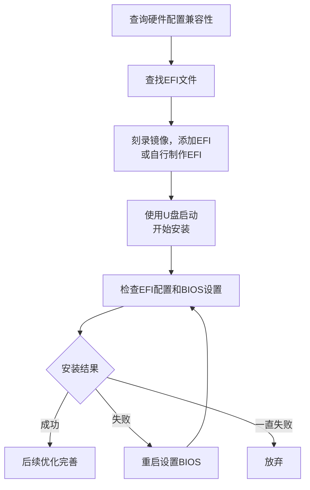

# 黑苹果资源下载地址和常见问题(FAQ)

> 《黑苹果资源下载地址和常见问题(FAQ)》，作者：[皮卡丘](https://github.com/PIKACHUIM)、鹰击长空，引用源：[黑苹果屋](https://imacos.top/)、[黑苹果星球](https://heipg.cn/)、[果里果气黑苹果](https://www.zhihu.com/people/forjar)、[国光的黑苹果教程](https://apple.sqlsec.com/)、[OpenCore Install Guide](https://dortania.github.io/OpenCore-Install-Guide/)等
>
> 本文章遵循[**CC BY-NC-SA 4.0**](https://creativecommons.org/licenses/by-nc-sa/4.0/deed.zh-hans)许可协议，您不得将本文用于商业行为，并且在共享、演绎、转载本文时需保留此部分及链接https://coding.pika.net.cn/index.php/archives/531/

## 0x0 前言—为什么要装黑果

自从苹果采用Intel的处理器，苹果操作系统(macOS)被黑客破解后可以安装在Intel CPU与部分AMD CPU的机器上，因此出现了一大批*
*非苹果设备而使用苹果操作系统**的机器，由于安装原版Mac系统的设备被称为白苹果(Macintosh)，因此这样的系统被称为**黑苹果(
Hackintosh)**。

黑苹果有着**性价比高**，**扩展性强**，**可玩性高**的优点，安装黑苹果主要是为了以更低成本体验 macOS
操作系统，实现高性价比的硬件定制化升级，同时享受苹果生态和专业软件，尤其适合预算有限或追求高性能、可玩性强的专业用户和DIY爱好者。

### 0.0 新手小白黑苹果安装流程



## 0x1 硬件兼容与版本选择

### 1.0 整体兼容性

由于苹果官方只为自家硬件兼容了macOS，因此黑苹果的硬件兼容性不如Windows，大致原则：

- ① Intel & AMD CPU (需AVX2指令集)  ② Intel 2~10代核显/AMD免驱/开普勒-帕斯卡N卡

- ③ Intel Core/Xeon X79~X299/AMD Ryzen之后主板 ④ 不存在部分三星/海力士固态硬盘

### 1.1 主板兼容性

黑苹果可考虑微星、技嘉、华硕、华擎，其它方面主要就是避免选择 BIOS 太烂的品牌，且 BIOS 设置里拥有 CFG Lock 选项的最佳；
> 为什么要求有 CFG Lock 选项？
>
> 因为此项关联主板 MSR 0xE2 寄存器是否可读写（也就是 NVRAM 读写支持）。
> 对于逐渐成为主流的新一代引导工具 OpenCore 来说，BIOS中没有该选项会导致额外的折腾流程；

#### 1.1.1「特别注意」

以下型号主板没有或不支持NVRAM读写，属于知名的macOS安装“老大难”平台：

- X79、X99 、X299、C422、C612、C621

绝大部分上述型号即使用工具解锁 CFG-Lock 后，也大概率会卡在CFG这里

### 1.2 CPU 兼容性

#### 1.2.1 CPU兼容性原则

参考：https://imacos.top/2023/05/12/intel-amd/

##### 1.2.1.1 架构支持：

- 32 位架构的 CPU 只支持 macOS 10.4.1 到 macOS 10.6.8
- 64 位架构的 CPU 支持 macOS 10.4.1 至 macOS 26

##### 1.2.1.2 指令支持：

- macOS 10.11 和更老版本需要 需要 SSE3
- macOS 10.12 和更新版本需要 SSE4
- macOS 10.14 和更新版本需要 SSE4.2
- macOS 12 和更新版本需要 AVX2（可以通过补丁绕过）

##### 1.2.1.3 品牌支持：

- 支持AMD（需补丁）和Intel（酷睿11代起需要仿冒10代）

##### 1.2.1.4 线程支持：

- macOS10.10及更早版本最多支持 24 个线程，包括双 CPU。
- macOS10.11及更新版本最多支持 64 个线程，包括双 CPU。

#### 1.2.2 CPU兼容性表

| 架构/代号                                    | 品牌    | 典型型号/系列                                 | 10.12-10.14 | 10.15-13+ | 兼容性备注                      |
  |:-----------------------------------------|:------|:----------------------------------------|:-----------:|:---------:|:---------------------------|
| **Presler/Cedar Mill/Conroe/Kentsfield** | Intel | Pentium D, Core 2 Duo/Quad              |      ❌      |     ❌     | 太旧，无SSE4.2指令集              |
| **Haswell→Comet Lake**                   | Intel | 4代-10代 Core i3/i5/i7/i9                 |      ✅      |     ✅     | 消费级主力，全功能支持                |
| **Clarkdale/Arrandale**                  | Intel | 1代Core i3/i5/i7                         |      ✅      |     ✅     | **需CPU仿冒**+核显补丁            |
| **Sandy/Ivy Bridge**                     | Intel | 2-3代 Core i3/i5/i7                      |      ✅      |     ✅     | **需核显补丁**(Mojave/Monterey) |
| **Sandy-E → Cascade Lake**               | Intel | HEDT/服务器 E3/E5/E7/Xeon W                |      ✅      |     ✅     | 无核显，服务器端稳定                 |
| **Nehalem/Westmere**                     | Intel | 1代Core i7/Xeon                          |      ✅      |     ✅     | **需CPU仿冒**，无核显             |
| **Rocket Lake(11代)**                     | Intel | Core i5/i7/i9-11xxx                     |      ✅      |     ✅     | **需仿冒**，无核显驱动              |
| **Alder Lake(12代)**                      | Intel | Core i3/i5/i7/i9-12xxx                  |      ✅      |     ✅     | **需仿冒**，无核显驱动              |
| **Raptor Lake(13/14代)**                  | Intel | Core i5/i7/i9-13xxx/14xxx               |      ✅      |     ✅     | **需仿冒**，无核显驱动              |
| **Meteor Lake(Core Ultra 1代)**           | Intel | Ultra 5/7/100H系列                        |      ✅      |     ✅     | **需仿冒**，无核显驱动              |
| **Arrow Lake(Core Ultra 2代)**            | Intel | Ultra 200S系列                            |      ✅      |     ✅     | **需仿冒**，无核显驱动              |
| **Bristol Ridge**                        | AMD   | A6/A8/A10/A12-9000系列                    |      ✅      |     ✅     | 无核显驱动，需独显                  |
| **Zen/Zen+/Zen2/Zen3**                   | AMD   | Ryzen 1000-6000, Threadripper 1000-3000 |      ✅      |     ✅     | 原生支持，完美兼容                  |
| **Raphael(Zen4桌面)**                      | AMD   | Ryzen 7000系列                            |      ✅      |     ✅     | **需CPUID仿冒**，无核显           |
| **Dragon Range(Zen4移动)**                 | AMD   | Ryzen 7000HX系列                          |      ✅      |     ✅     | **需CPUID仿冒**，无核显           |
| **Phoenix/Hawk Point(Zen4 APU)**         | AMD   | Ryzen 7000/8000G系列                      |      ✅      |     ✅     | **需仿冒**，核显不可用              |
| **Strix Point/Granite Ridge(Zen5)**      | AMD   | Ryzen 9000系列                            |      ✅      |     ✅     | **需仿冒**，无核显支持              |

### 1.3 GPU 兼容性

#### 1.3.1 什么是免驱卡

macOS 的显卡驱动是系统内置的，这些驱动支持部分 AMD/NVIDIA/Intel 推出的显卡型号，型号符合的显卡在安装完 macOS
就可以自己驱动起来正常工作，即“免驱卡”；

##### 1.3.1.1 完全免驱显卡

- AMD 免驱显卡: RX4x0、RX5x0、RX Vega、RX5x00XT、RX6x00XT、RX6x50XT、MI25/50/镭7、WXx100系列，但是RX6700/6X50不能原生支持，需要仿冒或者使用NootRX
- NVIDIA免驱显卡: 只有两代 Kepler，对应 GTX6x0 和 GTX7x0 系列，但不包括 745、750 和 750Ti，并且最多只支持到 macOS 12.0 beta
  6，更高版本需要打第三方补丁；
- Intel 免驱显卡: 仅支持Intel核显，最新只到 UHD630（8-10 代酷睿）以及 Iris Plus Graphics（10 代移动端酷睿）及以前的型号，新型号Xe系列/Arc
  独显的暂不支持；

##### 1.3.1.2 可打驱动显卡

- NVIDIA可打驱动: Maxwell 和 Pascal 两个系列的显卡。需要额外安装 Webdriver 驱动并且默认只能支持 10.13.6，通过 OpenCore
  Legacy Patcher 则可以支持最新版本
- AMD 可打驱动: AMD核心显卡仅 Vega 架构这一代，这包括了 Ryzen 1xxx (Athlon Silver/Gold) 到 5xxx，还有 7x30
  系列，独显则支持RX6900~6600范围内的所有显卡

> 「注意」
> 1. 苹果于 2022 年 6 月公布了 Metal 3 支持的硬件，从 RX Vega 起步，不再支持 RX4x0 和 Rx5x0，不过不支持 Metal 3
     也仍然可以正常使用目前的 Metal 2；

#### 1.3.2 显卡兼容性表

##### 1.3.2.1 NVIDIA 显卡兼容性明细表

| **型号系列**                         | **核心架构**                         | **原生支持最高版本**            | **OCLP支持最高版本** | **备注**                       |
|:---------------------------------|:---------------------------------|:------------------------|:---------------|:-----------------------------|
| **GTX 670/680/760/770/780**      | Kepler (GK104/110)               | 12.x Monterey           | 15.x Sequoia   | 含Ti/690/TITAN Z，无HEVC硬解      |
| **GTX 660/650/640/740**          | Kepler (GK106/107)               | 12.x Monterey           | 15.x Sequoia   | 含Ti/Boost/OEM，部分花屏           |
| **GTX 750/950/960**              | Maxwell (GM107/206)              | **10.13.6 High Sierra** | 15.x Sequoia   | **原生需WebDriver，OCLP下无Metal** |
| **GTX 970/980/980Ti**            | Maxwell (GM204/200)              | **10.13.6 High Sierra** | 15.x Sequoia   | **原生需WebDriver，OCLP下无Metal** |
| **GTX 1050/1060/1070/1080**      | Pascal (GP107/106/104)           | **10.13.6 High Sierra** | 15.x Sequoia   | **原生需WebDriver，OCLP下无Metal** |
| **GT 1010/1030**                 | Pascal (GP108)                   | **10.13.6 High Sierra** | 15.x Sequoia   | GK107版属Kepler，需甄别核心          |
| **Quadro K系列**                   | Kepler (GK104/106/107)           | 12.x Monterey           | 15.x Sequoia   | K2000-K6000，部分无确切资料          |
| **Quadro M/P系列**                 | Maxwell/Pascal                   | **10.13.6 High Sierra** | 15.x Sequoia   | **原生需WebDriver，OCLP下无Metal** |
| **RTX 2060/2070/2080全系列**        | Turing (TU106/104/102)           | ❌ **无法驱动**              | ❌ **无法驱动**     | **苹果永久终止合作**                 |
| **GTX 1650/1660全系列**             | Turing (TU117/116)               | ❌ **无法驱动**              | ❌ **无法驱动**     | **架构被系统级屏蔽**                 |
| **RTX 3050/3060/3070/3080/3090** | Ampere (GA106/104/102)           | ❌ **无法驱动**              | ❌ **无法驱动**     | **无任何社区解决方案**                |
| **RTX 4060/4070/4080/4090**      | Ada Lovelace (AD106/104/103/102) | ❌ **无法驱动**              | ❌ **无法驱动**     | **完全不支持**                    |

##### 1.3.2.2 AMD 显卡兼容性明细表

| **架构代际**                     | **型号系列**                         | **原生支持最高版本** | **OCLP支持最高版本** | **备注**                |
|:-----------------------------|:---------------------------------|:-------------|:---------------|:----------------------|
| **GCN 4.0 (Polaris)**        | RX 460/470/480/570/580/590       | 26.x Tahoe   | 26.x Tahoe     | 含XT/D/2048SP/580G，最稳定 |
| **GCN 5.0/5.1 (Vega)**       | Vega 56/64/FE/Radeon VII         | 26.x Tahoe   | 26.x Tahoe     | 含Liquid/Pro版本，Mac专属   |
| **RDNA 1.0 (Navi 10)**       | RX 5300/5500/5600/5700系列         | 26.x Tahoe   | 26.x Tahoe     | 含50周年纪念版，完美免驱         |
| **RDNA 2.0 (Navi 23)**       | RX 6600/6600XT                   | 26.x Tahoe   | 26.x Tahoe     | **需macOS 12.1 Beta+** |
| **RDNA 2.0 (Navi 21)**       | RX 6800/6900全系列                  | 26.x Tahoe   | 26.x Tahoe     | 含XT/XTX/6950XT，完美免驱   |
| **RDNA 2.0 Mac专属**           | Pro W6800/W6900X/Vega II         | 26.x Tahoe   | 26.x Tahoe     | Mac Pro/iMac Pro独占    |
| **GCN 1.0-3.0**              | HD 7000/R9 200系列                 | 11.x Big Sur | 15.x Sequoia   | 需刷BIOS或仿冒ID，双芯卡单核     |
| **RDNA 2.0 (Navi 22)**       | RX 6700/6750XT/6650XT            | 15.x Sequoia | 15.x Sequoia   | **需第三方补丁或仿冒ID**       |
| **RDNA 2.0 (Navi 24)**       | **RX 6400/6500XT**               | ❌ **无法驱动**   | ❌ **无法驱动**     | **系统级核心屏蔽**           |
| **RDNA 3.0 (Navi 31/32/33)** | **RX 7600/7700XT/7800XT/7900系列** | ❌ **无法驱动**   | ❌ **无法驱动**     | **苹果未开发RDNA3驱动**      |
| **GCN 1.0双芯卡**               | HD7990/R9 295X2等                 | 11.x Big Sur | 11.x Big Sur   | **第二核心永久失效**          |

##### 1.3.2.3 Intel显卡兼容性列表

| 世代                 | 架构     | 型号系列                              | 最高支持 macOS | 原生支持起始版本 | 关键备注                       |
|:-------------------|:-------|:----------------------------------|:-----------|:---------|:---------------------------|
| Westmere (1代)      | 一代酷睿   | HD Graphics 1000                  | 10.13.6    | -        | 10.14+ 需修改，无 Metal，胶水封装    |
| Sandy Bridge (2代)  | 二代酷睿   | HD Graphics 2000/3000             | 10.13.6    | 10.7     | 10.14+ 需修改，无 Metal         |
| Ivy Bridge (3代)    | 三代酷睿   | HD Graphics 2500/4000             | 10.15.7    | 10.8     | 10.16+ 需第三方补丁              |
| Haswell (4代)       | 四代酷睿   | HD/Iris/Iris Pro Graphics         | 11.7.x     | 10.9     | HD4400 需仿冒 HD4600          |
| Broadwell (5代)     | 五代酷睿   | Iris Pro Graphics 6200 等          | 12.0       | 10.10.2  | 性能接近 GT740                 |
| Skylake (6代)       | 六代酷睿   | HD 510/520/530/540/550/580        | 12.0       | 10.11.4  | 型号改为3位数                    |
| Kabylake (7代)      | 七代酷睿   | HD 615/620/630/640/650, Iris Plus | 13.0       | 10.12.6  | **HD610 不支持**              |
| Coffeelake (8/9代)  | 八/九代酷睿 | UHD Graphics 630                  | 13.0       | 10.13.6  | F 后缀无核显，部分 i3 需仿冒          |
| Comet Lake (10代桌面) | 十代酷睿   | UHD Graphics 630                  | 最新版        | -        | 需 Lilu 1.4.5+ / WEG 1.4.0+ |
| Ice Lake (10代移动)   | 十代酷睿   | Iris Plus Graphics                | 最新版        | 10.15.4  | 移动端最强，需特殊启动参数              |

##### 1.3.2.4 AMD核显兼容性列表

| **架构代号**         | **APU 系列**                                   | **原生支持最高版本**  | **OCLP 支持最高版本** | **驱动状态**           | **特殊要求与备注**                            |
|:-----------------|:---------------------------------------------|:--------------|:----------------|:-------------------|:---------------------------------------|
| **Raven Ridge**  | Ryzen 3/5/7 2xxxG<br>Athlon Silver/Gold 2xxx | 12.x Monterey | 15.x Sequoia    | ⚠️ **需 NootedRed** | 需屏蔽独显，移除 WhateverGreen，分配 1GB+ VRAM    |
| **Picasso**      | Ryzen 3/5/7 3xxxG<br>Athlon Silver/Gold 3xxx | 12.x Monterey | 15.x Sequoia    | ⚠️ **需 NootedRed** | 使用 iMac20,1 SMBIOS，笔记本需 SSDT-PNLF 背光补丁 |
| **Renoir**       | Ryzen 4xxxG/5xxxG (U/HS/H)                   | 13.x Ventura  | 15.x Sequoia    | ⚠️ **需 NootedRed** |                                        |
| **Barcelo-R**    | Ryzen 7330U/7530U/7730U                      | 15.x Sequoia  | 15.x Sequoia    | ⚠️ **需 NootedRed** | **唯一支持核显的 Ryzen 7000 系**               |
| **Dali**         | Athlon Gold 3150U/3150C                      | 12.x Monterey | 15.x Sequoia    | ⚠️ **需 NootedRed** | 低功耗版本，性能受限                             |
| **Pollock**      | Athlon Silver 3050GE/3150GE                  | 12.x Monterey | 15.x Sequoia    | ⚠️ **需 NootedRed** | 嵌入式版本，兼容性一般                            |
| **Rembrandt**    | Ryzen 5/7/9 6xxxH/HS/HX                      | ❌ **无法驱动**    | ❌ **无法驱动**      | ❌ **完全不支持**        | RDNA 2 核显架构，系统级屏蔽                      |
| **Phoenix**      | Ryzen 5/7/9 7xxxHS/7940HS等                   | ❌ **无法驱动**    | ❌ **无法驱动**      | ❌ **完全不支持**        | RDNA 3 核显架构，无驱动支持                      |
| **Raphael**      | Ryzen 7000 系列 (Radeon 700M)                  | ❌ **无法驱动**    | ❌ **无法驱动**      | ❌ **完全不支持**        | 桌面版 RDNA 2 核显，苹果未跟进                    |
| **Dragon Range** | Ryzen 9 7945HX等                              | ❌ **无法驱动**    | ❌ **无法驱动**      | ❌ **完全不支持**        | 无核显驱动支持                                |
| **Van Gogh**     | Steam Deck APU                               | ❌ **无法驱动**    | ❌ **无法驱动**      | ❌ **完全不支持**        | 定制架构，无对应驱动                             |
| **Mendocino**    | Ryzen 7020 系列                                | ❌ **无法驱动**    | ❌ **无法驱动**      | ❌ **完全不支持**        | RDNA 2 低端，系统黑名单                        |
| **GCN 3.0**      | Radeon R7/R9 移动版                             | ❌ **无法驱动**    | ❌ **无法驱动**      | ❌ **完全不支持**        | 核显部分无驱动支持                              |

### 1.4 网卡兼容性

#### 1.4.1 网卡选购建议

| 使用场景               | 推荐方案              | 理由              |
|--------------------|-------------------|-----------------|
| **白苹果原装**          | BCM94360CS/CS2/CD | 苹果专用，免驱完美兼容     |
| **黑苹果装机**          | BCM94360NG/Z3/Z4  | 免驱，即插即用         |
| **Windows最新**      | BE200/AX411       | WiFi 7/6E，速率最高  |
| **黑苹果+Windows双系统** | BCM94360NG        | 兼顾Mac免驱和Win兼容性  |
| **预算有限**           | AC9260/9560       | Intel最强AC，性价比最高 |
| **PCIe网卡**         | DW1560/DW1830     | 博通方案，黑苹果友好      |

#### 1.4.2 网卡兼容性表

##### 1.4.1.1 Intel 网卡完整兼容性表

| 系列           | 芯片型号               | 接口类型          | Wi-Fi标准  | 蓝牙版本 | 支持macOS版本 | 所需驱动               | 备注                  |
|--------------|--------------------|---------------|----------|------|-----------|--------------------|---------------------|
| **Wi-Fi 7**  | Intel BE200        | M.2 A/E Key   | Wi-Fi 7  | 5.3  | 10.15+    | Airportitlwm/itlwm | 最新型号                |
| **Wi-Fi 6E** | Intel AX210        | M.2 A/E Key   | Wi-Fi 6E | 5.2  | 10.15+    | Airportitlwm/itlwm | 支持6GHz              |
|              | Intel AX211        | M.2 A/E Key   | Wi-Fi 6E | 5.2  | 10.15+    | Airportitlwm/itlwm | CNVio2接口            |
|              | Intel AX411        | M.2 A/E Key   | Wi-Fi 6E | 5.2  | 10.15+    | Airportitlwm/itlwm | 高端型号                |
| **Wi-Fi 6**  | Intel AX200        | M.2 A/E Key   | Wi-Fi 6  | 5.0  | 10.15+    | Airportitlwm/itlwm | 硬件ID: 0x2723        |
|              | Intel AX201        | M.2 A/E Key   | Wi-Fi 6  | 5.0  | 10.15+    | Airportitlwm/itlwm | CNVio2接口            |
|              | Intel AX101        | M.2 A/E Key   | Wi-Fi 6  | 5.2  | 10.15+    | Airportitlwm/itlwm | 入门级                 |
| **Wi-Fi 5**  | Intel AC 9560      | M.2 A/E Key   | 802.11ac | 5.0  | 10.15+    | Airportitlwm/itlwm | 1.73Gbps            |
|              | Intel AC 9461/9462 | M.2 A/E Key   | 802.11ac | 5.0  | 10.15+    | Airportitlwm/itlwm | 集成MAC               |
|              | Intel AC 9260      | M.2 A/E Key   | 802.11ac | 5.0  | 10.15+    | Airportitlwm/itlwm | 1.73Gbps            |
|              | Intel AC 8265      | M.2 A/E Key   | 802.11ac | 4.2  | 10.15+    | Airportitlwm/itlwm | 硬件ID: 0x24f3/0x24f4 |
|              | Intel AC 8260      | M.2 A/E Key   | 802.11ac | 4.2  | 10.15+    | Airportitlwm/itlwm | 企业级                 |
|              | Intel AC 7265      | M.2 A/E Key   | 802.11ac | 4.0  | 10.15+    | Airportitlwm/itlwm | 硬件ID: 0x095a/0x095b |
|              | Intel AC 7260      | Mini PCIe/M.2 | 802.11ac | 4.0  | 10.15+    | Airportitlwm/itlwm | 硬件ID: 0x08b1/0x08b2 |
|              | Intel AC 4165      | M.2 A/E Key   | 802.11ac | 4.2  | 10.15+    | Airportitlwm/itlwm | 硬件ID: 0x24f5/0x24f6 |
|              | Intel AC 3168      | M.2 A/E Key   | 802.11ac | 4.2  | 10.15+    | Airportitlwm/itlwm | 硬件ID: 0x24fb        |
|              | Intel AC 3165      | M.2 A/E Key   | 802.11ac | 4.2  | 10.15+    | Airportitlwm/itlwm | 硬件ID: 0x3166        |
|              | Intel AC 3160      | Mini PCIe/M.2 | 802.11ac | 4.0  | 10.15+    | Airportitlwm/itlwm | 硬件ID: 0x08b4        |

##### 1.4.1.2 博通网卡完整兼容性表

| 子类别           | 芯片型号         | 接口类型             | Wi-Fi标准  | 蓝牙版本 | 天线数 | 支持macOS版本   | 驱动/状态                           | 备注                                      |
|---------------|--------------|------------------|----------|------|-----|-------------|---------------------------------|-----------------------------------------|
| **原生免驱**      | BCM943602CDP | PCIe (转接)        | 802.11ac | 4.1  | 3+1 | 10.11-10.14 | 免驱                              | iMac 2015拆机卡, 性能最强                      |
| **原生免驱**      | BCM943602CD  | PCIe (转接)        | 802.11ac | 4.0  | 3+1 | 10.11-10.14 | 免驱                              | iMac 2014拆机卡                            |
| **原生免驱**      | BCM94360CD   | PCIe (转接)        | 802.11ac | 4.0  | 3+1 | 10.11-10.14 | 免驱                              | iMac 2013-14拆机卡, 性价比高                   |
| **原生免驱**      | BCM943602CS  | M.2 A/E Key (转接) | 802.11ac | 4.1  | 3   | 10.11-10.14 | 免驱                              | MacBook Pro 2015                        |
| **原生免驱**      | BCM94360CS2  | M.2 A/E Key (转接) | 802.11ac | 4.0  | 2   | 10.11-10.14 | 免驱                              | MacBook Air 2013-17, 笔记本首选              |
| **原生免驱**      | BCM94360CSAX | M.2 A/E Key (转接) | 802.11ac | 4.0  | 3   | 10.11-10.14 | 免驱                              | MacBook Pro 2012-13                     |
| **原生免驱**      | BCM94360CS   | M.2 A/E Key (转接) | 802.11ac | 4.0  | 3   | 10.11-10.14 | 免驱                              | Mac mini 2014                           |
| **原生免驱**      | BCM94331CD   | PCIe (转接)        | 802.11n  | 4.0  | 2   | 10.11-10.13 | 需强制加载IO80211Family              | iMac 2012-13, 老系统适用                     |
| **需驱动**       | BCM94352Z    | M.2 A/E Key      | 802.11ac | 4.0  | 2   | 10.11-10.14 | AirportBrcmFixup + BrcmPatchRAM | DW1560/DW1830, 基本完美                     |
| **需驱动**       | BCM94350ZAE  | M.2 A/E Key      | 802.11ac | 4.0  | 2   | 10.11-10.14 | AirportBrcmFixup + BrcmPatchRAM | DW1820A, 需注入pci-aspm-default参数          |
| **需驱动**       | BCM943224    | Mini PCIe        | 802.11n  | 4.0  | 2   | 10.11-10.14 | AirportBrcmFixup + BrcmPatchRAM | 古董级, 性能低                                |
| **需驱动**       | BCM94352HMB  | Mini PCIe        | 802.11ac | 4.0  | 2   | 10.11-10.14 | AirportBrcmFixup + BrcmPatchRAM | 半高卡, 老笔记本适用                             |
| **博通古董**      | BCM94322     | Mini PCIe        | 802.11n  | -    | 2   | 10.11-10.13 | 需驱动, 稳定性差                       | 极老型号, 不建议使用                             |
| **博通古董**      | BCM943225    | Mini PCIe        | 802.11n  | -    | 2   | 10.11-10.13 | 需驱动                             | 古董型号                                    |
| **博通古董**      | BCM94321mc   | Mini PCIe        | 802.11n  | -    | 2   | 10.11-10.13 | 需驱动                             | 性能低下                                    |
| **Atheros古董** | AR9380       | PCIe             | 802.11n  | -    | 3   | 10.11-10.13 | 免驱/AirPortAtheros40             | 3×3 MIMO, 450Mbps, 需苹果原装卡               |
| **Atheros古董** | AR9280       | Mini PCIe        | 802.11n  | -    | 2   | 10.11-10.13 | 免驱                              | 2×2 MIMO, 300Mbps, 硬件ID: 168c:2a        |
| **Atheros古董** | AR9287       | Mini PCIe        | 802.11n  | -    | 2   | 10.11-10.13 | 需修改驱动                           | 2×2 MIMO, 300Mbps, 仅2.4G, 硬件ID: 168c:2e |
| **Atheros古董** | AR9285       | Mini PCIe        | 802.11n  | -    | 1   | 10.11-10.13 | 需修改驱动                           | 1×1 MIMO, 150Mbps, 硬件ID: 168c:2b        |
| **Atheros古董** | AR9283       | Mini PCIe        | 802.11n  | -    | 2   | 10.11-10.13 | 需修改驱动                           | 2×2 MIMO, 300Mbps, 仅2.4G                |
| **Atheros古董** | AR9462       | Mini PCIe        | 802.11n  | 4.0  | 2   | 10.11-10.13 | AirPortAtheros40                | 蓝牙4.0二合一, 硬件ID: 168c:0034               |
| **Atheros古董** | AR9485       | Mini PCIe        | 802.11n  | -    | 1   | 10.11-10.13 | AirPortAtheros40                | 单频, 仅2.4G, 硬件ID: 168c:0032              |
| **Atheros古董** | AR9565       | Mini PCIe        | 802.11n  | 4.00 | 1   | 10.11-10.13 | AirPortAtheros40                | 集成蓝牙, 仅2.4G                             |

### 1.5 硬盘兼容性

#### 1.5.1 硬盘选购建议

| 使用场景      | 推荐品牌/系列                    | 不推荐品牌/系列                   |
|-----------|----------------------------|----------------------------|
| **黑苹果装机** | 西数SN系列、三星SATA系列、海盗船MP系列    | 三星PM系列、海力士、镁光、Intel傲腾      |
| **追求稳定**  | 西数SN550/570/850、金典/浦科特SATA | 所有标注⚠️和❌的型号                |
| **性价比**   | 西数SN550、海盗船MP400           | 致钛、京造（性能陷阱）                |
| **笔记本原装** | 确认非海力士/镁光OEM型号             | 联想/戴尔部分OEM盘（PC601/611/711） |

#### 1.5.2 硬盘兼容性表

| 品牌        | 型号/系列                           | 兼容性状态                | 备注与解决方案                          |
|-----------|---------------------------------|----------------------|----------------------------------|
| **三星**    | PM981/PM981A/PM991/PM9A1/983ZET | ❌ **不可安装**           | MZVLQ/MZVLB前缀全系列，进系统慢、不稳定        |
|           | 970 EVO Plus（2019年5月前出厂）        | ⚠️ **需固件升级**         | 类似PM9x1问题，需在Windows升级官方固件        |
|           | 970 EVO/Pro/Plus（升级固件后）         | ✅ **可安装**            | 存在TRIM支持问题，需SetApfsTrimTimeout=0 |
|           | 980/980 Pro                     | ✅ **可安装**            | 同上，TRIM支持不佳                      |
|           | 950/960/970 Evo/Pro             | ⚠️ **不完全支持TRIM**     | 可安装运行，但TRIM执行慢，建议关闭              |
|           | 850/870 EVO（SATA）               | ✅ **支持TRIM**         | SATA接口相对稳定                       |
| **海力士**   | BC711/PC711/PC601/P31           | ❌ **多数不可安装**         | HFS/HFM前缀多数翻车，P31可装但易出问题         |
|           | SK Hynix HFS001TD9TNG-L5B0B     | ❌ **兼容性不佳**          | 可能无故卡住或运行不正常                     |
| **镁光**    | 2200/S2200/2200S/2200V          | ❌ **不可安装**           | MTFDHBA前缀全部翻车，需代码屏蔽              |
| **Intel** | 傲腾Optane Memory                 | ❌ **不支持**            | 必须物理拆除，否则无法安装                    |
| **金士顿**   | A2000（S5Z42105控制器）              | ⚠️ **需NVMeFix.kext** | 必须搭配NVMeFix 1.0.8+，也可能完全无法安装     |
| **技嘉**    | GIGABYTE M.2 PCIe SSD           | ⚠️ **可能有问题**         | 型号如GP-GSM2NE8512GNTD，可装但运行异常     |
| **威刚**    | Swordfish 2TB                   | ⚠️ **可能有问题**         | 兼容性问题，运行不稳定                      |
|           | S7 2TB                          | ❌ **不可安装**           | 无法通过正常安装流程                       |
| **雷克沙**   | NM620                           | ❌ **完全不能用**          | 需SSDT屏蔽否则卡代码无法进系统                |
| **阿斯加特**  | AN3+/AN2                        | ⚠️ **性能问题**          | 可安装但运行慢或卡顿                       |
| **朗科**    | NVME SSD 480                    | ❌ **不可安装**           | 有反应但无法正常安装                       |
| **致钛**    | 英韧科技主控系列                        | ⚠️ **严重性能问题**        | 能装但写入速度<200MB/s，完全不可用            |
| **京造**    | J.ZAO 5 SERIES                  | ⚠️ **致命缺陷**          | 能装但写入数据即死机，无法使用                  |
| **金泰克**   | TIGO SSD 512GB NVME             | ❌ **不可安装**           | 恢复版、安装版均失败                       |
| **大华**    | C900 PLUS 1TB                   | ⚠️ **严重性能问题**        | 英韧IG5216主控速度仅20MB/s，需确认主控        |
| **Intel** | 600P/660P/760P系列                | ⚠️ **兼容性不佳**         | 可能无故卡住或运行不正常                     |
| **西数**    | SN550/570/730/750/850           | ✅ **完美兼容**           | 可正常安装运行，TRIM支持良好                 |
| **海盗船**   | MP400/MP600系列                   | ✅ **可安装**            | 可正常安装运行                          |
| **金典**    | KingDian S280（SATA）             | ✅ **支持TRIM**         | SATA接口兼容性好                       |
| **浦科特**   | M5Pro（SATA）                     | ✅ **支持TRIM**         | SATA接口相对安全                       |
|           | M9P Plus等NVMe系列                 | ❌ **不建议**            | 多数型号存在问题                         |
| **英睿达**   | Crucial P1 1TB                  | ✅ **支持TRIM**         | SM2263EN主控，未完全测试                 |
| **爱国者**   | P2000 256GB                     | ❌ **不可安装**           | 无法通过10.15/11.x/12.x正常流程（个例除外）    |

## 0x2 常见教程及现成引导

### 2.0 黑苹果教程

- [Dortania - OpenCore黑苹果安装教程](https://dortania.github.io/OpenCore-Install-Guide/prerequisites.html)
- [国光的黑苹果安装教程：手把手教你配置 OpenCore](https://apple.sqlsec.com/)

### _黑苹果引导_

- [Daliansky - 黑苹果长期维护机型 EFI 及安装教程整理](https://github.com/daliansky/Hackintosh)
- [皮卡的资源站 - 黑苹果EFI引导文件搜集](https://shared.pika.net.cn/Sources/OSImages/MacOS/EFIData)

## 0x3 黑苹果镜像下载地址

### 3.1 镜像下载

| 版本类型    | 说明                            | 下载地址                                                      |
|---------|-------------------------------|-----------------------------------------------------------|
| 离线安装版   | DMG无需网络                       | https://shared.pika.net.cn/Sources/OSImages/MacOS/Hackins |
| 在线安装版   | 需要联网安装                        | https://shared.pika.net.cn/Sources/OSImages/MacOS/Onlines |
| ISO离线版  | 主要给虚拟机安装                      | https://shared.pika.net.cn/Sources/OSImages/MacOS/ISOFile |
| VM懒人包   | 安装好的VM虚拟机镜像                   | https://shared.pika.net.cn/Sources/OSImages/MacOS/Vmwares |
| PVE懒人包  | 一键启动PVE的macOS模板               | https://shared.pika.net.cn/Sources/OSImages/MacOS/Proxmox |
| RDR恢复版本 | R-Drive Image恢复版本             | https://shared.pika.net.cn/Sources/OSImages/MacOS/Rec-rdr |
| PHD恢复版本 | Paragon Hard Disk Manager 恢复版 | https://shared.pika.net.cn/Sources/OSImages/MacOS/Rec-phd |

### 3.2 工具下载

| 工具名称 | 介绍 | 下载地址 |
|------|----|------|
|      |    |      |
|      |    |      |
|      |    |      |

### 3.3 补丁下载

| 工具名称              | 介绍           | 下载地址                                                                                                                             |
|-------------------|--------------|----------------------------------------------------------------------------------------------------------------------------------|
| Intel Wireless    | Intel 无线网卡补丁 | https://github.com/OpenIntelWireless/itlwm/releases <br/> https://shared.pika.net.cn/Sources/OSImages/MacOS/MacKext/AirportItlwm |
| Intel Bluetooth   | Intel 蓝牙补丁   | https://shared.pika.net.cn/Sources/OSImages/MacOS/MacKext/IntelBluetooth                                                         |
| Broadcom Wireless | 博通蓝牙&无线网卡补丁  | https://shared.pika.net.cn/Sources/OSImages/MacOS/MacKext/BrcmPatchRAM                                                           |
| Nvidia Web Driver | 英伟达显卡补丁      | https://shared.pika.net.cn/Sources/OSImages/MacOS/MacKext/WebDriver-NVidia <br/>注意：只能用于10.13.6及以下MacOS，且只支持N卡GT(X)7XX~10XX显卡     |
| NootRX NootedRed  | AMD独显和核显驱动   | https://shared.pika.net.cn/Sources/OSImages/MacOS/MacKext/NootRX-NootedRed                                                       |
| VoodooHDA-Sounds  | 万能声卡驱动       | https://shared.pika.net.cn/Sources/OSImages/MacOS/MacKext/VoodooHDA-Sounds                                                       |
|                   |              |                                                                                                                                  |

## 0x4 黑苹果安装详细教程

### 4.0 写入镜像

1.下载软件：[BalenaEtcher.exe](https://file-cn.52pika.cn/Sources/OSMirror/MacOS/MacTool/Mac-OS-Install-Tools/U盘工具balenaEtchers.exe)

> 如果后缀是.rar，则需要先解压，只能烧录DMF/ISO/CDR/IMG
> 如果名称有part*，比如.part1.rar，则需要下载所有的part

2. 打开软件：选择——从**文件烧录**——选择DMG/ISO/CDR/IMG
3. 选择模板：**选择你的USB设备**——**现在烧录**————**自动校验————完成烧录**

> 如提示校验失败，大概率是因为无法自动拔插读取，是正常情况，其实已经成功了

## 0x5 黑苹果OCLP补丁教程

### 安装 KDK

### 关闭 SIP

1.

```
csr-active-config修改：FF0F000
```

2. 进入opencore页面按空格选择“reset nvram”项
3. 重启电脑，就关闭成功了

参考

0xFF030000 - 禁用 macOS High Sierra (0x3ff) 中的所有标志。
0xFF070000 - 禁用 macOS Mojave 和 macOS Catalina (0x7ff) 中的所有标志
0xFF0F0000 - 禁用 macOS Big Sur (0xfff) 中的所有标志
0x00000000 - 完全启用SIP
0x30000000 - 部分禁用SIP，允许未签名的 Kext 加载并允许写入受保护的文件系统路径
0x03080000 - 部分禁用SIP，
0xE7030000 - 彻底禁用SIP，不再推荐使用
0x67000000 - 彻底禁用SIP，不再推荐使用
0x7f0a0000 - 彻底禁用SIP

GithubProxy：

皮卡の网盘：[Kernels | 皮卡丘文件共享中心 - 大陆 (52pika.cn)](https://file-cn.52pika.cn/Sources/OSMirror/MacOS/Kernels)

### **3、**     **如何撤销OCLP补丁**

1、OCLP或者Github无法下载文件：

Github CF文件加速地址：https://github.opkg.us.kg

Github Docker代理地址：https://ghcrio.opkg.us.kg

Docker Center代理地址：https://docker.opkg.us.kg

macOS Sequoia 15.0.1 rdr恢复版已上传百度网盘，123云盘账号被封了，晚上解封后上传

白果mbp11,4+oclp 2.0.2安装的，一进系统选语言的界面就cmd+q关机进win打包，啥也没设置，后续会继续更新其他rdr恢复版

123云盘：

主链接：https://www.123865.com/s/I90DVv-C35h3

备用链接：https://www.123684.com/s/I90DVv-C35h3

百度网盘：

链接: https://pan.baidu.com/s/1ZcZFAdi_mQefGupQJAO3Gw?pwd=7rbw 提取码: 7rbw

黑苹果在线版本&离线版本8合1合集版本，下载地址：https://file-cn.52pika.cn/Sources/OSMirror/MacOS/AllOne

## 如何注入缓冲帧（仅Intel1-10代核显）

下载OCC或者OCAT：
打开[Github](https://github.com/)，搜索“Hackintosh + 你的核显/CPU”

## 常见问题

常见问题列表

1. 唤醒黑屏或者开机需要插拔显示器线才可以点亮屏幕进系统。
   尝试添加在启动项添加 igfxonln=1 参数，还可与尝试启动项添加gfxrst=1 参数
2. 我的显卡免驱，但是进系统黑屏，没有输出信号。
   尝试添加在启动项添加 agdpmod=pikera 参数，可用于 RX5500/5600/5700/6600/6800/6900 新的免驱系列显卡，防止启动过程中黑屏
3. 笔记本睡眠唤醒黑屏
   这种情况有很多种可能，有一种可能是没有屏蔽独显的原因，请尝试在启动项添加 -wegnoegpu 参数
4. 安装系统提示 An Internet connection is required to install macOS（需要互联网连接才能安装macOS）
   群里有小伙伴遇到这个问题了，解决方法就是：连接网线就行了，真的是顾名思义呀。
5. macOS 老是检测不到系统更新怎么办
   打开 OCC，在「Misc-其他设置」-「Security」标签下面，将 SecureBootMode 改为 Default 即可。
6. 核显打完缓冲帧后，HEVC 解码不能用，以及 REQ 最高只有 0.35Ghz
   DeviceProperties 设备属性设置里面的核显设备，删除 AAPL,slot-name 即可。
7. 启动的时候 若提示【oc grabbed zero systm-id for sb. this is not allowed halting on critlcal error 】
   基本就是【Misc】-->【security】下的【SecureBootModel 】的问题，默认【Default 】可以改为【Disabled 】或其他。
8. 启动的时候 若开在 【End SetConsoleMode】这个报错
   基本就是【Misc】-->【security】下的【SecureBootModel 】的问题，默认【Default 】可以改为【Disabled 】或其他。
9. 睡眠唤醒后出现莫名其妙的花屏现象
   尝试核显属性里面注入更大的显存，比如 2048MB framebuffer-unifiedmem 00000080 data 类型
10. 发现不了已经安装好 macOS 的磁盘分区
    使用 OCC在 ACPI 选项中打一个 Fix RTC _STA bug 补丁即可，或者是你的 OCC 版本高于已安装系统的版本，在「UEFI设置」-「嵌入式
    APFS」-「MinVersion」改为「-1」无限制即可。
11. 安装系统的时候，提示：「安装无法继续，因为安装器已损坏」
    两种可能
1. 顾名思义，安装镜像真的损坏了，解决方法就是换个镜像重新刻录安装。（这种可能性不高）
2. 当前的时间不太对，打开终端输入 date 看看时间是否正确，不正确的话使用 date 命令改下时间就 OK 了
12. 我进系统几分钟之后就死机黑屏重启，不插网线就正常，1225V 网卡无法正常工作
    首先确保你的网卡路径正确，然后驱动的姿势正确，下面两个是关键的参数：

然后从 macOS12.3 开始，启动项参数也由之前的dk.e1000=0参数变为了添加e1000=0参数 ，所以如果不对就替换或者添加一下。

13. USB 不定制就正常，使用 USBToolBox 定制了就会直接卡 APFS 无法进操作系统
    在部分 USB3.1 的设备比如 ASMedia ASM1142 上可能出现过，定制 USB 的时候不要插这个接口，然后到下面这一步的时候选择I忽略即可：

14. macOS 10.13.6 的应用商店无法使用，下载提示「使用已购页面再试一次」
    其实就是 10.13.6 的应用商店太老了，更新一下浏览器和 iTunes ，这些玄学问题即可解决：

15. ASMedia ASM1142 USB 3.1 Type-A 和 Type-C 一体的接口无法工作
    使用这个 SSDT-USB3-1-XHC2.aml SSDT 即可解决。
16. 这个安装 macOS XXXX 应用程序副本已损坏，不能用来安装 macOS

原因就是当前的时间太新了，我们安装的系统已经不维护了 ，直接改时间为 2015 年就可以了，详细操作参考网上的一篇文章：这个安装macOS
Mojave 应用程序副本已损坏，不能用来安装Mac OS

17. 笔记本 Type-C 没有视频输出
    如果确认你的 Type-C 走的是核显的话，那么多半和机型有关，如果是16寸笔记本型号 改成13寸的，确保核显 ID 正确的情况下，多半就可以
    Type-C 输出信号了。
18. 拷贝 EFI 提示 EFI 上的可用空间不足
    更多的是 U 盘问题，macOS 下记得清除回收站，Windows 下可以手动删除 .Trashes 垃圾文件：

或者在 macOS 下，挂载 EFI 分区后使用命令行手动删除垃圾文件：
cd /Volumes/EFI && rm -rf .Trashes

19. 安装代码跑完画面出现妙控板和妙控鼠标的画面
    两种可能：
1. USB 没有定制，建议参考 USB 定制教程重新定制
2. 缺少键鼠驱动，打一下 VoodooPS2Controller.kext 即可
20. Lenovo ThinkPad X13 20T3 10代U 其实黑苹果挺完美的，睡眠也很棒棒
    BIOS 里面调整休眠策略为 Linux，即可开启 S3 睡眠，自测一晚上耗电正常，特此记录给后人一些经验吧。
21. I2C 触控板默认轮询模式不工作
    这里以 Dell Latitude 3400 i5-8265U 的 DELL08BC 触控板为例，默认的 IRQ 为 0x00000033（51）是大于 2F 的，但是使用默认的
    XOSI 轮询模式却不工作，实际上这种 i2cAddress 地址为 0x2c 的都比较坑，缺少了 SSCN，我们打 1 个下面的 SSCN SSDT 即可解决问题：

DefinitionBlock ("", "SSDT", 2, "LENOVO", "ICL     ", 0x20170001)
{
External (_SB_.PCI0.I2C0, DeviceObj)
External (FMD1, IntObj)
External (FMH1, IntObj)
External (FML1, IntObj)
External (SSD1, IntObj)
External (SSH1, IntObj)
External (SSL1, IntObj)
External (TPDM, IntObj)

    Method (PKG3, 3, Serialized)
    {
        Name (PKG, Package (0x03)
        {
            Zero, 
            Zero, 
            Zero
        })
        PKG [Zero] = Arg0
        PKG [One] = Arg1
        PKG [0x02] = Arg2
        Return (PKG) /* \PKG3.PKG_ */
    }
    
    Scope (_SB.PCI0.I2C0)
    {
        Method (SSCN, 0, NotSerialized)
        {
            Return (PKG3 (SSH1, SSL1, SSD1))
        }
    
        Method (FMCN, 0, NotSerialized)
        {
            Return (PKG3 (FMH1, FML1, FMD1))
        }
    }

}

下面是打了 SSCN SSDT 的前后对比，可以看到一开始（左边的那个）的确是一个不完整的 I2C：

22. 安装代码跑完，但是后面安装的时候提示「准备软件更新时出错」
    在一些 Dell 的笔记本上看到过这种情况，BIOS 里面勾选「Enable Custom Mode」接口解决这个问题
23. USB 定制完成后但是 USB3.X 依然无法正常工作
    这种问题常见于 400 系列主板，这种情况打一个 XHCI-unsupported.kext 即可
24. 华硕主板开机提示「The system has POSTed in safe mode.」
    这种问题常见于华硕主板，OC 配置文件里面 Kernel 里面勾选「DisableRtcChecksum」即可

没有在以上的问题内的其他问题，请参考以下两个网址给出的解决方法：
OpenCore 安装卡住的拯救手册Q&A-黑苹果星球

## 本教程引用参考链接

> - [1]《黑苹果系列1 - 为什么需要黑苹果》，作者：陈鹏，链接：https://zhuanlan.zhihu.com/p/180946454
> - [2]《如何上手黑苹果》，作者：黑苹果星球，链接：https://heipg.cn/tutorial/how-to-hackintosh.html
> - [3]《2025年黑苹果硬件配置推荐表》，作者：黑苹果星球，链接：https://heipg.cn/tutorial/diy-hackintosh-2020.html
> - [4]《黑苹果macOS显卡支持列表》，作者：黑苹果星球，链接：https://heipg.cn/tutorial/gpu-support-for-hackintosh.html
> - [5]《NootedRed - The AMD iGPU kernel extension.》，作者：ChefKiss，链接：https://chefkiss.dev/applehax/nootedred/
> - [6]《黑苹果 macOS 兼容 Intel 与 AMD 处理器 CPU 的列表-速查表》，作者：imacos.top，链接：https://imacos.top/2023/05/12/intel-amd/
> - [7]《国光的黑苹果安装教程：手把手教你配置 OpenCore》，作者：国光，链接：https://apple.sqlsec.com/
> - [8]《黑苹果无线网卡购买&安装&使用指南2023年版》，作者：黑苹果星球，链接：https://heipg.cn/tutorial/wifi-bluetooth-card-for-hackintosh.html
> - [9]《macOS黑苹果固态硬盘不推荐系列》，作者：imacos.top，链接：https://imacos.top/2023/12/11/4568/
> - [10]《黑苹果固态避坑指南》，作者：老孙，链接：https://www.imsun.org/archives/323.html
> - [11]《OpenCore引导-v各种卡及OC引导常见问题解决方案速查表合集》，作者：imacos.top，链接： https://imacos.top/2021/01/19/0154/
> - [12]《OpenCore 安装卡住的拯救手册Q&A》，作者：黑苹果星球，链接： https://heipg.cn/tutorial/opencore-install-errors-handbook.html/comment-page-3